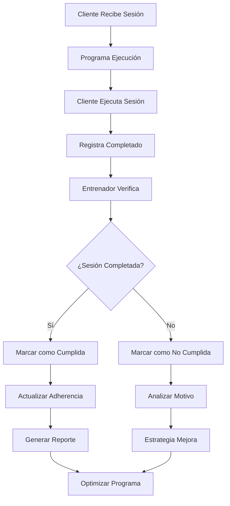
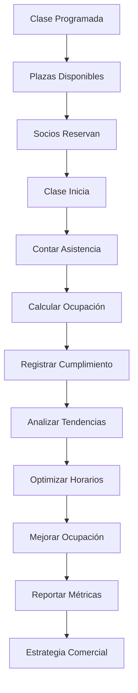

# Objetivo

**URL:** https://www.notion.so/29706f76bed4816ab944d280cb208489
**Extraído el:** 2025-10-29T20:48:36.270Z

---

> 📊 **Sistema de seguimiento de adherencia con lógica diferenciada para entrenadores personales y gimnasios**

# Objetivo

Proporcionar un sistema completo de seguimiento de adherencia y cumplimiento de entrenamiento con lógica diferenciada según el tipo de negocio. Para entrenadores personales: '¿Este cliente hizo la sesión que le mandé?'. Para gimnasios: '% de ocupación en la clase vs plazas', '¿cuánta gente sigue el plan grupal estándar?'. Mismo nombre pero lógica distinta. El sistema debe permitir seguimiento individual para entrenadores y métricas grupales para gimnasios.

# Diagramas de Flujo

## Flujo de Adherencia para Entrenadores



## Flujo de Adherencia para Gimnasios



# Matrices de Recursos

## Funcionalidades Principales

- Seguimiento Individual: Para entrenadores personales
- Métricas de Ocupación: Para gimnasios y centros
- Cumplimiento de Sesiones: Registro de sesiones completadas
- Seguimiento Grupal: Para planes estándar de gimnasios
- Análisis de Tendencias: Patrones de adherencia
- Alertas de Baja Adherencia: Notificaciones automáticas
- Estrategias de Mejora: Recomendaciones automáticas
- Reportes de Adherencia: Métricas y análisis
## Integraciones

- Sistema de Programas: Adherencia a programas asignados
- Sistema de Clientes: Seguimiento por cliente individual
- Sistema de Reservas: Ocupación de clases y sesiones
- Sistema de Comunicaciones: Recordatorios y motivación
- Sistema de Analytics: Métricas de adherencia y ocupación
- Sistema de Progreso: Relación entre adherencia y resultados
# User Stories

## Para Entrenadores Personales 🧍

- Como entrenador personal, quiero saber si mi cliente hizo la sesión que le mandé
- Como entrenador personal, necesito ver el porcentaje de adherencia de cada cliente
- Como entrenador personal, debo poder identificar clientes con baja adherencia
- Como entrenador personal, quiero recibir alertas cuando un cliente no cumple
- Como entrenador personal, necesito analizar patrones de cumplimiento
- Como entrenador personal, debo poder ajustar programas según adherencia
## Para Gimnasios/Centros 🏢

- Como gimnasio, quiero ver el % de ocupación en la clase vs plazas disponibles
- Como centro, necesito saber cuánta gente sigue el plan grupal estándar
- Como gimnasio, debo poder identificar clases con baja ocupación
- Como centro, quiero analizar tendencias de asistencia por horario
- Como gimnasio, necesito optimizar horarios según ocupación
- Como centro, debo poder generar reportes de ocupación para gestión
# Componentes React

- AdherenciaTracker: Tracker principal de adherencia
- CumplimientoCliente: Seguimiento individual por cliente
- OcupacionClase: Métricas de ocupación de clases
- SeguimientoGrupal: Seguimiento de planes grupales
- MetricasAdherencia: Métricas y análisis de adherencia
- AlertasAdherencia: Sistema de alertas por baja adherencia
- AnalizadorTendencias: Análisis de patrones de adherencia
- OptimizadorAdherencia: Recomendaciones de mejora
# APIs Requeridas

```bash
GET /api/entrenamiento/adherencia
GET /api/entrenamiento/cumplimiento
GET /api/entrenamiento/ocupacion
POST /api/entrenamiento/seguimiento
GET /api/entrenamiento/metricas
GET /api/entrenamiento/adherencia/cliente/:id
GET /api/entrenamiento/adherencia/clase/:id
POST /api/entrenamiento/adherencia/alerta
GET /api/entrenamiento/adherencia/analytics
```

# Estructura MERN

```bash
entrenamiento/adherencia/
├─ page.tsx
├─ api/
│  ├─ adherencia.ts
│  ├─ cumplimiento.ts
│  └─ ocupacion.ts
└─ components/
   ├─ AdherenciaTracker.tsx
   ├─ CumplimientoCliente.tsx
   ├─ OcupacionClase.tsx
   ├─ SeguimientoGrupal.tsx
   ├─ MetricasAdherencia.tsx
   ├─ AlertasAdherencia.tsx
   ├─ AnalizadorTendencias.tsx
   └─ OptimizadorAdherencia.tsx
```

# Documentación de Procesos

1. Se programa una sesión o clase según el tipo de negocio
1. Para entrenadores: se asigna sesión a cliente específico
1. Para gimnasios: se programa clase con plazas disponibles
1. Se ejecuta la sesión o clase programada
1. Se registra la asistencia o cumplimiento
1. Se calculan las métricas de adherencia correspondientes
1. Se analizan patrones y tendencias
1. Se generan alertas por baja adherencia si es necesario
1. Se optimizan programas o horarios según los datos
1. Se generan reportes de adherencia para análisis
# Nota Final

> 💡 **La adherencia y cumplimiento de entrenamiento tiene el mismo nombre pero lógica completamente distinta según el tipo de negocio. Para entrenadores personales se enfoca en seguimiento individual: '¿Este cliente hizo la sesión que le mandé?'. Para gimnasios se enfoca en métricas de ocupación: '% de ocupación en la clase vs plazas', '¿cuánta gente sigue el plan grupal estándar?'. El sistema debe adaptarse automáticamente a estas diferencias, proporcionando las métricas relevantes para cada tipo de negocio.**

