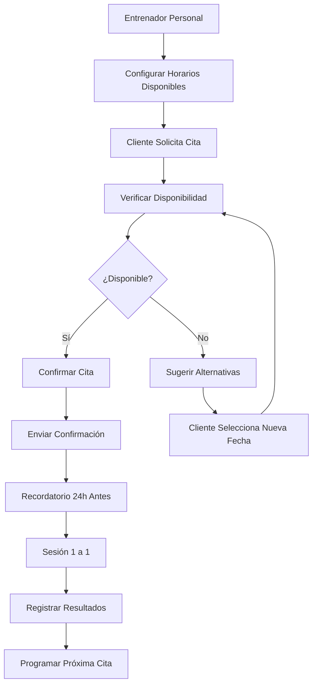
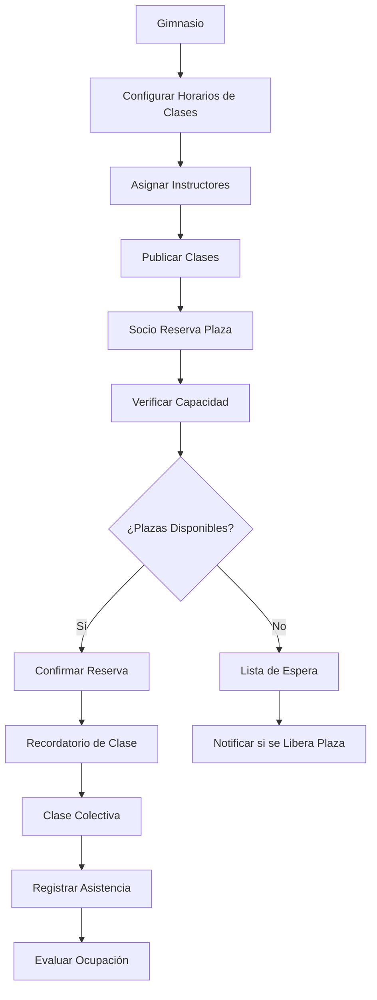

# Objetivo

**URL:** https://www.notion.so/29706f76bed48171836dc1a60509a510
**Extraído el:** 2025-10-29T20:48:44.650Z

---

> 📅 **Sistema de gestión de agenda diferenciado por tipo de usuario: personal para entrenadores, completa para gimnasios**

# Objetivo

Proporcionar un sistema completo de gestión de agenda y calendario adaptado a las necesidades específicas de cada tipo de usuario. Para entrenadores: agenda personal (sesiones 1 a 1, videollamadas, evaluaciones). Para gimnasios: agenda del centro completo (clases colectivas, horas de fisioterapia, evaluaciones físicas). El sistema debe optimizar la gestión del tiempo y la disponibilidad según el modelo de negocio.

# Diagramas de Flujo

## Flujo de Gestión de Agenda para Entrenadores



## Flujo de Gestión de Agenda para Gimnasios



# Matrices de Recursos

## Funcionalidades Principales

- Vista Personal: Agenda individual para entrenadores con sesiones 1 a 1
- Vista Centro: Agenda completa del gimnasio con clases colectivas
- Gestión de Horarios: Configuración de disponibilidad y horarios de trabajo
- Reservas y Citas: Sistema de reservas para clientes y socios
- Bloqueos de Agenda: Gestión de días libres, vacaciones y mantenimiento
- Recordatorios Automáticos**: Notificaciones de citas y clases
- Integración con Pagos: Cobro automático de sesiones y clases
- Analytics de Ocupación: Métricas de uso y optimización
## Integraciones

- Sistema de Clientes: Gestión de clientes y socios
- Sistema de Pagos: Cobro automático de servicios
- Sistema de Comunicaciones: Notificaciones y recordatorios
- Sistema de Evaluaciones: Citas para evaluaciones físicas
- Sistema de Videollamadas: Integración con plataformas de video
- Sistema de Analytics: Métricas de ocupación y rendimiento
# User Stories

## Para Entrenadores Personales 🧍

- Como entrenador personal, quiero gestionar mi agenda personal con sesiones 1 a 1 para optimizar mi tiempo y ingresos
- Como entrenador personal, necesito que mis clientes puedan reservar citas directamente desde mi portal para facilitar la gestión
- Como entrenador personal, debo poder configurar mis horarios de trabajo y días libres para controlar mi disponibilidad
- Como entrenador personal, quiero recibir recordatorios automáticos de mis citas para no perder ninguna sesión
- Como entrenador personal, necesito poder programar videollamadas para sesiones online cuando no puedo estar presencialmente
- Como entrenador personal, debo poder gestionar evaluaciones físicas y seguimientos de mis clientes en mi agenda
## Para Gimnasios/Centros 🏢

- Como gimnasio, quiero gestionar la agenda completa del centro con todas las clases colectivas y servicios
- Como gerente de gimnasio, necesito asignar instructores a las clases y gestionar sus horarios de trabajo
- Como centro, debo poder configurar la capacidad de cada clase y gestionar las reservas de los socios
- Como gimnasio, quiero que los socios puedan reservar clases directamente desde la app para mejorar la experiencia
- Como centro, necesito gestionar las horas de fisioterapia y evaluaciones físicas como servicios adicionales
- Como gimnasio, debo poder analizar la ocupación de las clases para optimizar la oferta y horarios
# Componentes React

- AgendaCalendar: Componente principal del calendario con vista mensual/semanal/diaria
- VistaPersonal: Vista específica para entrenadores con sesiones 1 a 1
- VistaCentro: Vista completa del gimnasio con todas las clases y servicios
- GestorHorarios: Configuración de horarios de trabajo y disponibilidad
- BloqueosAgenda: Gestión de días libres, vacaciones y mantenimiento
- ReservasCitas: Sistema de reservas para clientes y socios
- RecordatoriosAutomaticos: Sistema de notificaciones de citas y clases
- AnalyticsOcupacion: Métricas de uso y optimización de horarios
# APIs Requeridas

```bash
GET /api/agenda/calendario
POST /api/agenda/citas
PUT /api/agenda/citas/:id
DELETE /api/agenda/citas/:id
GET /api/agenda/disponibilidad
POST /api/agenda/bloqueos
GET /api/agenda/clases
POST /api/agenda/reservas
GET /api/agenda/analytics
```

# Estructura MERN

```bash
agenda/calendario/
├─ page.tsx
├─ api/
│  ├─ calendario.ts
│  ├─ citas.ts
│  └─ disponibilidad.ts
└─ components/
   ├─ AgendaCalendar.tsx
   ├─ VistaPersonal.tsx
   ├─ VistaCentro.tsx
   ├─ GestorHorarios.tsx
   ├─ BloqueosAgenda.tsx
   ├─ ReservasCitas.tsx
   ├─ RecordatoriosAutomaticos.tsx
   └─ AnalyticsOcupacion.tsx
```

# Documentación de Procesos

1. El usuario configura sus horarios de trabajo y disponibilidad en el sistema
1. Para entrenadores: se configuran sesiones 1 a 1, videollamadas y evaluaciones
1. Para gimnasios: se configuran clases colectivas, servicios y horarios del centro
1. Los clientes/socios pueden reservar citas o clases desde su portal
1. El sistema verifica la disponibilidad y confirma la reserva automáticamente
1. Se envían recordatorios automáticos antes de cada cita o clase
1. Se registra la asistencia y se actualiza el historial del cliente/socio
1. El sistema genera analytics de ocupación para optimizar horarios
1. Se pueden gestionar bloqueos de agenda para días libres y mantenimiento
1. El sistema se integra con pagos para cobro automático de servicios
# Nota Final

> 💡 **La Agenda / Calendario es un módulo fundamental que debe adaptarse perfectamente al modelo de negocio. Para entrenadores personales, la gestión individual y personalizada es clave. Para gimnasios, la gestión colectiva y la optimización de recursos es prioritaria. El sistema debe ser intuitivo para los usuarios finales y eficiente para la gestión operativa. La integración con pagos, comunicaciones y analytics es esencial para maximizar la ocupación y los ingresos.**

