# Objetivo

**URL:** https://www.notion.so/29706f76bed4815185fdf5c6307381bd
**Extraído el:** 2025-10-29T20:48:43.844Z

---

> ⚠️ **Sistema de gestión de restricciones alimentarias y alertas de seguridad sanitaria**

# Objetivo

Proporcionar un sistema completo de gestión de restricciones alimentarias y alertas de seguridad sanitaria que garantice la protección de los usuarios. Funcionalidades: alergias, intolerancias, 'no cerdo', restricciones religiosas, alertas de seguridad alimentaria. Esto es sanitario / de seguridad. Cualquier centro que ofrezca nutrición tiene que respetarlo. Este módulo es fundamental para la seguridad y cumplimiento legal de cualquier servicio nutricional.

# Diagramas de Flujo

## Flujo de Gestión de Restricciones Alimentarias

```mermaid
graph TD
    A[Cliente con Restricciones] --> B[Registrar Tipo de Restricción]
    B --> C[Alergias]
    B --> D[Intolerancias]
    B --> E[Religiosas]
    B --> F[Culturales]
    C --> G[Configurar Severidad]
    D --> G
    E --> G
    F --> G
    G --> H[Validar Ingredientes]
    H --> I{Ingrediente Seguro?}
    I -->|Sí| J[Permitir en Plan]
    I -->|No| K[Generar Alerta]
    K --> L[Bloquear Ingrediente]
    L --> M[Notificar Cliente]
    J --> N[Continuar Planificación]
    M --> O[Revisar Plan Alternativo]
```



## Flujo de Validación de Ingredientes

```mermaid
graph TD
    A[Ingrediente en Receta] --> B[Consultar Base de Datos]
    B --> C[Verificar Alérgenos]
    C --> D[Verificar Intolerancias]
    D --> E[Verificar Restricciones Religiosas]
    E --> F[Verificar Restricciones Culturales]
    F --> G{¿Alguna Restricción?}
    G -->|Sí| H[Generar Alerta]
    G -->|No| I[Ingrediente Aprobado]
    H --> J[Bloquear Ingrediente]
    J --> K[Buscar Alternativa]
    K --> L[Proponer Sustitución]
    I --> M[Incluir en Plan]
    L --> N[Validar Sustitución]
```



# Matrices de Recursos

## Funcionalidades Principales

- Gestión de Alergias: Registro y seguimiento de alergias alimentarias
- Intolerancias Alimentarias: Control de intolerancias (lactosa, gluten, etc.)
- Restricciones Religiosas: Respeto a creencias alimentarias (halal, kosher, etc.)
- Restricciones Culturales: Preferencias culturales ('no cerdo', vegetarianismo, etc.)
- Alertas de Seguridad: Notificaciones automáticas de ingredientes problemáticos
- Validación de Ingredientes: Verificación automática de compatibilidad
- Historial de Alertas: Registro completo de restricciones y violaciones
- Sustituciones Automáticas: Propuesta de alternativas seguras
## Integraciones

- Sistema de Dietas: Validación de planes nutricionales
- Recetario: Verificación de ingredientes en recetas
- Base de Datos de Alimentos: Información de alérgenos e ingredientes
- Sistema de Clientes: Perfil individual de restricciones
- Sistema de Comunicaciones: Alertas y notificaciones de seguridad
- Sistema de Compliance: Cumplimiento legal y sanitario
# User Stories

## Para Entrenadores Personales 🧍

- Como entrenador personal, debo registrar todas las alergias alimentarias de mis clientes para garantizar su seguridad
- Como entrenador personal, necesito que el sistema me alerte automáticamente si un ingrediente puede causar una reacción alérgica
- Como entrenador personal, debo respetar las restricciones religiosas de mis clientes (halal, kosher, etc.)
- Como entrenador personal, quiero que el sistema me proponga alternativas seguras cuando un ingrediente esté restringido
- Como entrenador personal, necesito un historial completo de todas las restricciones y alertas de mis clientes
- Como entrenador personal, debo poder configurar la severidad de cada restricción (leve, moderada, severa)
## Para Gimnasios/Centros 🏢

- Como gimnasio, debo cumplir con todas las normativas sanitarias y de seguridad alimentaria
- Como centro, necesito que el sistema me proteja legalmente de demandas por negligencia alimentaria
- Como gimnasio, debo respetar las restricciones religiosas y culturales de todos mis socios
- Como centro, quiero que el sistema valide automáticamente todos los planes nutricionales antes de asignarlos
- Como gimnasio, necesito un sistema de alertas que me notifique inmediatamente sobre cualquier problema de seguridad
- Como centro, debo poder generar reportes de compliance para auditorías sanitarias
# Componentes React

- RestriccionesList: Lista principal de restricciones del cliente
- AlertasAlergias: Sistema de alertas para alergias alimentarias
- ConfiguradorRestricciones: Herramienta para configurar restricciones
- ValidacionIngredientes: Verificación automática de ingredientes
- HistorialAlertas: Registro completo de alertas y restricciones
- SustitucionesSeguras: Propuesta de alternativas seguras
- ReportesCompliance: Generación de reportes de cumplimiento
- NotificacionesSeguridad: Sistema de alertas de seguridad
# APIs Requeridas

```bash
GET /api/nutricion/restricciones
POST /api/nutricion/restricciones
PUT /api/nutricion/restricciones/:id
DELETE /api/nutricion/restricciones/:id
GET /api/nutricion/alertas
POST /api/nutricion/validar-ingrediente
GET /api/nutricion/sustituciones
POST /api/nutricion/compliance
GET /api/nutricion/reportes-seguridad
```

# Estructura MERN

```bash
nutricion/restricciones/
├─ page.tsx
├─ api/
│  ├─ restricciones.ts
│  ├─ alertas.ts
│  └─ validacion.ts
└─ components/
   ├─ RestriccionesList.tsx
   ├─ AlertasAlergias.tsx
   ├─ ConfiguradorRestricciones.tsx
   ├─ ValidacionIngredientes.tsx
   ├─ HistorialAlertas.tsx
   ├─ SustitucionesSeguras.tsx
   ├─ ReportesCompliance.tsx
   └─ NotificacionesSeguridad.tsx
```

# Documentación de Procesos

1. El cliente registra sus restricciones alimentarias en su perfil
1. El sistema valida y categoriza cada restricción por tipo y severidad
1. Al crear un plan nutricional, se verifica cada ingrediente contra las restricciones
1. Si se detecta un conflicto, se genera una alerta automática
1. El sistema propone alternativas seguras para ingredientes problemáticos
1. Se notifica al cliente y al entrenador sobre cualquier restricción violada
1. Se registra todo en el historial para auditorías y seguimiento
1. Se generan reportes de compliance para cumplimiento legal
1. El sistema se actualiza continuamente con nuevas restricciones y alérgenos
1. Se mantiene un registro completo para protección legal y sanitaria
# Nota Final

> 💡 **Las Alertas / Restricciones Alimentarias son un módulo de seguridad sanitaria fundamental que debe ser implementado por cualquier centro que ofrezca servicios nutricionales. No es opcional, es obligatorio para cumplir con normativas sanitarias y proteger la seguridad de los usuarios. El sistema debe ser robusto, automático y generar alertas inmediatas para prevenir cualquier problema de seguridad alimentaria. La protección legal y la responsabilidad social requieren este nivel de control y seguimiento.**

