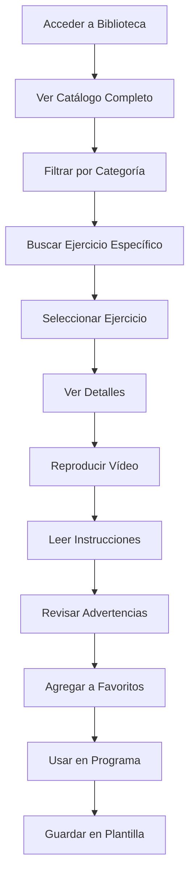
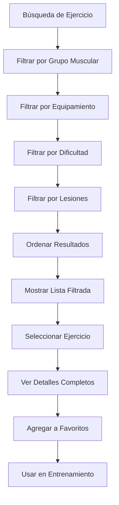

# Objetivo

**URL:** https://www.notion.so/29706f76bed4810d8fa6f99f02e586a1
**Extraído el:** 2025-10-29T20:48:34.972Z

---

> 📚 **Catálogo completo de ejercicios con vídeos, ejecución, advertencias y categorización para entrenadores y gimnasios**

# Objetivo

Proporcionar un catálogo completo de ejercicios con funcionalidades avanzadas para la creación y gestión de programas de entrenamiento. Funcionalidades: catálogo de ejercicios con vídeo, ejecución, advertencias por lesión, búsqueda y filtrado, categorización por grupos musculares. Útil para entrenadores y gimnasios por igual. El sistema debe permitir acceso rápido a ejercicios, visualización detallada, búsqueda eficiente y gestión de favoritos.

# Diagramas de Flujo

## Flujo de Navegación en Biblioteca



## Flujo de Búsqueda y Filtrado



# Matrices de Recursos

## Funcionalidades Principales

- Catálogo Completo: Biblioteca de ejercicios con información detallada
- Reproductor de Vídeo: Visualización de técnica de ejecución
- Instrucciones Detalladas: Guía paso a paso de ejecución
- Advertencias de Lesión: Precauciones y contraindicaciones
- Búsqueda Avanzada: Filtros por múltiples criterios
- Categorización: Organización por grupos musculares
- Sistema de Favoritos: Ejercicios marcados como preferidos
- Integración con Programas: Uso directo en entrenamientos
## Integraciones

- Editor de Entrenamiento: Selección de ejercicios para sesiones
- Sistema de Plantillas: Ejercicios en plantillas reutilizables
- Sistema de Programas: Ejercicios en programas asignados
- Sistema de Progreso: Seguimiento de ejercicios utilizados
- Sistema de Comunicaciones: Compartir ejercicios con clientes
- Sistema de Analytics: Métricas de uso de ejercicios
# User Stories

## Para Entrenadores Personales 🧍

- Como entrenador personal, quiero buscar ejercicios por grupo muscular específico
- Como entrenador personal, necesito ver vídeos de ejecución para enseñar técnica correcta
- Como entrenador personal, debo poder filtrar ejercicios por equipamiento disponible
- Como entrenador personal, quiero revisar advertencias de lesión para clientes con problemas específicos
- Como entrenador personal, necesito marcar ejercicios favoritos para acceso rápido
- Como entrenador personal, debo poder agregar ejercicios directamente a programas de clientes
## Para Gimnasios/Centros 🏢

- Como gimnasio, quiero que mis instructores tengan acceso a ejercicios estandarizados
- Como centro, necesito ejercicios categorizados por tipo de clase
- Como gimnasio, debo poder filtrar ejercicios por equipamiento del centro
- Como centro, quiero ejercicios con diferentes niveles de dificultad
- Como gimnasio, necesito ejercicios que se puedan usar en clases grupales
- Como centro, debo poder crear plantillas con ejercicios de la biblioteca
# Componentes React

- BibliotecaEjercicios: Vista principal del catálogo de ejercicios
- VisorEjercicio: Visor detallado de ejercicio individual
- BuscadorEjercicios: Motor de búsqueda avanzada
- FiltrosCategoria: Sistema de filtros por categorías
- ReproductorVideo: Reproductor de vídeos de ejercicios
- GestorFavoritos: Gestión de ejercicios favoritos
- AdvertenciasLesion: Sistema de advertencias y contraindicaciones
- IntegradorProgramas: Integración con programas de entrenamiento
# APIs Requeridas

```bash
GET /api/entrenamiento/ejercicios
GET /api/entrenamiento/ejercicios/:id
GET /api/entrenamiento/ejercicios/categorias
GET /api/entrenamiento/ejercicios/buscar
POST /api/entrenamiento/ejercicios/favoritos
GET /api/entrenamiento/ejercicios/favoritos
POST /api/entrenamiento/ejercicios/usar
GET /api/entrenamiento/ejercicios/analytics
```

# Estructura MERN

```bash
entrenamiento/biblioteca/
├─ page.tsx
├─ api/
│  ├─ ejercicios.ts
│  ├─ categorias.ts
│  └─ favoritos.ts
└─ components/
   ├─ BibliotecaEjercicios.tsx
   ├─ VisorEjercicio.tsx
   ├─ BuscadorEjercicios.tsx
   ├─ FiltrosCategoria.tsx
   ├─ ReproductorVideo.tsx
   ├─ GestorFavoritos.tsx
   ├─ AdvertenciasLesion.tsx
   └─ IntegradorProgramas.tsx
```

# Documentación de Procesos

1. El usuario accede a la biblioteca de ejercicios
1. Se visualiza el catálogo completo con opciones de filtrado
1. Se aplican filtros por grupo muscular, equipamiento o dificultad
1. Se selecciona un ejercicio específico para ver detalles
1. Se visualiza la información completa: vídeo, instrucciones, advertencias
1. Se reproduce el vídeo de ejecución para ver la técnica
1. Se revisan las advertencias de lesión y contraindicaciones
1. Se agrega el ejercicio a favoritos si es necesario
1. Se integra el ejercicio en un programa o plantilla
1. Se guarda y programa la sesión con el ejercicio seleccionado
# Nota Final

> 💡 **La biblioteca de ejercicios es un activo fundamental que vale igual para entrenadores y gimnasios. Proporciona la base técnica para la creación de programas de entrenamiento efectivos y seguros. La categorización, búsqueda avanzada y sistema de advertencias garantizan que tanto entrenadores personales como instructores de gimnasio puedan acceder rápidamente a ejercicios apropiados, con información completa sobre técnica, equipamiento y precauciones de seguridad.**

