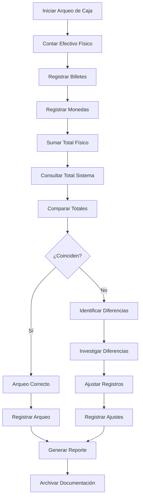
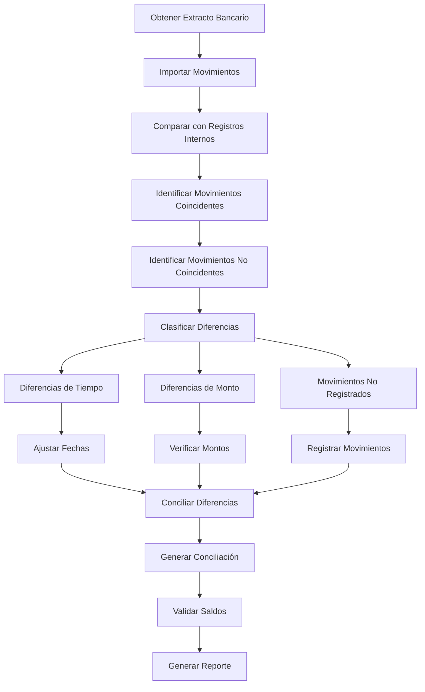

# Objetivo

**URL:** https://www.notion.so/29806f76bed481bd8b24faf6577f7792
**Extraído el:** 2025-10-29T20:48:58.843Z

---

> 🏦 **Sistema de gestión de caja física y bancos para negocios con recepción y TPV**

# Objetivo

Proporcionar un sistema completo de gestión de caja y bancos para negocios con recepción y TPV. Funcionalidades: arqueo de caja física, conciliación bancaria, control de TPV, gestión de movimientos. Típico en negocio con recepción y TPV. El entrenador suelto rara vez tiene 'caja del centro'. Este módulo optimiza el control de efectivo y la gestión bancaria para mantener la transparencia financiera.

# Diagramas de Flujo

## Flujo de Arqueo de Caja



## Flujo de Conciliación Bancaria



# Matrices de Movimientos

## Funcionalidades Principales

- Arqueo de Caja Física: Control diario de efectivo en caja
- Conciliación Bancaria: Sincronización con extractos bancarios
- Control de TPV: Gestión de terminales de pago
- Gestión de Movimientos: Registro de todas las transacciones
- Control de Diferencias: Identificación y resolución de discrepancias
- Reportes de Caja: Análisis de movimientos de efectivo
- Integración Bancaria: Conexión con sistemas bancarios
- Auditoría de Caja: Trazabilidad completa de movimientos
## Tipos de Movimientos

- Ingresos en Efectivo: Pagos en efectivo de clientes
- Pagos en Efectivo: Gastos pagados en efectivo
- Transferencias Bancarias: Movimientos entre cuentas
- Pagos con TPV: Transacciones con tarjeta
- Depósitos Bancarios: Ingresos de efectivo al banco
- Retiros Bancarios: Extracciones de efectivo
# User Stories

## Para Gimnasios/Centros 🏢

- Como gimnasio, quiero hacer arqueo de caja diario para controlar el efectivo
- Como centro, necesito conciliar los movimientos bancarios con mis registros
- Como gimnasio, debo controlar los pagos con TPV para evitar fraudes
- Como centro, quiero registrar todos los movimientos de caja para auditoría
- Como gimnasio, necesito identificar diferencias entre caja física y sistema
- Como centro, debo generar reportes de caja para la dirección
## Para Recepcionistas 👨‍💼

- Como recepcionista, quiero registrar fácilmente los pagos en efectivo
- Como recepcionista, necesito procesar pagos con TPV de forma segura
- Como recepcionista, debo poder hacer arqueo de caja al final del día
- Como recepcionista, quiero ver el estado de la caja en tiempo real
- Como recepcionista, necesito recibir alertas cuando hay diferencias
- Como recepcionista, debo poder generar comprobantes de pago
## Para Contadores 👨‍💼

- Como contador, quiero conciliar automáticamente los movimientos bancarios
- Como contador, necesito identificar diferencias entre registros y bancos
- Como contador, debo poder generar reportes de conciliación
- Como contador, quiero auditar todos los movimientos de caja
- Como contador, necesito integrar los datos con el sistema contable
- Como contador, debo poder exportar datos para auditorías externas
# Componentes React

- CajaManager: Componente principal de gestión de caja
- ArqueoCaja: Sistema de arqueo de caja física
- ConciliacionBancaria: Sistema de conciliación bancaria
- ControlTPV: Gestión de terminales de pago
- MovimientosBancarios: Registro de movimientos bancarios
- ControlDiferencias: Gestión de diferencias de caja
- ReportesCaja: Análisis y reportes de caja
- AuditoriaCaja: Sistema de auditoría de movimientos
# APIs Requeridas

```bash
GET /api/finanzas/caja
POST /api/finanzas/arqueo
GET /api/finanzas/bancos
POST /api/finanzas/conciliacion
GET /api/finanzas/movimientos
POST /api/finanzas/movimientos
GET /api/finanzas/tpv
POST /api/finanzas/diferencias
```

# Estructura MERN

```bash
finanzas/caja/
├─ page.tsx
├─ api/
│  ├─ caja.ts
│  ├─ bancos.ts
│  └─ movimientos.ts
└─ components/
   ├─ CajaManager.tsx
   ├─ ArqueoCaja.tsx
   ├─ ConciliacionBancaria.tsx
   ├─ ControlTPV.tsx
   ├─ MovimientosBancarios.tsx
   ├─ ControlDiferencias.tsx
   ├─ ReportesCaja.tsx
   └─ AuditoriaCaja.tsx
```

# Documentación de Procesos

1. Se registran todos los movimientos de caja en tiempo real
1. Se realiza arqueo de caja física al final de cada día
1. Se comparan los totales físicos con los registros del sistema
1. Se identifican y documentan las diferencias encontradas
1. Se concilian los movimientos bancarios con los extractos
1. Se verifican las transacciones con TPV y se controlan los fraudes
1. Se generan reportes de caja y movimientos para auditoría
1. Se integran los datos con sistemas contables y bancarios
1. Se optimizan los procesos de control basándose en datos históricos
1. Se mantiene un historial completo para auditorías y análisis futuros
# Nota Final

> 💡 **La gestión de Caja & Bancos es típica en negocios con recepción y TPV, donde se maneja efectivo físico y transacciones bancarias. El entrenador suelto rara vez tiene 'caja del centro' porque trabaja de forma independiente. Este módulo es fundamental para gimnasios y centros que manejan efectivo, TPV y múltiples cuentas bancarias, garantizando la transparencia financiera y el control de fraudes.**

