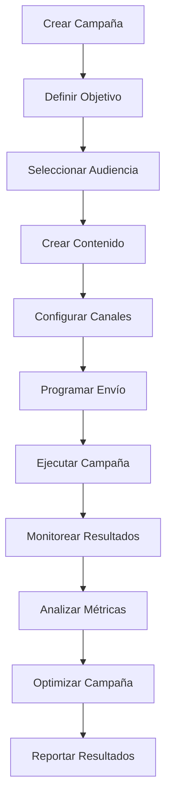
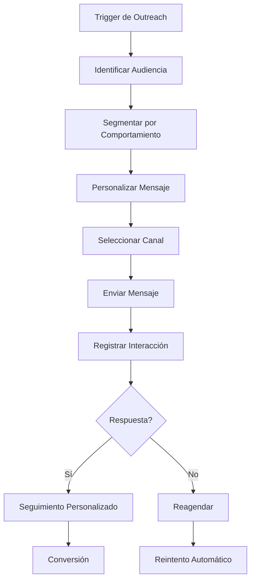

# Objetivo

**URL:** https://www.notion.so/29706f76bed48131aa76c09a47d66ec9
**Extraído el:** 2025-10-29T20:48:31.825Z

---

> 📢 **Sistema de campañas coordinadas y outreach automatizado especializado para gimnasios y centros**

# Objetivo

Proporcionar un sistema completo de gestión de campañas coordinadas y outreach automatizado. Este módulo está especialmente diseñado para gimnasios y centros que necesitan campañas masivas (WhatsApp masivo a leads de Black Friday, emailing a socios a punto de baja). Los entrenadores personales suelen hacer outreach manual desde Leads, no necesitando un módulo de campaña completa con métricas, pero los gimnasios requieren herramientas avanzadas de marketing automation.

# Diagramas de Flujo

## Flujo de Campañas Coordinadas



## Flujo de Outreach Automatizado



# Matrices de Recursos

## Funcionalidades Principales

- Campañas Coordinadas: Gestión de campañas masivas con múltiples canales
- Outreach Automatizado: Secuencias automáticas basadas en comportamiento
- Segmentación Avanzada: Clasificación automática por comportamiento y perfil
- Personalización de Contenido: Mensajes adaptados a cada segmento
- Multi-Canal: WhatsApp, Email, SMS, Push notifications
- Analytics Avanzados: Métricas de conversión, engagement y ROI
## Integraciones

- WhatsApp Business API: Campañas masivas por WhatsApp
- Email Marketing: Mailchimp, ConvertKit, ActiveCampaign
- SMS Gateway: Envío masivo de SMS
- Sistema de CRM: Base de datos de leads y clientes
- Sistema de Eventos: Triggers basados en comportamiento
- Analytics Externos: Google Analytics, Facebook Pixel
# User Stories

## Para Gimnasios/Centros 🏢

- Como gimnasio, quiero crear campañas coordinadas de Black Friday para captar nuevos socios
- Como centro, necesito enviar emailing masivo a socios a punto de baja para retenerlos
- Como gimnasio, debo poder segmentar audiencias por comportamiento y perfil
- Como centro, quiero automatizar secuencias de nurturing para leads calientes
- Como gimnasio, necesito medir el ROI de cada campaña para optimizar el presupuesto
- Como centro, debo poder programar campañas estacionales y promocionales
## Para Entrenadores Personales 🧍

- Como entrenador personal, quiero hacer outreach manual desde mi lista de leads
- Como entrenador personal, necesito seguimiento personalizado con cada lead
- Como entrenador personal, debo poder enviar mensajes personalizados por WhatsApp
- Como entrenador personal, quiero recordatorios para dar seguimiento a leads calientes
# Componentes React

- CampaignsManager: Gestor principal de campañas y outreach
- CampaignBuilder: Constructor de campañas coordinadas
- OutreachAutomation: Automatización de secuencias de outreach
- AudienceSegmenter: Segmentación avanzada de audiencias
- ContentPersonalizer: Personalización de contenido por segmento
- MultiChannelSender: Envío multi-canal coordinado
- CampaignAnalytics: Analytics y métricas de campañas
- ROITracker: Seguimiento de ROI y efectividad
# APIs Requeridas

```bash
GET /api/campaigns
POST /api/campaigns
PUT /api/campaigns/:id
DELETE /api/campaigns/:id
GET /api/campaigns/outreach
POST /api/campaigns/send
GET /api/campaigns/analytics
POST /api/campaigns/segment
GET /api/campaigns/roi
POST /api/campaigns/automation
```

# Estructura MERN

```bash
marketing/campaigns/
├─ page.tsx
├─ api/
│  ├─ campaigns.ts
│  ├─ outreach.ts
│  ├─ analytics.ts
│  └─ automation.ts
└─ components/
   ├─ CampaignsManager.tsx
   ├─ CampaignBuilder.tsx
   ├─ OutreachAutomation.tsx
   ├─ AudienceSegmenter.tsx
   ├─ ContentPersonalizer.tsx
   ├─ MultiChannelSender.tsx
   ├─ CampaignAnalytics.tsx
   └─ ROITracker.tsx
```

# Documentación de Procesos

1. Se define el objetivo de la campaña (captación, retención, promoción)
1. Se selecciona y segmenta la audiencia objetivo
1. Se crea el contenido personalizado para cada segmento
1. Se configuran los canales de comunicación (WhatsApp, Email, SMS)
1. Se programa el envío y se ejecuta la campaña
1. Se monitorean los resultados en tiempo real
1. Se analizan las métricas y se optimiza para futuras campañas
# Nota Final

> 💡 **El sistema de campañas y outreach está especialmente diseñado para gimnasios que necesitan campañas coordinadas masivas (Black Friday, retención de socios). Los entrenadores personales pueden usar funcionalidades básicas para outreach manual, pero el módulo completo es ideal para centros que requieren marketing automation avanzado con métricas detalladas y segmentación compleja.**

