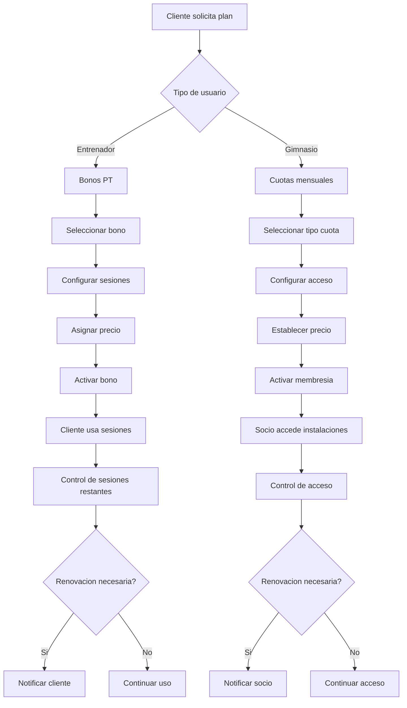

# Catálogo de Planes / Bonos - Documentación Completa

**URL:** https://www.notion.so/29906f76bed48193ab04e1ae04a61742
**Extraído el:** 2025-10-29T20:48:10.149Z

---

# Catálogo de Planes / Bonos - Documentación Completa

Esta página sirve como documentación completa del módulo de gestión de planes y bonos del software fitness. El módulo se adapta según el tipo de usuario:

- Para entrenadores: bonos de 10 sesiones PT, plan mensual 1 a 1
- Para gimnasios: tipos de cuota (básica, premium, libre acceso), clases ilimitadas
## Diagramas de Flujo de Planes

Los diagramas de flujo muestran el proceso completo de gestion de planes y bonos:



## Matrices de Bonos

Tabla de configuraciones de bonos para entrenadores:

- Bono Basico: 5 sesiones - 150�,� - Validez 3 meses
- Bono Estandar: 10 sesiones - 280�,� - Validez 6 meses
- Bono Premium: 20 sesiones - 500�,� - Validez 12 meses
## Configuraciones de Tipos

Configuraciones especificas para cada tipo de plan:

- Bonos PT (Entrenadores):
- Cuotas Gimnasio:
## Componentes React

Documentacion de componentes React para el modulo de planes y bonos:

### CatalogoPlanes

```typescript
interface CatalogoPlanesProps {
  userType: 'entrenador' | 'gimnasio';
  planes: Plan[];
  onSelectPlan: (plan: Plan) => void;
  onEditPlan: (plan: Plan) => void;
  onDeletePlan: (planId: string) => void;
}

const CatalogoPlanes: React.FC<CatalogoPlanesProps> = ({
  userType,
  planes,
  onSelectPlan,
  onEditPlan,
  onDeletePlan
}) => {
  return (
    <div className='catalogo-planes'>
      <h2>Catalogo de Planes</h2>
      <div className='planes-grid'>
        {planes.map(plan => (
          <PlanCard
            key={plan.id}
            plan={plan}
            userType={userType}
            onSelect={onSelectPlan}
            onEdit={onEditPlan}
            onDelete={onDeletePlan}
          />
        ))}
      </div>
    </div>
  );
};
```

### GestorBonos

```typescript
interface GestorBonosProps {
  bonos: Bono[];
  onCreateBono: (bono: CreateBonoRequest) => void;
  onUpdateBono: (id: string, bono: UpdateBonoRequest) => void;
  onDeleteBono: (id: string) => void;
}

const GestorBonos: React.FC<GestorBonosProps> = ({
  bonos,
  onCreateBono,
  onUpdateBono,
  onDeleteBono
}) => {
  const [showCreateForm, setShowCreateForm] = useState(false);
  
  return (
    <div className='gestor-bonos'>
      <div className='header'>
        <h2>Gestion de Bonos</h2>
        <button onClick={() => setShowCreateForm(true)}>
          Crear Nuevo Bono
        </button>
      </div>
      
      {showCreateForm && (
        <BonoForm
          onSubmit={onCreateBono}
          onCancel={() => setShowCreateForm(false)}
        />
      )}
      
      <BonosList
        bonos={bonos}
        onEdit={onUpdateBono}
        onDelete={onDeleteBono}
      />
    </div>
  );
};
```

### TiposCuota

```typescript
interface TiposCuotaProps {
  tiposCuota: TipoCuota[];
  onCreateTipo: (tipo: CreateTipoCuotaRequest) => void;
  onUpdateTipo: (id: string, tipo: UpdateTipoCuotaRequest) => void;
}

const TiposCuota: React.FC<TiposCuotaProps> = ({
  tiposCuota,
  onCreateTipo,
  onUpdateTipo
}) => {
  return (
    <div className='tipos-cuota'>
      <h2>Tipos de Cuota</h2>
      <div className='tipos-grid'>
        {tiposCuota.map(tipo => (
          <TipoCuotaCard
            key={tipo.id}
            tipo={tipo}
            onEdit={onUpdateTipo}
          />
        ))}
      </div>
      <TipoCuotaForm onSubmit={onCreateTipo} />
    </div>
  );
};
```

### PlanesPersonalizados

```typescript
interface PlanesPersonalizadosProps {
  clienteId: string;
  planesDisponibles: Plan[];
  planesAsignados: PlanAsignado[];
  onAsignarPlan: (clienteId: string, planId: string) => void;
  onDesasignarPlan: (asignacionId: string) => void;
}

const PlanesPersonalizados: React.FC<PlanesPersonalizadosProps> = ({
  clienteId,
  planesDisponibles,
  planesAsignados,
  onAsignarPlan,
  onDesasignarPlan
}) => {
  return (
    <div className='planes-personalizados'>
      <h2>Planes Personalizados</h2>
      
      <div className='planes-asignados'>
        <h3>Planes Activos</h3>
        {planesAsignados.map(asignacion => (
          <PlanAsignadoCard
            key={asignacion.id}
            asignacion={asignacion}
            onDesasignar={onDesasignarPlan}
          />
        ))}
      </div>
      
      <div className='planes-disponibles'>
        <h3>Planes Disponibles</h3>
        {planesDisponibles.map(plan => (
          <PlanDisponibleCard
            key={plan.id}
            plan={plan}
            onAsignar={() => onAsignarPlan(clienteId, plan.id)}
          />
        ))}
      </div>
    </div>
  );
};
```

### ConfiguradorPrecios

```typescript
interface ConfiguradorPreciosProps {
  plan: Plan;
  onUpdatePrecio: (planId: string, precio: PrecioConfig) => void;
}

const ConfiguradorPrecios: React.FC<ConfiguradorPreciosProps> = ({
  plan,
  onUpdatePrecio
}) => {
  const [precioConfig, setPrecioConfig] = useState<PrecioConfig>(plan.precio);
  
  const handleSave = () => {
    onUpdatePrecio(plan.id, precioConfig);
  };
  
  return (
    <div className='configurador-precios'>
      <h2>Configuracion de Precios</h2>
      
      <div className='precio-form'>
        <div className='form-group'>
          <label>Precio Base:</label>
          <input
            type='number'
            value={precioConfig.base}
            onChange={(e) => setPrecioConfig({
              ...precioConfig,
              base: parseFloat(e.target.value)
            })}
          />
        </div>
        
        <div className='form-group'>
          <label>Descuento (%):</label>
          <input
            type='number'
            value={precioConfig.descuento}
            onChange={(e) => setPrecioConfig({
              ...precioConfig,
              descuento: parseFloat(e.target.value)
            })}
          />
        </div>
        
        <div className='form-group'>
          <label>Precio Final:</label>
          <span className='precio-final'>
            {precioConfig.base * (1 - precioConfig.descuento / 100)}�,�
          </span>
        </div>
        
        <button onClick={handleSave}>Guardar Precio</button>
      </div>
    </div>
  );
};
```

## APIs Requeridas

Documentacion de las APIs necesarias para el modulo de planes y bonos:

- GET /api/membresias/planes - Obtener todos los planes disponibles
- POST /api/membresias/planes - Crear un nuevo plan
- PUT /api/membresias/planes/:id - Actualizar un plan existente
- GET /api/membresias/bonos - Obtener todos los bonos
- POST /api/membresias/bonos - Crear un nuevo bono para un cliente
## Estructura de Carpetas MERN

Estructura de carpetas para el stack MERN:

- membresias/planes/page.tsx - Pagina principal del catalogo
- membresias/planes/api/ - API routes para planes
- membresias/planes/components/ - Componentes React del modulo
## Documentacion de Procesos

Procesos principales de la seccion de planes y bonos:

### Proceso de Creacion de Planes

- Definir tipo de plan (bono PT o cuota gimnasio)
- Configurar numero de sesiones o tipo de acceso
- Establecer precio y periodo de validez
- Activar plan en el sistema
### Proceso de Asignacion de Bonos

- Cliente selecciona plan disponible
- Procesar pago del bono
- Activar bono para el cliente
- Enviar confirmacion y detalles del bono
### Proceso de Control de Uso

- Registrar uso de sesion o acceso
- Actualizar contador de sesiones restantes
- Verificar fecha de vencimiento
- Enviar alertas de renovacion si es necesario
## Consideraciones Tecnicas

Aspectos tecnicos importantes para la implementacion:

- Validacion de fechas de vencimiento automatica
- Control de sesiones restantes en tiempo real
- Sistema de notificaciones para renovaciones
- Integracion con sistema de pagos
- Auditoria de cambios en planes y bonos
## Mejores Practicas

Recomendaciones para el desarrollo:

- Usar TypeScript para tipado fuerte
- Implementar validaciones tanto en frontend como backend
- Usar React Query para gestion de estado de servidor
- Implementar manejo de errores robusto
- Crear tests unitarios y de integracion
## Resumen

Esta documentacion proporciona una guia completa para implementar el modulo de Catalogo de Planes / Bonos del software fitness. El modulo se adapta segun el tipo de usuario (entrenador vs gimnasio) y proporciona todas las funcionalidades necesarias para la gestion eficiente de planes y bonos.

URL de la pagina: https://www.notion.so/Cat-logo-de-Planes-Bonos-29906f76bed48193ab04e1ae04a61742

