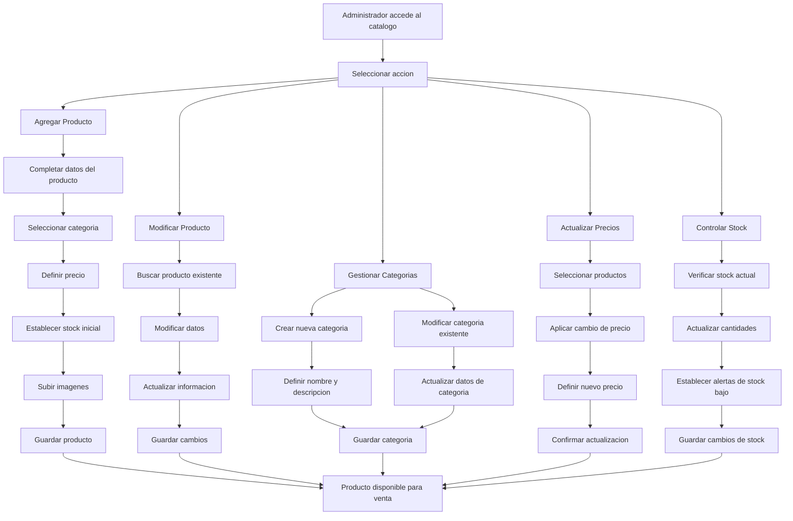

# Catálogo de Productos - Documentacion Completa

**URL:** https://www.notion.so/29906f76bed4815ca58acbb351932988
**Extraído el:** 2025-10-29T20:48:18.145Z

---

# Catálogo de Productos - Documentacion Completa

Esta pagina sirve como documentacion completa del modulo de catalogo de productos del software fitness. Este modulo es util tanto para entrenadores como para gimnasios:

- Stock de suplementos deportivos
- Camisetas y ropa deportiva
- Merchandising del gimnasio
- Gestion completa de productos
- Control de precios y categorias
Este modulo permite gestionar todo el inventario de productos disponibles para la venta, desde suplementos hasta merchandising personalizado.

## Diagramas de Flujo de Catalogo

Los diagramas de flujo muestran el proceso completo de gestion del catalogo de productos:

## Matrices de Productos

Categorias principales de productos en el catalogo:

- Suplementos: Proteinas, creatina, vitaminas, pre-entrenos, BCAA
- Ropa Deportiva: Camisetas, pantalones, shorts, leggings, sudaderas
- Accesorios: Guantes, cinturones, vendas, bandas elasticas, cuerdas
- Merchandising: Gorras, botellas, toallas, mochilas con logo del gimnasio
- Equipamiento: Pesas, mancuernas, kettlebells, equipos de cardio
- Bebidas: Agua, isotonicas, batidos de proteina, energeticas
## Componentes React

Documentacion de componentes React para el modulo de catalogo de productos:

### CatalogoProductos

Componente principal que muestra el catalogo completo de productos. Incluye busqueda, filtros por categoria, ordenamiento y visualizacion en grilla o lista.

### GestorProductos

Componente para la gestion completa de productos. Permite crear, editar, eliminar y duplicar productos con todos sus datos e imagenes.

### CategoriasProductos

Componente para gestionar las categorias de productos. Permite crear, modificar y organizar categorias jerarquicamente.

### PreciosProductos

Componente para gestionar precios de productos. Incluye precios base, descuentos, promociones y calculo de margenes.

### StockProductos

Componente para controlar el stock de productos. Permite actualizar cantidades, establecer alertas de stock bajo y gestionar movimientos de inventario.

## Configuraciones de Categorias

Configuraciones especificas para el sistema de categorias:

- Jerarquia de categorias: Categorias principales y subcategorias
- Iconos de categoria: Iconos personalizados para cada categoria
- Orden de visualizacion: Orden personalizable de categorias
- Filtros por categoria: Filtros automaticos en el catalogo
- Categorias activas/inactivas: Control de visibilidad de categorias
## APIs Requeridas

Documentacion de las APIs necesarias para el modulo de catalogo de productos:

- GET /api/ventas/productos - Obtener lista de productos
- POST /api/ventas/productos - Crear nuevo producto
- PUT /api/ventas/productos/:id - Actualizar producto existente
- GET /api/ventas/categorias - Obtener categorias de productos
- GET /api/ventas/precios - Obtener informacion de precios
## Estructura de Carpetas MERN

Estructura de carpetas para el stack MERN:

- ventas/catalogo/page.tsx - Pagina principal del catalogo
- ventas/catalogo/api/ - API routes para el catalogo
- ventas/catalogo/components/ - Componentes React del catalogo
- ventas/catalogo/hooks/ - Custom hooks para gestion de estado
- ventas/catalogo/utils/ - Utilidades y helpers
- ventas/catalogo/services/ - Servicios de integracion
## Documentacion de Procesos

Procesos principales del modulo de catalogo de productos:

### Proceso de Creacion de Productos

- Definir datos basicos del producto
- Seleccionar categoria apropiada
- Establecer precio de venta
- Definir stock inicial
- Subir imagenes del producto
- Configurar alertas de stock
### Proceso de Gestion de Categorias

- Crear nueva categoria
- Definir jerarquia de categorias
- Asignar iconos y colores
- Configurar orden de visualizacion
### Proceso de Actualizacion de Precios

- Seleccionar productos a actualizar
- Aplicar cambio de precio individual o masivo
- Calcular impacto en margenes
- Notificar cambios a clientes
### Proceso de Control de Stock

- Monitorear niveles de stock
- Generar alertas de stock bajo
- Actualizar cantidades disponibles
- Sincronizar con sistema de ventas
## Consideraciones Tecnicas

Aspectos tecnicos importantes para la implementacion:

- Optimizacion de imagenes para web
- Sistema de cache para productos
- Integracion con sistemas de inventario
- Sistema de busqueda avanzada
- Backup automatico de datos de productos
## Mejores Practicas

Recomendaciones para el desarrollo:

- Usar TypeScript para tipado fuerte
- Implementar paginacion para grandes catalogos
- Usar React Query para gestion de estado de servidor
- Implementar validaciones de datos robustas
- Crear tests unitarios y de integracion
## Resumen

Esta documentacion proporciona una guia completa para implementar el modulo de Catalogo de Productos del software fitness. Este modulo es util tanto para entrenadores como para gimnasios, permitiendo gestionar todo el inventario de productos disponibles para la venta, desde suplementos hasta merchandising personalizado. Proporciona herramientas completas para la gestion de productos, precios, categorias y stock.

URL de la pagina: https://www.notion.so/Cat-logo-de-Productos-29906f76bed4815ca58acbb351932988

