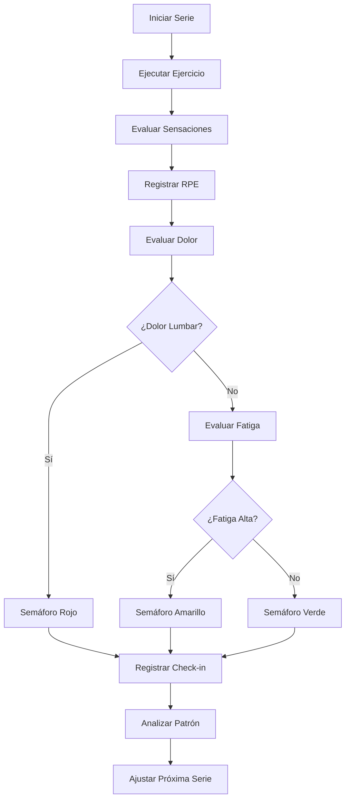
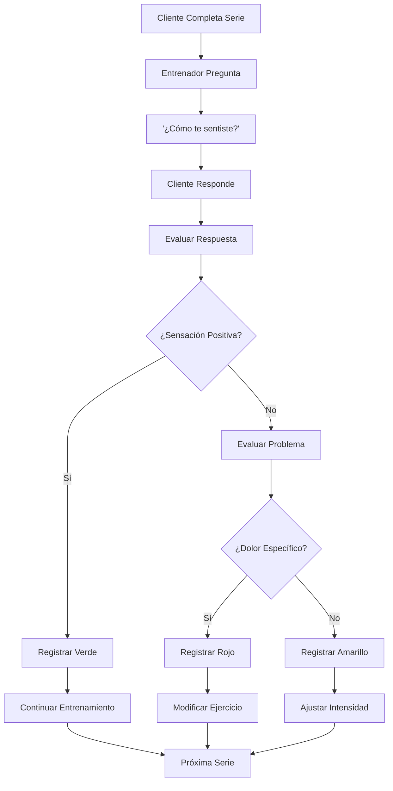

# Objetivo

**URL:** https://www.notion.so/29706f76bed481819186fdc2c5901bc0
**Extraído el:** 2025-10-29T20:48:35.661Z

---

> 🚦 **Sistema de check-ins detallados por serie/set con semáforos, evaluación de sensaciones y seguimiento personalizado para entrenadores 1 a 1**

# Objetivo

Proporcionar un sistema completo de check-ins detallados por serie/set para entrenadores personales que trabajan 1 a 1 con sus clientes. Funcionalidades: semáforos por serie/set, evaluación de sensaciones, dolor lumbar, RPE por ejercicio. Específico para entrenadores 1 a 1: '¿Cómo te sentiste hoy / dolor lumbar?'. Los gimnasios normalmente no revisan check-in individual de cada serie de cada socio porque no hay banda ancha para hacer eso sobre 300 socios. El sistema debe permitir seguimiento detallado, alertas automáticas y análisis de progreso.

# Diagramas de Flujo

## Flujo de Check-ins por Serie



## Flujo de Evaluación de Sensaciones



# Matrices de Recursos

## Funcionalidades Principales

- Semáforos por Serie: Sistema rojo/amarillo/verde para cada serie
- Evaluación de Sensaciones: Registro de cómo se siente el cliente
- Detección de Dolor Lumbar: Monitoreo específico de problemas de espalda
- RPE por Ejercicio: Rate of Perceived Exertion detallado
- Historial de Check-ins: Seguimiento temporal de sensaciones
- Alertas Automáticas: Notificaciones por patrones problemáticos
- Análisis de Patrones: Identificación de tendencias en sensaciones
- Ajustes Automáticos: Modificaciones basadas en check-ins
## Integraciones

- Editor de Entrenamiento: Check-ins durante la creación de sesiones
- Sistema de Programas: Check-ins en programas asignados
- Sistema de Progreso: Análisis de evolución de sensaciones
- Sistema de Clientes: Check-ins específicos por cliente
- Sistema de Comunicaciones: Alertas y notificaciones
- Sistema de Analytics: Métricas de adherencia y sensaciones
# User Stories

## Para Entrenadores Personales 🧍

- Como entrenador personal, quiero registrar check-ins detallados por serie con cada cliente
- Como entrenador personal, necesito usar semáforos para evaluar rápidamente el estado del cliente
- Como entrenador personal, debo poder preguntar '¿Cómo te sentiste hoy?' y registrar la respuesta
- Como entrenador personal, quiero detectar dolor lumbar específico para ajustar ejercicios
- Como entrenador personal, necesito registrar RPE por ejercicio para ajustar intensidad
- Como entrenador personal, debo poder ver historial de check-ins para identificar patrones
- Como entrenador personal, quiero recibir alertas automáticas por patrones problemáticos
## Para Gimnasios/Centros 🏢

- Como gimnasio, normalmente no reviso check-in individual de cada serie de cada socio
- Como centro, no tengo banda ancha para hacer seguimiento detallado sobre 300 socios
- Como gimnasio, me enfoco en métricas de ocupación y uso general del centro
- Como centro, uso check-ins solo para entrenamiento personal premium interno
# Componentes React

- CheckInsEntreno: Sistema principal de check-ins
- SemáforoSerie: Componente de semáforos por serie
- EvaluacionSensaciones: Evaluador de sensaciones del cliente
- HistorialCheckIns: Historial temporal de check-ins
- AlertasDolor: Sistema de alertas por dolor
- RegistradorRPE: Registro de Rate of Perceived Exertion
- AnalizadorPatrones: Análisis de patrones en sensaciones
- AjustadorAutomatico: Ajustes automáticos basados en check-ins
# APIs Requeridas

```bash
GET /api/entrenamiento/checkins
POST /api/entrenamiento/checkins
PUT /api/entrenamiento/checkins/:id
GET /api/entrenamiento/checkins/historial
POST /api/entrenamiento/checkins/alerta
GET /api/entrenamiento/checkins/patrones
POST /api/entrenamiento/checkins/ajuste
GET /api/entrenamiento/checkins/analytics
```

# Estructura MERN

```bash
entrenamiento/checkins/
├─ page.tsx
├─ api/
│  ├─ checkins.ts
│  ├─ patrones.ts
│  └─ alertas.ts
└─ components/
   ├─ CheckInsEntreno.tsx
   ├─ SemáforoSerie.tsx
   ├─ EvaluacionSensaciones.tsx
   ├─ HistorialCheckIns.tsx
   ├─ AlertasDolor.tsx
   ├─ RegistradorRPE.tsx
   ├─ AnalizadorPatrones.tsx
   └─ AjustadorAutomatico.tsx
```

# Documentación de Procesos

1. El cliente inicia una serie de ejercicios
1. El entrenador pregunta '¿Cómo te sentiste hoy?' después de cada serie
1. Se registra la respuesta y se evalúa el estado del cliente
1. Se asigna un semáforo (rojo/amarillo/verde) según la evaluación
1. Se registra el RPE (Rate of Perceived Exertion) por ejercicio
1. Se evalúa específicamente dolor lumbar si está presente
1. Se guarda el check-in en el historial del cliente
1. Se analizan patrones para identificar tendencias problemáticas
1. Se generan alertas automáticas si se detectan problemas
1. Se ajustan automáticamente las próximas series según los check-ins
# Nota Final

> 💡 **Los check-ins de entrenamiento son específicos para entrenadores personales que trabajan 1 a 1 con sus clientes. Este nivel de detalle no es práctico para gimnasios que manejan cientos de socios, pero es fundamental para entrenadores personales que necesitan monitorear cada serie, evaluar sensaciones, detectar dolor lumbar y ajustar la intensidad en tiempo real. El sistema de semáforos proporciona feedback visual inmediato, mientras que el análisis de patrones permite identificar tendencias y optimizar el entrenamiento.**

