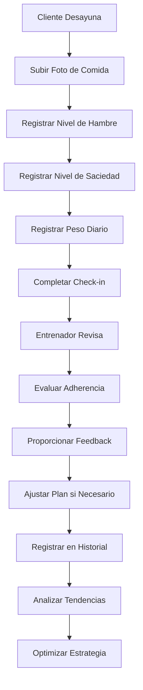
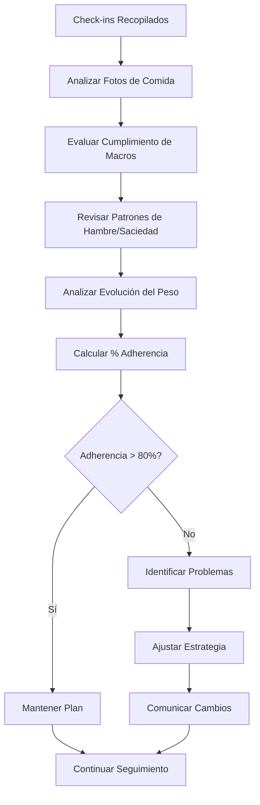

# Objetivo

**URL:** https://www.notion.so/29706f76bed481819a27e11a469e7797
**Extraído el:** 2025-10-29T20:48:40.858Z

---

> 🍎 **Sistema de seguimiento nutricional detallado para entrenadores 1 a 1 con check-ins diarios**

# Objetivo

Proporcionar un sistema completo de seguimiento nutricional detallado para entrenadores personales que trabajan 1 a 1 con sus clientes. Funcionalidades: revisar fotos de comidas, hambre, saciedad, peso diario, seguimiento de adherencia nutricional. Específico para entrenadores 1 a 1. Un gimnasio normal NO quiere entrar cada mañana a mirar si Pepe desayunó avena, salvo que sea un gimnasio boutique que vende nutrición premium como upsell. Este módulo permite un seguimiento personalizado y detallado de la adherencia nutricional.

# Diagramas de Flujo

## Flujo de Check-ins Nutricionales Diarios



## Flujo de Evaluación de Adherencia



# Matrices de Recursos

## Funcionalidades Principales

- Fotos de Comidas: Registro visual de cada comida del día
- Seguimiento de Hambre: Escala de 1-10 para evaluar sensaciones
- Seguimiento de Saciedad: Evaluación post-comida de satisfacción
- Peso Diario: Registro de peso corporal para seguimiento de progreso
- Adherencia Nutricional: Cálculo del cumplimiento del plan alimentario
- Historial Detallado: Registro completo de todos los check-ins
- Análisis de Tendencias: Identificación de patrones y comportamientos
- Feedback Personalizado: Comentarios y ajustes del entrenador
## Integraciones

- Sistema de Dietas: Integración con planes nutricionales asignados
- Módulo de Clientes: Seguimiento individual por cliente
- Sistema de Progreso: Integración con métricas de rendimiento
- Sistema de Comunicaciones: Notificaciones y recordatorios
- Sistema de Analytics: Métricas de adherencia y efectividad
# User Stories

## Para Entrenadores Personales 🧍

- Como entrenador personal, quiero que mis clientes suban fotos de cada comida para verificar que están siguiendo su plan nutricional
- Como entrenador personal, necesito que mis clientes registren su nivel de hambre antes y después de cada comida para entender sus patrones alimentarios
- Como entrenador personal, debo poder ver el peso diario de mis clientes para hacer ajustes en tiempo real a su plan nutricional
- Como entrenador personal, quiero calcular el porcentaje de adherencia nutricional de cada cliente para identificar quién necesita más apoyo
- Como entrenador personal, necesito poder dar feedback inmediato a mis clientes sobre sus check-ins para mantenerlos motivados
- Como entrenador personal, debo poder analizar las tendencias de mis clientes para optimizar sus estrategias nutricionales
## Para Gimnasios Boutique Premium 🏢

- Como gimnasio boutique, quiero ofrecer seguimiento nutricional premium como servicio adicional para justificar precios más altos
- Como centro premium, necesito que mis nutricionistas puedan hacer seguimiento detallado de clientes VIP con planes nutricionales personalizados
- Como gimnasio boutique, debo poder diferenciar entre servicios básicos y premium basándome en el nivel de seguimiento nutricional
- Como centro premium, quiero que el sistema me permita cobrar extra por el seguimiento nutricional detallado como upsell
## Para Gimnasios Regulares 🏢

- Como gimnasio regular, normalmente NO quiero entrar cada mañana a revisar si Pepe desayunó avena, ya que no tengo la capacidad operativa
- Como gimnasio estándar, mi enfoque está en métricas de ocupación de clases y membresías, no en seguimiento individual de alimentación
- Como centro regular, no tengo la infraestructura para hacer seguimiento nutricional detallado de cientos de socios
# Componentes React

- CheckInsNutricion: Componente principal para gestión de check-ins nutricionales
- FotosComida: Interfaz para subir y revisar fotos de comidas
- SeguimientoPeso: Registro y visualización del peso diario
- EvaluacionHambre: Escalas para hambre y saciedad
- HistorialNutricional: Visualización del historial completo de check-ins
- CalculadoraAdherencia: Cálculo del porcentaje de cumplimiento
- AnalizadorTendencias: Análisis de patrones nutricionales
- FeedbackEntrenador: Sistema de comentarios y ajustes
# APIs Requeridas

```bash
GET /api/nutricion/checkins
POST /api/nutricion/checkins
PUT /api/nutricion/checkins/:id
DELETE /api/nutricion/checkins/:id
GET /api/nutricion/peso
POST /api/nutricion/fotos
GET /api/nutricion/adherencia
GET /api/nutricion/tendencias
POST /api/nutricion/feedback
GET /api/nutricion/analytics
```

# Estructura MERN

```bash
nutricion/checkins/
├─ page.tsx
├─ api/
│  ├─ checkins.ts
│  ├─ peso.ts
│  └─ fotos.ts
└─ components/
   ├─ CheckInsNutricion.tsx
   ├─ FotosComida.tsx
   ├─ SeguimientoPeso.tsx
   ├─ EvaluacionHambre.tsx
   ├─ HistorialNutricional.tsx
   ├─ CalculadoraAdherencia.tsx
   ├─ AnalizadorTendencias.tsx
   └─ FeedbackEntrenador.tsx
```

# Documentación de Procesos

1. El cliente accede a su portal y ve las tareas nutricionales del día
1. Antes de cada comida, registra su nivel de hambre en una escala del 1-10
1. Después de comer, sube una foto de su comida y registra su nivel de saciedad
1. Al final del día, registra su peso corporal en la báscula
1. El sistema calcula automáticamente su porcentaje de adherencia nutricional
1. El entrenador recibe notificaciones de los check-ins completados
1. El entrenador revisa las fotos, métricas y patrones del cliente
1. El entrenador proporciona feedback personalizado y ajustes al plan
1. El sistema analiza las tendencias y genera alertas si es necesario
1. Todo el historial se guarda para análisis a largo plazo y optimización
# Nota Final

> 💡 **Los Check-ins Nutricionales son una herramienta de alto valor para entrenadores personales que trabajan 1 a 1, permitiendo un seguimiento detallado y personalizado. Sin embargo, su implementación a gran escala en gimnasios regulares es inviable debido a la necesidad de atención individualizada. Solo gimnasios boutique que ofrecen nutrición premium como upsell pueden justificar este nivel de seguimiento. El sistema debe ser intuitivo para los clientes y eficiente para los entrenadores, optimizando el tiempo de revisión y feedback.**

