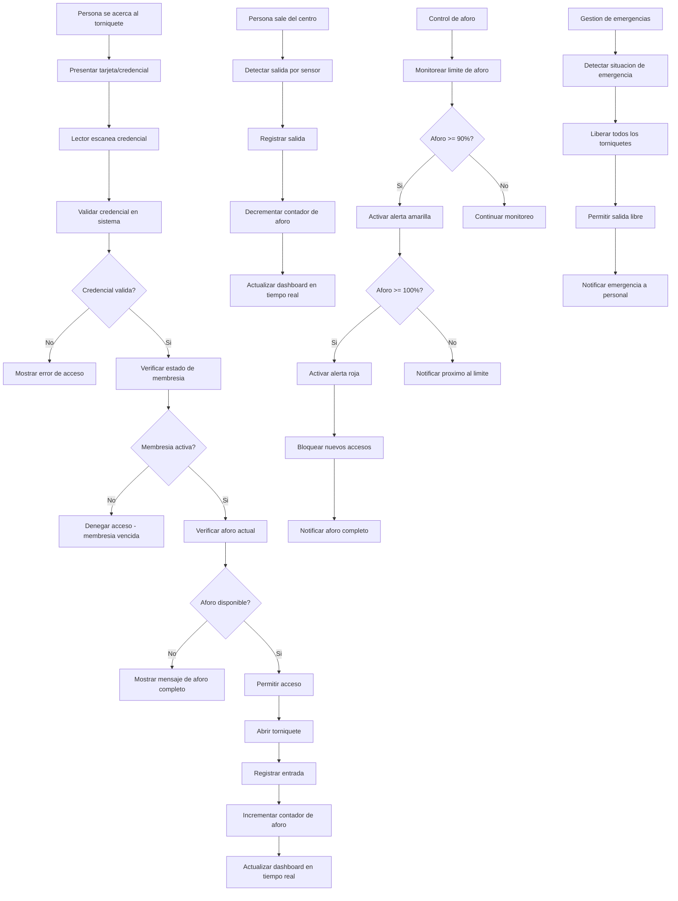

# Control de Acceso & Aforo en Tiempo Real - Documentacion Completa

**URL:** https://www.notion.so/29906f76bed48101bb76eef62c9e26f0
**Extraído el:** 2025-10-29T20:48:24.974Z

---

# Control de Acceso & Aforo en Tiempo Real - Documentacion Completa

Esta pagina sirve como documentacion completa del modulo de control de acceso y aforo del software fitness. Este modulo esta exclusivamente dirigido a gimnasios y centros fitness con sistemas de control de acceso:

## Funcionalidades Principales

- Torniquetes y sistemas de control de acceso
- Conteo de personas dentro del centro en tiempo real
- Control de acceso por tarjeta y credenciales
- Gestion de aforo en tiempo real con alertas
Nota: Un entrenador personal no gestiona aforo de sala propia con lector de tarjetas normalmente. Este modulo es especifico para gimnasios y centros fitness con sistemas de control de acceso fisicos.

## Diagramas de Flujo de Acceso

Los diagramas de flujo muestran el proceso completo de control de acceso y gestion de aforo:

## Matrices de Aforo

Configuraciones de aforo por tipo de espacio:

- Sala de Musculacion: Aforo maximo segun metros cuadrados
- Sala de Cardio: Limite por equipamiento disponible
- Sala de Clases Grupales: Aforo fijo por tipo de clase
- Zona de Piscina: Aforo segun capacidad de agua
- Spa y Sauna: Aforo reducido por seguridad
- Zona de Recepcion: Aforo flexible para consultas
- Vestuarios: Aforo segun capacidad de taquillas
## Componentes React

Documentacion de componentes React para el modulo de control de acceso y aforo:

### ControlAcceso

Componente principal para gestionar el control de acceso. Valida credenciales, verifica membresias y controla el flujo de entrada y salida del centro.

### AforoTiempoReal

Componente para mostrar el aforo en tiempo real. Actualiza constantemente el numero de personas dentro del centro y muestra el porcentaje de ocupacion.

### Torniquetes

Componente para controlar los torniquetes fisicos. Gestiona la apertura y cierre de torniquetes, detecta intentos de acceso no autorizados y maneja situaciones de emergencia.

### ContadorPersonas

Componente para contar personas dentro del centro. Utiliza sensores de entrada y salida para mantener un conteo preciso y actualizado en tiempo real.

### AlertasAforo

Componente para gestionar alertas de aforo. Genera alertas cuando el aforo se acerca al limite, bloquea nuevos accesos cuando se alcanza el maximo y notifica al personal.

## Configuraciones de Torniquetes

Configuraciones especificas para los sistemas de torniquetes:

- Torniquetes de Entrada: Control de acceso principal
- Torniquetes de Salida: Control de salida y conteo
- Lectores de Tarjeta: RFID, NFC, codigo de barras
- Sensores de Deteccion: Infrarrojos, laser, peso
- Modo Emergencia: Liberacion automatica de torniquetes
- Modo Mantenimiento: Bloqueo temporal para reparaciones
## APIs Requeridas

Documentacion de las APIs necesarias para el modulo de control de acceso y aforo:

- GET /api/operaciones/acceso - Obtener estado del control de acceso
- POST /api/operaciones/acceso - Registrar entrada/salida
- GET /api/operaciones/aforo - Obtener aforo actual
- POST /api/operaciones/aforo - Actualizar contador de aforo
- GET /api/operaciones/alertas - Obtener alertas de aforo
## Estructura de Carpetas MERN

Estructura de carpetas para el stack MERN:

- operaciones/acceso/page.tsx - Pagina principal de control de acceso
- operaciones/acceso/api/ - API routes para control de acceso
- operaciones/acceso/components/ - Componentes React de acceso
- operaciones/acceso/hooks/ - Custom hooks para gestion de estado
- operaciones/acceso/utils/ - Utilidades y helpers
- operaciones/acceso/services/ - Servicios de integracion
- operaciones/acceso/types/ - Tipos TypeScript
- operaciones/acceso/sensors/ - Componentes de sensores
## Documentacion de Procesos

Procesos principales del modulo de control de acceso y aforo:

### Proceso de Control de Acceso

- Validacion de credenciales en el sistema
- Verificacion del estado de membresia
- Control de acceso segun tipo de membresia
- Registro de entrada y salida
- Gestion de accesos no autorizados
### Proceso de Gestion de Aforo

- Conteo automatico de personas dentro del centro
- Calculo del porcentaje de ocupacion
- Monitoreo de limites de aforo por zona
- Actualizacion en tiempo real del dashboard
- Gestion de alertas de proximidad al limite
### Proceso de Gestion de Torniquetes

- Control de apertura y cierre de torniquetes
- Deteccion de intentos de acceso no autorizados
- Gestion de situaciones de emergencia
- Mantenimiento y calibracion de sensores
- Registro de incidencias y fallos
### Proceso de Alertas y Notificaciones

- Generacion de alertas por proximidad al limite
- Notificacion de aforo completo
- Alertas de emergencia y evacuacion
- Notificaciones de mantenimiento programado
- Reportes automaticos de actividad diaria
## Consideraciones Tecnicas

Aspectos tecnicos importantes para la implementacion:

- Integracion con sistemas de torniquetes fisicos
- Sistema de sensores de deteccion preciso
- Actualizacion en tiempo real del aforo
- Sistema de respaldo para situaciones de emergencia
- Gestion de fallos de sensores y torniquetes
- Sistema de alertas y notificaciones automaticas
## Mejores Practicas

Recomendaciones para el desarrollo:

- Usar TypeScript para tipado fuerte
- Implementar validaciones de acceso robustas
- Usar React Query para gestion de estado de servidor
- Implementar manejo de errores robusto
- Crear tests unitarios y de integracion
- Implementar sistema de monitoreo continuo
## Resumen

Esta documentacion proporciona una guia completa para implementar el modulo de Control de Acceso & Aforo en Tiempo Real del software fitness. Este modulo esta exclusivamente dirigido a gimnasios y centros fitness con sistemas de control de acceso fisicos, proporcionando gestion completa de torniquetes, conteo de personas dentro del centro, control de acceso por tarjeta y gestion de aforo en tiempo real. Un entrenador personal no gestiona aforo de sala propia con lector de tarjetas normalmente. Incluye sistema de alertas automaticas, gestion de emergencias y monitoreo continuo del aforo.

URL de la pagina: https://www.notion.so/Control-de-Acceso-Aforo-en-Tiempo-Real-29906f76bed48101bb76eef62c9e26f0

