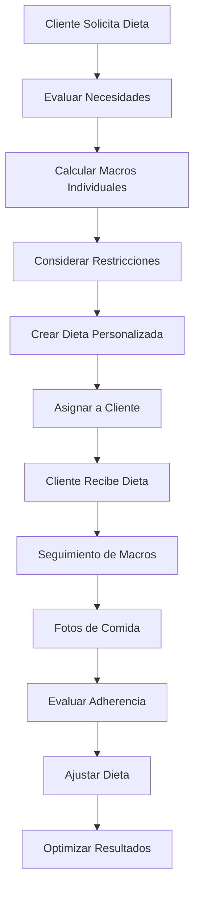
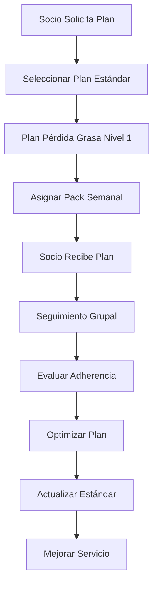

# Objetivo

**URL:** https://www.notion.so/29706f76bed481ee855afc7f94790ebe
**Extraído el:** 2025-10-29T20:48:37.790Z

---

> 🥗 **Sistema de gestión de dietas con asignación diferenciada para entrenadores personales y gimnasios**

# Objetivo

Proporcionar un sistema completo de gestión de dietas con asignación diferenciada según el tipo de negocio. Para entrenadores personales: cada cliente tiene su dieta individual, ajustada por macros, restricciones y fotos de comida. Para gimnasios: planes tipo 'Plan pérdida grasa nivel 1', packs semanales, nutrición como servicio extra, gestión más estandarizada. El sistema debe permitir creación, asignación, seguimiento y gestión de dietas adaptadas a cada tipo de negocio.

# Diagramas de Flujo

## Flujo de Gestión de Dietas para Entrenadores



## Flujo de Gestión de Dietas para Gimnasios



# Matrices de Recursos

## Funcionalidades Principales

- Dietas Individuales: Para entrenadores personales
- Planes Estándar: Para gimnasios y centros
- Cálculo de Macros: Personalizado por cliente
- Gestión de Restricciones: Alergias e intolerancias
- Seguimiento de Fotos: Control visual de comidas
- Packs Semanales: Planes estructurados por semanas
- Nutrición como Servicio: Upsell para gimnasios
- Gestión Estandarizada: Procesos optimizados para centros
## Integraciones

- Sistema de Clientes: Base de datos de clientes y socios
- Editor de Dieta: Herramienta de creación de dietas
- Sistema de Plantillas: Plantillas nutricionales reutilizables
- Sistema de Progreso: Relación entre dieta y resultados
- Sistema de Comunicaciones: Recordatorios y motivación
- Sistema de Analytics: Métricas de adherencia nutricional
# User Stories

## Para Entrenadores Personales 🧍

- Como entrenador personal, quiero crear dietas individuales para cada cliente
- Como entrenador personal, necesito ajustar macros según objetivos específicos
- Como entrenador personal, debo considerar restricciones alimentarias de cada cliente
- Como entrenador personal, quiero que mis clientes envíen fotos de comida
- Como entrenador personal, necesito seguir la adherencia nutricional de cada cliente
- Como entrenador personal, debo poder ajustar dietas según progreso
## Para Gimnasios/Centros 🏢

- Como gimnasio, quiero ofrecer planes estándar como 'Plan pérdida grasa nivel 1'
- Como centro, necesito crear packs semanales estructurados
- Como gimnasio, debo poder ofrecer nutrición como servicio extra
- Como centro, quiero gestionar planes de forma estandarizada
- Como gimnasio, necesito escalar el servicio nutricional
- Como centro, debo poder optimizar planes basándose en resultados
# Componentes React

- DietasList: Lista principal de dietas asignadas
- AsignacionDieta: Sistema de asignación de dietas
- PlanesNutricion: Gestión de planes nutricionales
- SeguimientoMacros: Seguimiento de macronutrientes
- FotosComida: Sistema de fotos de comidas
- GestorRestricciones: Gestión de restricciones alimentarias
- PacksSemanales: Gestión de packs semanales
- AnalyticsNutricion: Métricas de adherencia nutricional
# APIs Requeridas

```bash
GET /api/nutricion/dietas
POST /api/nutricion/dietas
PUT /api/nutricion/dietas/:id
GET /api/nutricion/planes
POST /api/nutricion/asignar
GET /api/nutricion/dietas/cliente/:id
POST /api/nutricion/dietas/ajustar
GET /api/nutricion/dietas/analytics
```

# Estructura MERN

```bash
nutricion/dietas/
├─ page.tsx
├─ api/
│  ├─ dietas.ts
│  ├─ planes.ts
│  └─ asignacion.ts
└─ components/
   ├─ DietasList.tsx
   ├─ AsignacionDieta.tsx
   ├─ PlanesNutricion.tsx
   ├─ SeguimientoMacros.tsx
   ├─ FotosComida.tsx
   ├─ GestorRestricciones.tsx
   ├─ PacksSemanales.tsx
   └─ AnalyticsNutricion.tsx
```

# Documentación de Procesos

1. Se evalúan las necesidades nutricionales del cliente/socio
1. Para entrenadores: se calculan macros individuales
1. Para gimnasios: se selecciona plan estándar apropiado
1. Se consideran restricciones alimentarias y preferencias
1. Se crea la dieta personalizada o se asigna plan estándar
1. Se asigna la dieta al cliente/socio correspondiente
1. Se inicia el seguimiento de adherencia nutricional
1. Se recopilan fotos de comida para verificación
1. Se evalúa la adherencia y se ajusta la dieta según sea necesario
1. Se optimiza la dieta basándose en resultados y feedback
# Nota Final

> 💡 **La gestión de dietas tiene enfoques completamente diferentes según el tipo de negocio. Para entrenadores personales, cada cliente requiere una dieta individual ajustada por macros, restricciones y seguimiento detallado con fotos de comida. Para gimnasios, se enfoca en planes estándar como 'Plan pérdida grasa nivel 1', packs semanales y nutrición como servicio extra con gestión más estandarizada. El sistema debe adaptarse automáticamente a estas diferencias, proporcionando las herramientas apropiadas para cada tipo de negocio.**

