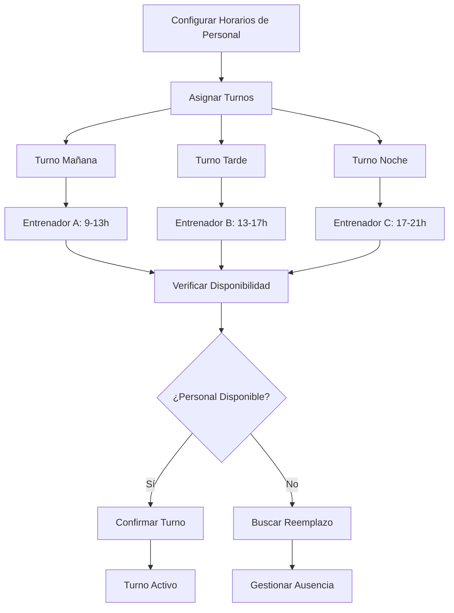
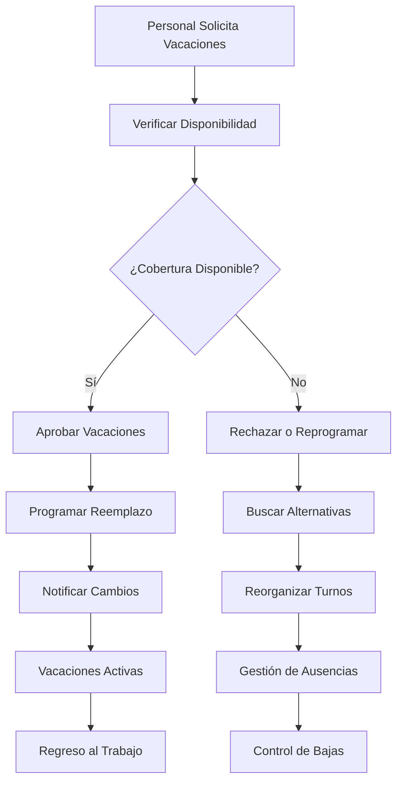

# Objetivo

**URL:** https://www.notion.so/29806f76bed481c5ae04e89bb869a6fe
**Extraído el:** 2025-10-29T20:48:47.683Z

---

> 👥 **Sistema de gestión de turnos y disponibilidad del personal para gimnasios y centros**

# Objetivo

Proporcionar un sistema completo de gestión de turnos y disponibilidad del personal para gimnasios y centros. Funcionalidades: 'qué entrenador está en el centro de 9 a 13', 'qué fisio está hoy', gestión de recursos humanos físicos, cuadrantes de personal, vacaciones, bajas. Específico para gimnasios/centros. Este módulo optimiza la gestión del personal y asegura la cobertura adecuada de servicios.

# Diagramas de Flujo

## Flujo de Gestión de Turnos



## Flujo de Gestión de Vacaciones y Bajas



# Matrices de Recursos

## Funcionalidades Principales

- Gestión de Turnos: Asignación y control de turnos del personal
- Disponibilidad del Personal: Control de quién está disponible en cada momento
- Cuadrantes de Personal: Programación semanal/mensual del personal
- Gestión de Vacaciones: Control de vacaciones y días libres
- Control de Bajas: Gestión de bajas médicas y ausencias
- Reemplazos**: Sistema de reemplazos y suplencias
- Horarios Flexibles: Adaptación a necesidades del personal
- Analytics de Personal: Métricas de ocupación y rendimiento
## Integraciones

- Sistema de RRHH: Gestión completa de recursos humanos
- Sistema de Clases: Asignación de instructores a clases
- Sistema de Comunicaciones: Notificaciones al personal
- Sistema de Pagos: Cálculo de nóminas y horas extras
- Sistema de Evaluaciones: Rendimiento del personal
- Sistema de Analytics: Métricas de gestión de personal
# User Stories

## Para Gimnasios/Centros 🏢

- Como gerente de gimnasio, quiero saber qué entrenador está en el centro de 9 a 13 para coordinar las clases
- Como centro, necesito saber qué fisioterapeuta está disponible hoy para derivar a los socios
- Como gimnasio, debo poder gestionar los cuadrantes de personal para asegurar la cobertura adecuada
- Como centro, quiero controlar las vacaciones del personal para planificar reemplazos
- Como gimnasio, necesito gestionar las bajas médicas y ausencias del personal
- Como centro, debo poder asignar reemplazos cuando alguien no puede trabajar
## Para Personal del Gimnasio 👨‍💼

- Como entrenador, quiero ver mis turnos asignados para planificar mi trabajo
- Como fisioterapeuta, necesito solicitar vacaciones con suficiente antelación
- Como instructor, debo poder comunicar mi disponibilidad para turnos extra
- Como personal, quiero recibir notificaciones de cambios en mis turnos
- Como empleado, necesito poder solicitar días libres o cambios de turno
- Como personal, debo poder ver el horario de mis compañeros para coordinación
# Componentes React

- TurnosStaff: Componente principal para gestión de turnos del personal
- GestorPersonal: Sistema de gestión del personal y sus datos
- Cuadrantes: Programación semanal/mensual del personal
- Vacaciones: Gestión de vacaciones y días libres
- Disponibilidad: Control de disponibilidad del personal
- Reemplazos**: Sistema de reemplazos y suplencias
- HorariosFlexibles: Configuración de horarios adaptables
- AnalyticsPersonal: Métricas de gestión de personal
# APIs Requeridas

```bash
GET /api/rrhh/turnos
POST /api/rrhh/turnos
PUT /api/rrhh/turnos/:id
DELETE /api/rrhh/turnos/:id
GET /api/rrhh/personal
POST /api/rrhh/vacaciones
GET /api/rrhh/disponibilidad
POST /api/rrhh/reemplazos
GET /api/rrhh/analytics
```

# Estructura MERN

```bash
rrhh/turnos/
├─ page.tsx
├─ api/
│  ├─ turnos.ts
│  ├─ personal.ts
│  └─ vacaciones.ts
└─ components/
   ├─ TurnosStaff.tsx
   ├─ GestorPersonal.tsx
   ├─ Cuadrantes.tsx
   ├─ Vacaciones.tsx
   ├─ Disponibilidad.tsx
   ├─ Reemplazos.tsx
   ├─ HorariosFlexibles.tsx
   └─ AnalyticsPersonal.tsx
```

# Documentación de Procesos

1. Se configura el horario base del gimnasio y los turnos necesarios
1. Se asigna personal a cada turno según su disponibilidad y especialización
1. Se crean los cuadrantes semanales/mensuales con la programación del personal
1. Se gestionan las solicitudes de vacaciones y días libres
1. Se controlan las bajas médicas y ausencias del personal
1. Se asignan reemplazos cuando alguien no puede trabajar
1. Se notifica al personal sobre cambios en turnos o horarios
1. Se registra la asistencia y se controla el cumplimiento de horarios
1. Se generan reportes de gestión de personal y análisis de ocupación
1. Se optimiza la programación basándose en datos históricos y patrones
# Nota Final

> 💡 **La Disponibilidad / Turnos Staff es un módulo específico para gimnasios y centros que necesitan gestionar múltiples empleados con diferentes especialidades y horarios. Los entrenadores personales no necesitan este módulo porque trabajan de forma independiente. El sistema debe optimizar la cobertura de servicios, gestionar eficientemente las vacaciones y bajas, y asegurar que siempre haya personal disponible para atender a los socios.**

