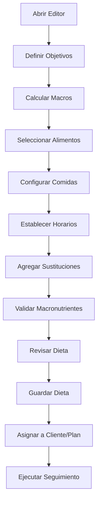
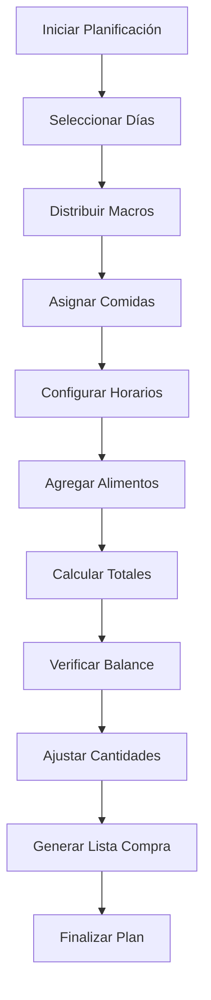

# Objetivo

**URL:** https://www.notion.so/29706f76bed4812fa6e9cf1bf9bc1684
**Extraído el:** 2025-10-29T20:48:38.489Z

---

> 🍽️ **Editor universal de dietas con funcionalidades avanzadas de planificación nutricional para entrenadores y gimnasios**

# Objetivo

Proporcionar un editor universal de dietas con funcionalidades avanzadas de planificación nutricional. Funcionalidades: crear dietas con macros, comidas, sustituciones, horarios, calculadora de macronutrientes, planificador de comidas. La herramienta es técnicamente la misma para entrenadores y gimnasios, proporcionando una experiencia consistente y profesional para la creación de dietas personalizadas y estandarizadas.

# Diagramas de Flujo

## Flujo del Editor de Dieta



## Flujo de Planificación de Comidas



# Matrices de Recursos

## Funcionalidades Principales

- Editor de Dietas: Herramienta principal de creación
- Calculadora de Macros: Cálculo automático de macronutrientes
- Planificador de Comidas: Organización temporal de comidas
- Selector de Alimentos: Base de datos de alimentos
- Gestión de Horarios: Programación de comidas
- Sistema de Sustituciones: Alternativas de alimentos
- Validación Nutricional: Verificación de balance
- Generador de Lista de Compra: Lista automática de ingredientes
## Integraciones

- Base de Datos de Alimentos: Información nutricional completa
- Sistema de Clientes: Asignación de dietas
- Sistema de Plantillas: Reutilización de dietas exitosas
- Sistema de Recetas: Integración con recetario
- Sistema de Restricciones: Gestión de alergias e intolerancias
- Sistema de Comunicaciones: Compartir dietas con clientes
# User Stories

## Para Entrenadores Personales 🧍

- Como entrenador personal, quiero crear dietas personalizadas con macros específicos
- Como entrenador personal, necesito usar la calculadora de macros para objetivos individuales
- Como entrenador personal, debo poder planificar comidas con horarios específicos
- Como entrenador personal, quiero agregar sustituciones para flexibilidad
- Como entrenador personal, necesito validar el balance nutricional de las dietas
- Como entrenador personal, debo poder generar listas de compra personalizadas
## Para Gimnasios/Centros 🏢

- Como gimnasio, quiero crear dietas estandarizadas para planes nutricionales
- Como centro, necesito usar la calculadora de macros para planes grupales
- Como gimnasio, debo poder planificar comidas para diferentes niveles
- Como centro, quiero crear sustituciones para diferentes preferencias
- Como gimnasio, necesito validar dietas para estándares de calidad
- Como centro, debo poder generar listas de compra para socios
# Componentes React

- EditorDieta: Editor principal de dietas
- CalculadoraMacros: Calculadora de macronutrientes
- PlanificadorComidas: Planificador temporal de comidas
- SelectorAlimentos: Selector de alimentos de la base de datos
- HorariosComida: Gestor de horarios de comidas
- GestorSustituciones: Sistema de sustituciones de alimentos
- ValidadorNutricional: Validador de balance nutricional
- GeneradorListaCompra: Generador de lista de compra
# APIs Requeridas

```bash
GET /api/nutricion/editor
POST /api/nutricion/dietas
PUT /api/nutricion/dietas/:id
GET /api/nutricion/alimentos
POST /api/nutricion/calcular-macros
GET /api/nutricion/editor/plantillas
POST /api/nutricion/editor/validar
GET /api/nutricion/editor/lista-compra
```

# Estructura MERN

```bash
nutricion/editor/
├─ page.tsx
├─ api/
│  ├─ editor.ts
│  ├─ macros.ts
│  └─ planificador.ts
└─ components/
   ├─ EditorDieta.tsx
   ├─ CalculadoraMacros.tsx
   ├─ PlanificadorComidas.tsx
   ├─ SelectorAlimentos.tsx
   ├─ HorariosComida.tsx
   ├─ GestorSustituciones.tsx
   ├─ ValidadorNutricional.tsx
   └─ GeneradorListaCompra.tsx
```

# Documentación de Procesos

1. Se abre el editor de dieta y se definen los objetivos nutricionales
1. Se utiliza la calculadora de macros para determinar necesidades
1. Se seleccionan alimentos de la base de datos nutricional
1. Se configuran las comidas con cantidades y horarios
1. Se establecen horarios de comidas según preferencias
1. Se agregan sustituciones para flexibilidad alimentaria
1. Se valida el balance nutricional de la dieta
1. Se revisa la dieta completa y se realizan ajustes
1. Se guarda la dieta en el sistema
1. Se asigna la dieta a cliente específico o plan estándar
1. Se genera lista de compra automática con ingredientes
# Nota Final

> 💡 **El editor de dieta y meal planner es una herramienta universal que proporciona la misma funcionalidad técnica tanto para entrenadores como para gimnasios. La diferencia radica únicamente en cómo se utiliza: entrenadores crean dietas personalizadas para clientes individuales, mientras que gimnasios crean dietas estandarizadas para planes grupales. La herramienta incluye todas las funcionalidades necesarias: cálculo de macros, planificación de comidas, sustituciones, horarios y generación de listas de compra, proporcionando una experiencia consistente y profesional.**

