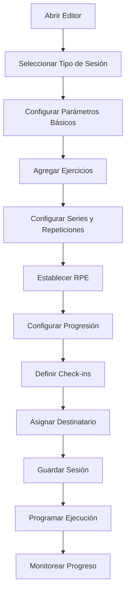
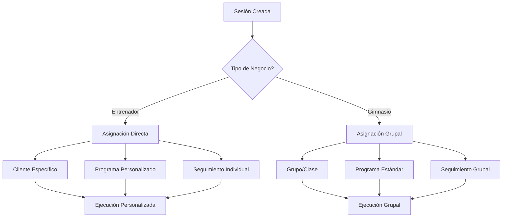

# Objetivo

**URL:** https://www.notion.so/29706f76bed4813caa11f71c76175caf
**Extraído el:** 2025-10-29T20:48:33.988Z

---

> 🏗️ **Editor universal de entrenamiento para crear, ajustar y gestionar sesiones de entrenamiento con funcionalidades avanzadas de progresión y seguimiento**

# Objetivo

Proporcionar un editor universal de entrenamiento que permita crear, ajustar y gestionar sesiones de entrenamiento con funcionalidades avanzadas. El editor incluye: crear/ajustar sesiones, series, repeticiones, RPE (Rate of Perceived Exertion), progresión automática, check-ins rojo/amarillo/verde. Para entrenadores: asignación directa a cliente concreto. Para gimnasios: asignación a grupo/clase/programa estándar. El core UI (constructor de entrenamiento) es el mismo para ambos tipos de negocio.

# Diagramas de Flujo

## Flujo del Editor de Entrenamiento



## Flujo de Asignación por Tipo de Negocio



# Matrices de Recursos

## Funcionalidades Principales

- Constructor de Sesiones: Crear y modificar sesiones de entrenamiento
- Gestión de Series: Configurar series, repeticiones y descansos
- Sistema RPE: Rate of Perceived Exertion para intensidad
- Progresión Automática: Ajustes automáticos según rendimiento
- Check-ins Semáforo: Sistema rojo/amarillo/verde para feedback
- Asignación Flexible: Individual o grupal según el tipo de negocio
## Integraciones

- Biblioteca de Ejercicios: Catálogo completo de ejercicios
- Sistema de Clientes: Base de datos de clientes y socios
- Sistema de Progreso: Seguimiento de resultados y evolución
- Sistema de Calendario: Programación de sesiones
- Sistema de Comunicaciones: Notificaciones y recordatorios
- Sistema de Plantillas: Reutilización de sesiones exitosas
# User Stories

## Para Entrenadores Personales 🧍

- Como entrenador personal, quiero crear sesiones personalizadas para cada cliente
- Como entrenador personal, necesito asignar sesiones directamente a clientes específicos
- Como entrenador personal, debo poder configurar RPE y progresión automática
- Como entrenador personal, quiero usar check-ins semáforo para evaluar sesiones
- Como entrenador personal, necesito ajustar sesiones según el progreso del cliente
- Como entrenador personal, debo poder duplicar sesiones exitosas para otros clientes
## Para Gimnasios/Centros 🏢

- Como gimnasio, quiero crear sesiones para grupos y clases
- Como centro, necesito asignar sesiones a programas estándar
- Como gimnasio, debo poder crear sesiones para diferentes tipos de clase
- Como centro, quiero estandarizar sesiones para instructores
- Como gimnasio, necesito gestionar sesiones para planes de sala
- Como centro, debo poder crear sesiones escalables para grupos grandes
# Componentes React

- EditorEntreno: Editor principal de entrenamiento
- ConstructorSesion: Constructor visual de sesiones
- SelectorEjercicios: Selector de ejercicios de la biblioteca
- ConfiguradorProgresion: Configurador de progresión automática
- CheckInsSemáforo: Sistema de check-ins rojo/amarillo/verde
- GestorSeries: Gestor de series y repeticiones
- ConfiguradorRPE: Configurador de Rate of Perceived Exertion
- AsignadorDestinatario: Asignador de sesiones a destinatarios
# APIs Requeridas

```bash
GET /api/entrenamiento/editor
POST /api/entrenamiento/sesiones
PUT /api/entrenamiento/sesiones/:id
DELETE /api/entrenamiento/sesiones/:id
GET /api/entrenamiento/ejercicios
POST /api/entrenamiento/progresion
GET /api/entrenamiento/sesiones/cliente/:id
GET /api/entrenamiento/sesiones/grupo/:id
POST /api/entrenamiento/sesiones/duplicar
GET /api/entrenamiento/sesiones/plantillas
```

# Estructura MERN

```bash
entrenamiento/editor/
├─ page.tsx
├─ api/
│  ├─ editor.ts
│  ├─ sesiones.ts
│  └─ progresion.ts
└─ components/
   ├─ EditorEntreno.tsx
   ├─ ConstructorSesion.tsx
   ├─ SelectorEjercicios.tsx
   ├─ ConfiguradorProgresion.tsx
   ├─ CheckInsSemáforo.tsx
   ├─ GestorSeries.tsx
   ├─ ConfiguradorRPE.tsx
   └─ AsignadorDestinatario.tsx
```

# Documentación de Procesos

1. Se abre el editor de entrenamiento y se selecciona el tipo de sesión
1. Se configuran los parámetros básicos (nombre, duración, objetivo)
1. Se agregan ejercicios desde la biblioteca y se configuran series/repeticiones
1. Se establece el RPE y se configura la progresión automática
1. Se definen los check-ins semáforo para evaluación de la sesión
1. Se asigna la sesión a cliente específico (entrenadores) o grupo/clase (gimnasios)
1. Se guarda la sesión y se programa su ejecución en el calendario
1. Se ejecuta la sesión y se monitorea el progreso con check-ins
# Nota Final

> 💡 **El editor de entrenamiento es una herramienta universal que mantiene la misma funcionalidad core para todos los tipos de negocio. La diferencia radica únicamente en la asignación: entrenadores asignan a clientes específicos, mientras que gimnasios asignan a grupos/clases/programas estándar. El constructor de entrenamiento, configuración de series, RPE y check-ins es idéntico, proporcionando una experiencia consistente y profesional.**

