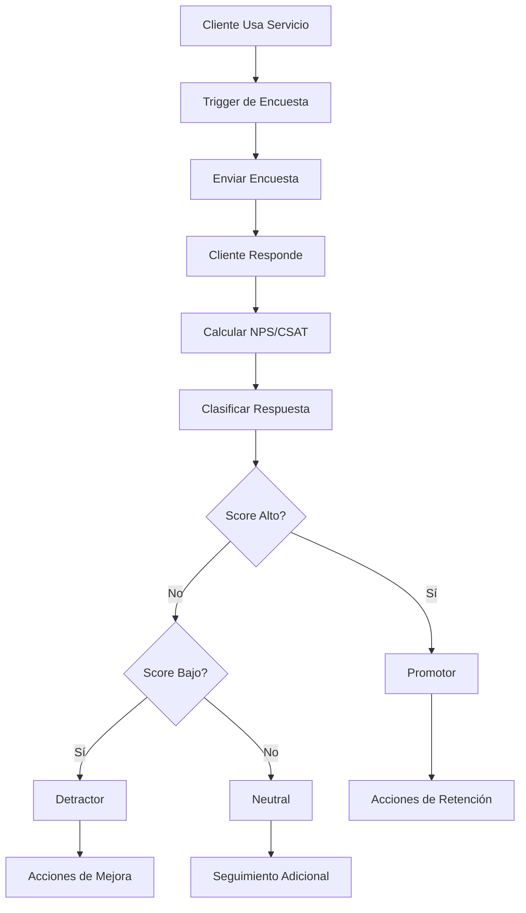
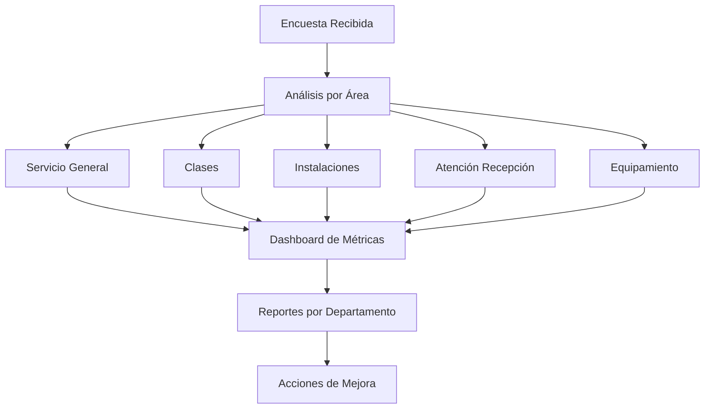

# Objetivo

**URL:** https://www.notion.so/29706f76bed48174bafdd4d231651e80
**Extraído el:** 2025-10-29T20:48:31.127Z

---

> 📊 **Sistema de evaluación de satisfacción y experiencia del cliente con métricas NPS/CSAT especializado para gimnasios y centros**

# Objetivo

Proporcionar un sistema completo de evaluación de satisfacción del cliente mediante encuestas NPS (Net Promoter Score) y CSAT (Customer Satisfaction). Este módulo está especialmente diseñado para gimnasios y centros, ya que evalúa servicio global, clases, instalaciones, atención de recepción, etc. Un entrenador individual normalmente no necesita un módulo formal de NPS con dashboards comparativos, pero los gimnasios requieren evaluación continua de múltiples aspectos del servicio.

# Diagramas de Flujo

## Flujo de Evaluación de Satisfacción



## Flujo de Análisis por Área



# Matrices de Recursos

## Funcionalidades Principales

- Encuestas NPS: Medición del Net Promoter Score con escala 0-10
- Encuestas CSAT: Evaluación de satisfacción con escala 1-5
- Encuestas por Área: Evaluación específica de clases, instalaciones, atención
- Automatización de Envío: Triggers automáticos basados en eventos
- Dashboard de Métricas: Visualización de NPS, CSAT y tendencias
- Análisis Comparativo: Comparación entre equipos, departamentos y períodos
## Integraciones

- Sistema de Clientes: Base de datos de socios y usuarios
- Sistema de Comunicaciones: Email, SMS, WhatsApp para envío de encuestas
- Sistema de Clases: Triggers basados en asistencia a clases
- Sistema de Operaciones: Evaluación de instalaciones y equipamiento
- Sistema de RRHH: Evaluación de atención de recepción y staff
- Analytics Externos: Exportación a herramientas de BI y reporting
# User Stories

## Para Gimnasios/Centros 🏢

- Como gimnasio, quiero evaluar la satisfacción general del servicio para medir la experiencia global
- Como centro, necesito evaluar específicamente las clases para mejorar la calidad de la programación
- Como gimnasio, debo poder evaluar las instalaciones para planificar mejoras y mantenimiento
- Como centro, quiero evaluar la atención de recepción para mejorar el servicio al cliente
- Como gimnasio, necesito comparar el rendimiento entre diferentes equipos y departamentos
- Como centro, debo poder generar reportes de satisfacción para la dirección y stakeholders
## Para Entrenadores Personales 🧍

- Como entrenador personal, quiero evaluar la satisfacción de mis clientes con mi servicio personal
- Como entrenador personal, necesito feedback sobre la efectividad de mis entrenamientos
- Como entrenador personal, debo poder identificar clientes promotores para referidos
- Como entrenador personal, quiero recibir alertas sobre clientes detractores para acciones de mejora
# Componentes React

- SurveysManager: Gestor principal de encuestas y satisfacción
- NPSSurvey: Componente de encuesta NPS con escala 0-10
- CSATSurvey: Componente de encuesta CSAT con escala 1-5
- SatisfactionDashboard: Dashboard de métricas de satisfacción
- SurveyBuilder: Constructor de encuestas personalizadas
- ResponseAnalytics: Analytics de respuestas y tendencias
- ComparisonReports: Reportes comparativos entre equipos y períodos
- AutomationRules: Reglas de automatización de envío de encuestas
# APIs Requeridas

```bash
GET /api/surveys
POST /api/surveys
PUT /api/surveys/:id
DELETE /api/surveys/:id
GET /api/surveys/nps
GET /api/surveys/csat
POST /api/surveys/send
GET /api/surveys/responses
GET /api/surveys/analytics
POST /api/surveys/automation
```

# Estructura MERN

```bash
crm/satisfaction/
├─ page.tsx
├─ api/
│  ├─ surveys.ts
│  ├─ nps.ts
│  ├─ csat.ts
│  └─ analytics.ts
└─ components/
   ├─ SurveysManager.tsx
   ├─ NPSSurvey.tsx
   ├─ CSATSurvey.tsx
   ├─ SatisfactionDashboard.tsx
   ├─ SurveyBuilder.tsx
   ├─ ResponseAnalytics.tsx
   ├─ ComparisonReports.tsx
   └─ AutomationRules.tsx
```

# Documentación de Procesos

1. Cliente utiliza un servicio del gimnasio (clase, instalación, atención)
1. Sistema detecta el evento y activa trigger de encuesta automática
1. Se envía encuesta NPS/CSAT por el canal preferido del cliente
1. Cliente responde la encuesta y se registra la respuesta
1. Sistema calcula automáticamente NPS/CSAT y clasifica al cliente
1. Se activan acciones automáticas según el score (retention, mejora, seguimiento)
1. Se generan reportes y analytics para análisis de satisfacción
# Nota Final

> 💡 **El sistema de encuestas y satisfacción está especialmente diseñado para gimnasios y centros, ya que evalúa múltiples aspectos del servicio (clases, instalaciones, atención). Los entrenadores personales pueden usar versiones simplificadas para feedback personal, pero el módulo completo es ideal para centros que necesitan evaluar servicio global y comparar rendimiento entre equipos y departamentos.**

