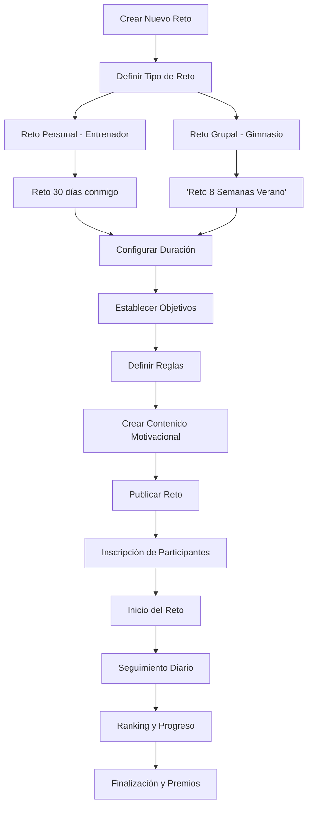
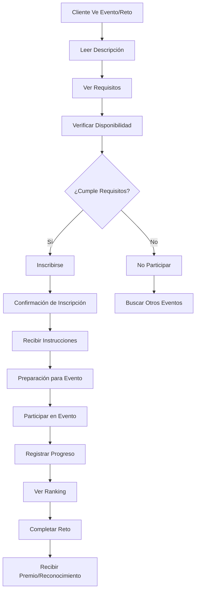

# Objetivo

**URL:** https://www.notion.so/29806f76bed481e0856fea7891a56b87
**Extraído el:** 2025-10-29T20:48:49.176Z

---

> 🎯 **Sistema de gestión de eventos especiales y retos para entrenadores y gimnasios**

# Objetivo

Proporcionar un sistema completo de gestión de eventos especiales y retos para entrenadores y gimnasios. Para entrenadores: 'Reto 30 días conmigo', muy branding personal. Para gimnasios: 'Masterclass de movilidad sábado 18:00' o 'Reto 8 Semanas Verano'. Misma idea pero distinto tono/escala. Este módulo fomenta la participación, engagement y retención de clientes a través de eventos motivacionales.

# Diagramas de Flujo

## Flujo de Creación de Retos



## Flujo de Participación en Eventos



# Matrices de Participación

## Funcionalidades Principales

- Creación de Retos: Sistema para crear retos personalizados
- Gestión de Eventos: Organización de eventos especiales
- Inscripción de Participantes: Sistema de registro y confirmación
- Seguimiento de Progreso: Monitoreo del avance de participantes
- Ranking y Competencia: Sistema de clasificación y motivación
- Contenido Motivacional: Material de apoyo y motivación
- Premios y Reconocimientos: Sistema de recompensas
- Analytics de Participación: Métricas de engagement
## Tipos de Eventos y Retos

- Retos de Duración: 7, 14, 21, 30, 60, 90 días
- Retos de Objetivo: Pérdida de peso, ganancia muscular, resistencia
- Retos de Actividad: Pasos diarios, entrenamientos, comidas saludables
- Eventos Únicos: Masterclasses, workshops, charlas
- Retos Estacionales: Verano, invierno, primavera, otoño
- Retos Temáticos: Navidad, Año Nuevo, San Valentín
- Retos de Grupo: Equipos, parejas, familias
- Retos de Especialidad: Yoga, pilates, crossfit, running
# User Stories

## Para Entrenadores Personales 🧍

- Como entrenador personal, quiero crear 'Reto 30 días conmigo' para fidelizar a mis clientes
- Como entrenador, necesito poder personalizar retos según las necesidades de cada cliente
- Como entrenador, debo poder hacer seguimiento del progreso de cada participante
- Como entrenador, quiero crear contenido motivacional para mantener el engagement
- Como entrenador, necesito poder comunicarme con los participantes durante el reto
- Como entrenador, debo poder celebrar los logros de mis clientes
## Para Gimnasios/Centros 🏢

- Como gimnasio, quiero crear 'Reto 8 Semanas Verano' para aumentar la retención
- Como centro, necesito organizar 'Masterclass de movilidad sábado 18:00' para generar engagement
- Como gimnasio, debo poder gestionar eventos con gran número de participantes
- Como centro, quiero crear retos estacionales para mantener la motivación
- Como gimnasio, necesito poder medir el impacto de los eventos en la retención
- Como centro, debo poder coordinar eventos con diferentes instructores
## Para Participantes 👥

- Como participante, quiero poder inscribirme fácilmente en retos y eventos
- Como participante, necesito poder ver mi progreso en tiempo real
- Como participante, quiero poder competir con otros y ver mi ranking
- Como participante, necesito recibir motivación y recordatorios durante el reto
- Como participante, quiero poder compartir mis logros en redes sociales
- Como participante, debo poder recibir premios y reconocimientos por completar retos
# Componentes React

- EventosList: Lista de eventos y retos disponibles
- CreadorReto: Herramienta para crear nuevos retos y eventos
- Participantes: Gestión de participantes inscritos
- SeguimientoProgreso: Monitoreo del avance de participantes
- RankingRetos: Sistema de clasificación y competencia
- ContenidoMotivacional: Material de apoyo y motivación
- PremiosReconocimientos: Sistema de recompensas
- AnalyticsEventos: Métricas de participación y engagement
# APIs Requeridas

```bash
GET /api/eventos/retos
POST /api/eventos/retos
PUT /api/eventos/retos/:id
DELETE /api/eventos/retos/:id
GET /api/eventos/participantes
POST /api/eventos/inscribir
GET /api/eventos/progreso
POST /api/eventos/progreso
GET /api/eventos/ranking
POST /api/eventos/premios
```

# Estructura MERN

```bash
eventos/retos/
├─ page.tsx
├─ api/
│  ├─ retos.ts
│  ├─ participantes.ts
│  └─ progreso.ts
└─ components/
   ├─ EventosList.tsx
   ├─ CreadorReto.tsx
   ├─ Participantes.tsx
   ├─ SeguimientoProgreso.tsx
   ├─ RankingRetos.tsx
   ├─ ContenidoMotivacional.tsx
   ├─ PremiosReconocimientos.tsx
   └─ AnalyticsEventos.tsx
```

# Documentación de Procesos

1. Se define el tipo de evento o reto a crear (personal vs grupal)
1. Se configuran los parámetros del reto (duración, objetivos, reglas)
1. Se crea el contenido motivacional y material de apoyo
1. Se publica el evento/reto y se abre la inscripción
1. Se gestionan las inscripciones y confirmaciones de participantes
1. Se inicia el evento/reto y se activa el seguimiento
1. Se monitorea el progreso de los participantes en tiempo real
1. Se actualiza el ranking y se envían motivaciones
1. Se finaliza el evento/reto y se entregan premios
1. Se analizan los resultados y se optimiza para futuros eventos
# Nota Final

> 💡 **Los Eventos & Retos Especiales son fundamentales para el engagement y la retención de clientes. Para entrenadores personales, los retos son más íntimos y personalizados ('Reto 30 días conmigo'). Para gimnasios, los eventos son más masivos y comunitarios ('Masterclass de movilidad sábado 18:00'). El sistema debe fomentar la participación, crear comunidad y motivar a los usuarios a alcanzar sus objetivos de forma divertida y social.**

