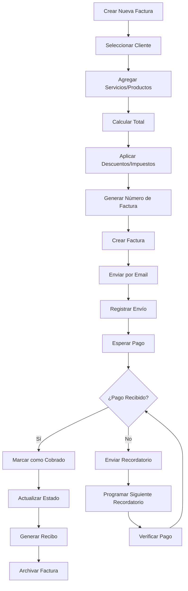
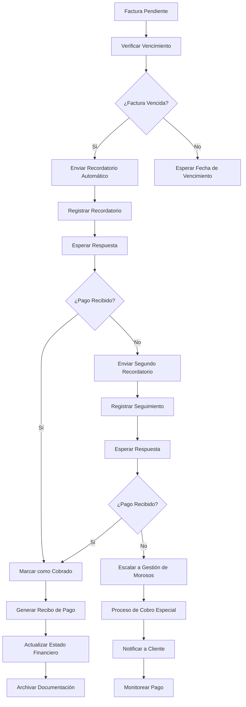

# Objetivo

**URL:** https://www.notion.so/29806f76bed481a5ba08f03c4ab0b13e
**Extraído el:** 2025-10-29T20:48:50.634Z

---

> 🧾 **Sistema universal de facturación y gestión de cobros para entrenadores y gimnasios**

# Objetivo

Proporcionar un sistema universal de facturación y gestión de cobros para entrenadores y gimnasios. Funcionalidades: crear factura, marcar cobro, enviar recordatorio, descargar PDF. Vale igual para entrenadores y gimnasios. Este módulo automatiza y simplifica todo el proceso de facturación, desde la creación hasta el cobro, garantizando un flujo de caja eficiente y profesional.

# Diagramas de Flujo

## Flujo de Facturación Universal



## Flujo de Gestión de Cobros



# Matrices de Cobros

## Funcionalidades Principales

- Creación de Facturas: Sistema completo de generación de facturas
- Gestión de Cobros: Control y seguimiento de pagos
- Recordatorios Automáticos: Sistema de notificaciones de pago
- Exportación PDF: Generación de documentos profesionales
- Plantillas Personalizables: Facturas con branding personal
- Seguimiento de Estados: Control del ciclo de vida de facturas
- Integración Bancaria: Conciliación automática de pagos
- Reportes Financieros: Análisis de facturación y cobros
## Tipos de Facturas

- Facturas de Servicios: Entrenamientos, consultas, clases
- Facturas de Productos: Venta de material, suplementos
- Facturas Recurrentes: Cuotas mensuales, membresías
- Facturas de Paquetes: Servicios prepagados
- Facturas de Eventos: Retos, masterclasses, workshops
- Facturas de Servicios Adicionales: Nutrición, fisioterapia
- Facturas de Corrección: Rectificativas y abonos
# User Stories

## Para Entrenadores Personales 🧍

- Como entrenador personal, quiero crear facturas profesionales para mis servicios
- Como entrenador, necesito poder marcar cuando un cliente me ha pagado
- Como entrenador, debo poder enviar recordatorios automáticos a clientes morosos
- Como entrenador, quiero descargar mis facturas en PDF para archivar
- Como entrenador, necesito ver qué facturas están pendientes de pago
- Como entrenador, debo poder personalizar mis facturas con mi branding
## Para Gimnasios/Centros 🏢

- Como gimnasio, quiero crear facturas masivas para todos mis socios
- Como centro, necesito gestionar cobros de diferentes líneas de negocio
- Como gimnasio, debo poder automatizar el envío de facturas recurrentes
- Como centro, quiero integrar la facturación con mi sistema de gestión
- Como gimnasio, necesito generar reportes de facturación por períodos
- Como centro, debo poder gestionar facturas de diferentes servicios
## Para Clientes 👥

- Como cliente, quiero recibir mis facturas por email automáticamente
- Como cliente, necesito poder descargar mis facturas en PDF
- Como cliente, quiero ver el historial de mis pagos
- Como cliente, necesito recibir recordatorios antes del vencimiento
- Como cliente, debo poder pagar online directamente desde la factura
- Como cliente, quiero recibir confirmaciones de pago
# Componentes React

- FacturacionManager: Componente principal de gestión de facturación
- CreadorFactura: Herramienta para crear nuevas facturas
- GestorCobros: Sistema de gestión y seguimiento de cobros
- RecordatoriosPago: Sistema de notificaciones automáticas
- ExportPDF: Generador de documentos PDF profesionales
- PlantillasFactura: Sistema de plantillas personalizables
- SeguimientoEstados: Control del ciclo de vida de facturas
- ReportesFacturacion: Análisis y reportes de facturación
# APIs Requeridas

```bash
GET /api/finanzas/facturas
POST /api/finanzas/facturas
PUT /api/finanzas/facturas/:id
DELETE /api/finanzas/facturas/:id
POST /api/finanzas/cobros
GET /api/finanzas/recordatorios
POST /api/finanzas/recordatorios
GET /api/finanzas/estados
POST /api/finanzas/exportar-pdf
```

# Estructura MERN

```bash
finanzas/facturacion/
├─ page.tsx
├─ api/
│  ├─ facturas.ts
│  ├─ cobros.ts
│  └─ recordatorios.ts
└─ components/
   ├─ FacturacionManager.tsx
   ├─ CreadorFactura.tsx
   ├─ GestorCobros.tsx
   ├─ RecordatoriosPago.tsx
   ├─ ExportPDF.tsx
   ├─ PlantillasFactura.tsx
   ├─ SeguimientoEstados.tsx
   └─ ReportesFacturacion.tsx
```

# Documentación de Procesos

1. Se selecciona el cliente y se identifican los servicios/productos a facturar
1. Se calculan los importes, descuentos e impuestos aplicables
1. Se genera el número de factura y se crea el documento
1. Se envía la factura por email al cliente automáticamente
1. Se registra el envío y se programa el seguimiento de pago
1. Se monitorea el estado de pago y se envían recordatorios automáticos
1. Se registra el pago cuando se recibe y se actualiza el estado
1. Se genera el recibo de pago y se archiva la documentación
1. Se actualiza el estado financiero y se generan reportes
1. Se archiva la factura y se mantiene el historial para auditorías
# Nota Final

> 💡 **La Facturación & Cobros es un módulo universal que funciona igual para entrenadores y gimnasios, simplificando todo el proceso de facturación desde la creación hasta el cobro. El sistema debe ser profesional, automatizado y fácil de usar, garantizando un flujo de caja eficiente y una gestión financiera transparente. La funcionalidad es la misma independientemente del tipo de usuario, pero se adapta a las necesidades específicas de cada negocio.**

