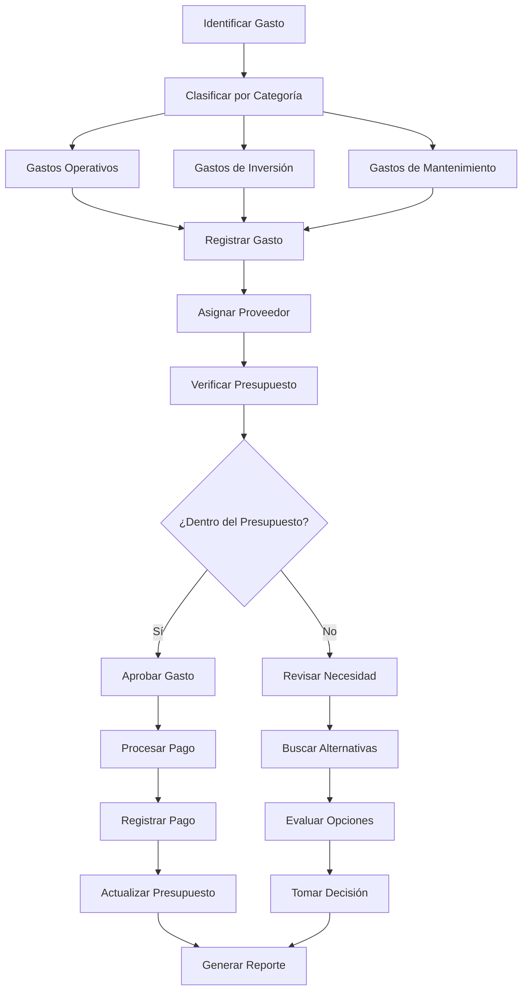
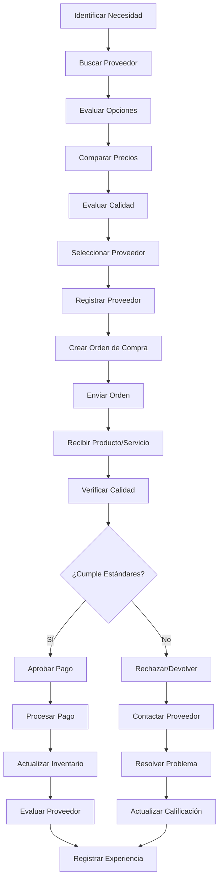

# Objetivo

**URL:** https://www.notion.so/29806f76bed4817d8816c4253753ea2a
**Extraído el:** 2025-10-29T20:48:57.678Z

---

> 💸 **Sistema de gestión de gastos y proveedores con enfoque diferenciado por tipo de usuario**

# Objetivo

Proporcionar un sistema completo de gestión de gastos y proveedores para entrenadores y gimnasios. Para entrenadores: gastos normalmente se lleva en Excel o ni se registra a este nivel. Para gimnasios: luz, suplementos que compra a proveedor, nóminas externas, mantenimiento máquinas. Este módulo optimiza el control de costes y la gestión de proveedores para mantener la rentabilidad del negocio.

# Diagramas de Flujo

## Flujo de Gestión de Gastos



## Flujo de Gestión de Proveedores



# Matrices de Proveedores

## Funcionalidades Principales

- Gestión de Gastos: Control y registro de todos los gastos del negocio
- Gestión de Proveedores: Base de datos completa de proveedores
- Categorización de Gastos: Clasificación automática por tipo
- Órdenes de Compra: Sistema de compras estructurado
- Control de Presupuesto: Límites y alertas de gastos
- Evaluación de Proveedores: Sistema de calificación y feedback
- Reportes Financieros: Análisis de gastos y proveedores
- Integración Contable: Sincronización con sistemas contables
## Tipos de Gastos por Usuario

- Entrenadores: Gastos mínimos, normalmente en Excel o no registrados
- Gimnasios: Luz, suplementos, nóminas externas, mantenimiento máquinas
- Ambos: Gastos operativos, inversiones, mantenimiento
# User Stories

## Para Entrenadores Personales 🧍

- Como entrenador personal, quiero registrar mis gastos básicos para controlar mi economía
- Como entrenador, necesito categorizar mis gastos para entender en qué invierto
- Como entrenador, debo poder generar reportes simples de mis gastos
- Como entrenador, quiero poder exportar mis gastos a Excel para mi contabilidad
- Como entrenador, necesito poder establecer un presupuesto mensual
- Como entrenador, debo poder recibir alertas cuando me acerco al límite de gastos
## Para Gimnasios/Centros 🏢

- Como gimnasio, quiero gestionar todos mis gastos operativos (luz, agua, gas)
- Como centro, necesito controlar los gastos de suplementos que compro a proveedores
- Como gimnasio, debo gestionar las nóminas externas (limpieza, seguridad)
- Como centro, quiero controlar los gastos de mantenimiento de máquinas
- Como gimnasio, necesito evaluar y calificar a mis proveedores
- Como centro, debo poder generar reportes ejecutivos de gastos
## Para Proveedores 👨‍💼

- Como proveedor, quiero recibir órdenes de compra de forma digital
- Como proveedor, necesito poder actualizar mi información de contacto
- Como proveedor, debo poder ver el historial de pedidos
- Como proveedor, quiero recibir feedback sobre mis servicios
- Como proveedor, necesito poder gestionar mis precios y catálogo
- Como proveedor, debo poder recibir notificaciones de nuevas órdenes
# Componentes React

- GastosManager: Componente principal de gestión de gastos
- ProveedoresList: Lista y gestión de proveedores
- CategoriasGastos: Sistema de categorización de gastos
- OrdenesCompra: Gestión de órdenes de compra
- MantenimientoCostos: Control de costos de mantenimiento
- ControlPresupuesto: Gestión de presupuestos y límites
- EvaluacionProveedores: Sistema de calificación de proveedores
- ReportesGastos: Análisis y reportes de gastos
# APIs Requeridas

```bash
GET /api/finanzas/gastos
POST /api/finanzas/gastos
PUT /api/finanzas/gastos/:id
DELETE /api/finanzas/gastos/:id
GET /api/finanzas/proveedores
POST /api/finanzas/proveedores
GET /api/finanzas/categorias
POST /api/finanzas/ordenes-compra
GET /api/finanzas/presupuesto
```

# Estructura MERN

```bash
finanzas/gastos/
├─ page.tsx
├─ api/
│  ├─ gastos.ts
│  ├─ proveedores.ts
│  └─ categorias.ts
└─ components/
   ├─ GastosManager.tsx
   ├─ ProveedoresList.tsx
   ├─ CategoriasGastos.tsx
   ├─ OrdenesCompra.tsx
   ├─ MantenimientoCostos.tsx
   ├─ ControlPresupuesto.tsx
   ├─ EvaluacionProveedores.tsx
   └─ ReportesGastos.tsx
```

# Documentación de Procesos

1. Se identifican y clasifican los gastos por categorías predefinidas
1. Se registran los gastos con información detallada (monto, fecha, proveedor)
1. Se verifica que el gasto esté dentro del presupuesto asignado
1. Se procesa el pago y se actualiza el estado del gasto
1. Se evalúa la calidad del proveedor y se actualiza su calificación
1. Se generan reportes de gastos por período y categoría
1. Se analizan las tendencias de gastos para optimizar el presupuesto
1. Se integran los datos con sistemas contables externos
1. Se optimizan los procesos de compra basándose en datos históricos
1. Se mantiene un historial completo para auditorías y análisis futuros
# Nota Final

> 💡 **La gestión de Gastos & Proveedores es fundamental para mantener la rentabilidad del negocio. Para entrenadores, los gastos son mínimos y normalmente se llevan en Excel o ni se registran. Para gimnasios, es crítico controlar gastos como luz, suplementos, nóminas externas y mantenimiento de máquinas. El sistema debe adaptarse al nivel de complejidad de cada usuario, proporcionando herramientas simples para entrenadores y funcionalidades avanzadas para gimnasios.**

