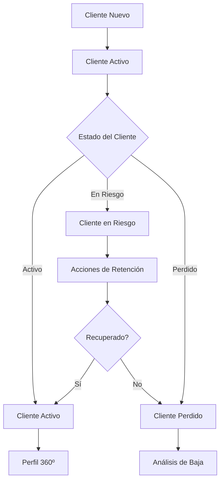
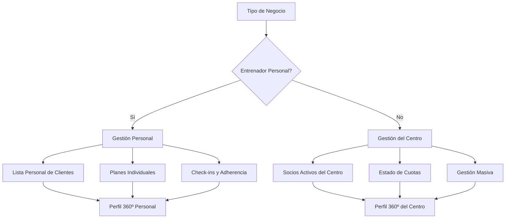

# Objetivo

**URL:** https://www.notion.so/29706f76bed48187b943f103b1b3667f
**Extraído el:** 2025-10-29T20:48:30.441Z

---

> 👥 **Sistema integral de gestión de clientes con seguimiento de estado, retención y perfil 360º personalizado por tipo de negocio**

# Objetivo

Proporcionar un sistema completo de gestión de clientes que incluya clientes activos, seguimiento de riesgo/retención, gestión de bajas y perfil 360º. Para entrenadores personales, el foco está en su lista personal de clientes con planes individuales, mientras que para gimnasios se centra en todos los socios activos con estado de cuota. El sistema debe permitir identificar clientes en riesgo, gestionar bajas y mantener un perfil completo de cada cliente.

# Diagramas de Flujo

## Flujo de Gestión de Clientes



## Flujo por Tipo de Negocio



# Matrices de Recursos

## Funcionalidades Principales

- Clientes Activos: Gestión de clientes/socios activos con sus planes y estado
- Clientes en Riesgo: Identificación automática de clientes con riesgo de baja
- Clientes Perdidos: Gestión de bajas con análisis de motivos
- Cliente 360º: Perfil completo con historial, documentos y consentimientos
- Alertas de Retención: Notificaciones automáticas para clientes en riesgo
- Análisis de Churn: Métricas de retención y motivos de baja
## Integraciones

- Sistema de Entrenamientos: Seguimiento de adherencia y progreso
- Sistema de Nutrición: Seguimiento dietético y cumplimiento
- Sistema de Facturación: Estado de pagos y cuotas
- Sistema de Comunicaciones: Email, WhatsApp, SMS
- Sistema de Calendario: Historial de citas y sesiones
- Sistema de Documentos: Consentimientos RGPD y documentos legales
# User Stories

## Para Entrenadores Personales 🧍

- Como entrenador personal, quiero ver mi lista personal de clientes con sus planes individuales
- Como entrenador personal, necesito identificar clientes que han dejado de hacer check-ins
- Como entrenador personal, debo poder ver clientes que no aparecen a sesiones
- Como entrenador personal, quiero registrar motivos de baja como 'problemas económicos' o 'falta de tiempo'
- Como entrenador personal, necesito un perfil 360º de cada cliente con historial completo
- Como entrenador personal, debo poder recibir alertas sobre clientes en riesgo de baja
## Para Gimnasios/Centros 🏢

- Como gimnasio, quiero gestionar todos los socios activos del centro con su estado de cuota
- Como centro, necesito identificar socios que no vienen desde hace X días
- Como gimnasio, debo poder ver socios con riesgo de baja de cuota
- Como centro, quiero registrar motivos formales de baja como mudanza, insatisfacción o lesión
- Como gimnasio, necesito un perfil 360º de cada socio con historial de uso
- Como centro, debo poder generar reportes de retención y análisis de churn
# Componentes React

- ClientsManager: Gestor principal de clientes y socios
- ActiveClientsList: Lista de clientes/socios activos
- RiskClientsPanel: Panel de clientes en riesgo
- LostClientsManager: Gestor de clientes perdidos y bajas
- Client360Profile: Perfil completo 360º del cliente
- RetentionAlerts: Sistema de alertas de retención
- ChurnAnalytics: Analytics de retención y churn
- ClientSegmentation: Segmentación automática de clientes
# APIs Requeridas

```bash
GET /api/clients
POST /api/clients
PUT /api/clients/:id
DELETE /api/clients/:id
GET /api/clients/active
GET /api/clients/risk
GET /api/clients/lost
GET /api/clients/:id/profile
POST /api/clients/:id/retention
GET /api/clients/analytics
POST /api/clients/segment
```

# Estructura MERN

```bash
crm/clients/
├─ page.tsx
├─ api/
│  ├─ clients.ts
│  ├─ retention.ts
│  ├─ analytics.ts
│  └─ segmentation.ts
└─ components/
   ├─ ClientsManager.tsx
   ├─ ActiveClientsList.tsx
   ├─ RiskClientsPanel.tsx
   ├─ LostClientsManager.tsx
   ├─ Client360Profile.tsx
   ├─ RetentionAlerts.tsx
   ├─ ChurnAnalytics.tsx
   └─ ClientSegmentation.tsx
```

# Documentación de Procesos

1. Cliente se registra y pasa a estado 'Activo' en el sistema
1. Sistema monitorea continuamente la actividad del cliente (check-ins, pagos, asistencia)
1. Si se detecta inactividad, cliente se marca como 'En Riesgo'
1. Se activan acciones de retención automáticas (emails, llamadas, ofertas)
1. Si no se recupera, cliente se marca como 'Perdido' con motivo de baja
1. Se mantiene perfil 360º completo con todo el historial del cliente
1. Sistema genera reportes de retención y análisis de churn para optimización
# Nota Final

> 💡 **La gestión de clientes es el corazón del negocio. Se adapta completamente al tipo de usuario: entrenadores personales manejan listas personales con enfoque en adherencia y check-ins, mientras que gimnasios gestionan socios masivos con foco en cuotas y uso del centro. El perfil 360º es universal y proporciona una vista completa del cliente independientemente del tipo de negocio.**

