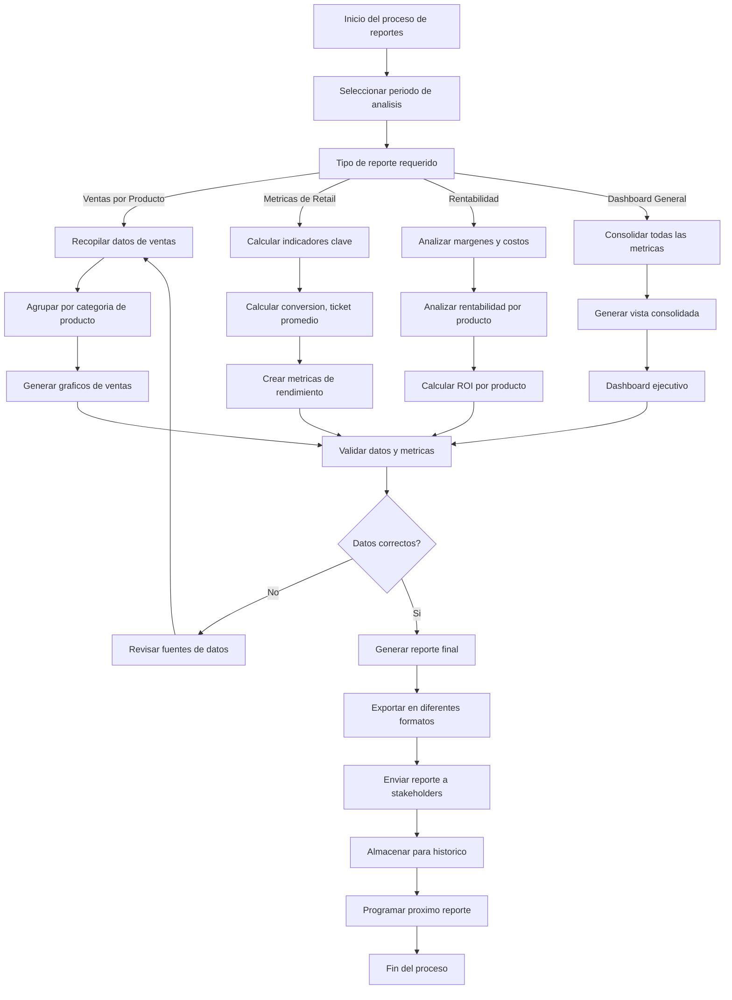

# Informe de Ventas Retail - Documentacion Completa

**URL:** https://www.notion.so/29906f76bed481ab81c2f27e6a41f191
**Extraído el:** 2025-10-29T20:48:22.639Z

---

# Informe de Ventas Retail - Documentacion Completa

Esta pagina sirve como documentacion completa del modulo de reportes de ventas retail del software fitness. Este modulo esta exclusivamente dirigido a gimnasios y centros fitness con tienda fisica:

## Funcionalidades Principales

- Informe de ventas fisicas en el centro
- Analisis de ventas por producto
- Metricas de retail y rendimiento
- Reportes de rentabilidad detallados
Nota: Este modulo NO aplica a un entrenador sin tienda fisica. Esta exclusivamente diseñado para gimnasios y centros fitness que operan una tienda fisica dentro de sus instalaciones.

## Diagramas de Flujo de Reportes

Los diagramas de flujo muestran el proceso completo de generacion de reportes de ventas retail:

## Matrices de Ventas Retail

Tipos de reportes y metricas disponibles:

- Ventas por Producto: Analisis detallado de cada producto vendido
- Ventas por Categoria: Suplementos, merchandising, equipamiento
- Ventas por Periodo: Diario, semanal, mensual, anual
- Ventas por Empleado: Rendimiento del personal de ventas
- Ventas por Horario: Analisis de picos de ventas
- Ventas por Cliente: Analisis de comportamiento de compra
- Comparativas Anuales: Evolucion de ventas año tras año
## Componentes React

Documentacion de componentes React para el modulo de reportes de ventas retail:

### ReportesRetail

Componente principal para generar reportes de ventas retail. Incluye filtros por periodo, categoria de producto y tipo de reporte. Permite exportar datos en diferentes formatos.

### AnalisisVentas

Componente especializado en el analisis detallado de ventas. Proporciona graficos interactivos, tendencias y comparativas para identificar patrones de venta y oportunidades de mejora.

### MetricasRetail

Componente para mostrar metricas clave de retail como conversion rate, ticket promedio, ventas por metro cuadrado, rotacion de inventario y otros indicadores de rendimiento.

### RentabilidadProductos

Componente para analizar la rentabilidad de cada producto. Calcula margenes, ROI, costos de almacenamiento y recomienda estrategias de precios y promociones.

### DashboardVentas

Componente de dashboard ejecutivo que consolida todas las metricas de ventas retail en una vista unificada. Incluye KPIs principales, alertas y recomendaciones automaticas.

## Configuraciones de Metricas

Configuraciones especificas para las metricas de retail:

- Metricas de Conversion: Tasa de conversion, tiempo promedio de decision
- Metricas de Valor: Ticket promedio, valor por cliente, LTV
- Metricas de Inventario: Rotacion, dias de stock, stock muerto
- Metricas de Rentabilidad: Margen bruto, margen neto, ROI por producto
- Metricas de Rendimiento: Ventas por empleado, ventas por metro cuadrado
- Metricas de Tiempo: Ventas por hora, picos de actividad, estacionalidad
## APIs Requeridas

Documentacion de las APIs necesarias para el modulo de reportes de ventas retail:

- GET /api/ventas/reportes-retail - Obtener reportes de ventas retail
- GET /api/ventas/analisis - Obtener analisis detallado de ventas
- GET /api/ventas/metricas - Obtener metricas de retail
- GET /api/ventas/rentabilidad - Obtener analisis de rentabilidad
- GET /api/ventas/dashboard - Obtener datos del dashboard ejecutivo
## Estructura de Carpetas MERN

Estructura de carpetas para el stack MERN:

- ventas/reportes/page.tsx - Pagina principal de reportes
- ventas/reportes/api/ - API routes para reportes
- ventas/reportes/components/ - Componentes React de reportes
- ventas/reportes/hooks/ - Custom hooks para gestion de estado
- ventas/reportes/utils/ - Utilidades y helpers
- ventas/reportes/services/ - Servicios de integracion
- ventas/reportes/types/ - Tipos TypeScript
- ventas/reportes/charts/ - Componentes de graficos
## Documentacion de Procesos

Procesos principales del modulo de reportes de ventas retail:

### Proceso de Generacion de Reportes

- Definir periodo de analisis y tipo de reporte
- Recopilar datos de ventas del sistema POS
- Procesar y agrupar datos por categoria
- Calcular metricas y indicadores clave
- Generar graficos y visualizaciones
- Exportar reporte en formato requerido
### Proceso de Analisis de Ventas

- Identificar productos mas vendidos
- Analizar tendencias de ventas por periodo
- Detectar patrones estacionales
- Comparar rendimiento entre productos
- Generar recomendaciones de optimizacion
### Proceso de Calculo de Metricas

- Calcular tasa de conversion de visitantes
- Determinar ticket promedio por transaccion
- Analizar rotacion de inventario
- Calcular ventas por metro cuadrado
- Evaluar rendimiento por empleado
### Proceso de Analisis de Rentabilidad

- Calcular margen bruto por producto
- Analizar costos de almacenamiento
- Evaluar ROI por categoria de producto
- Identificar productos de baja rentabilidad
- Recomendar ajustes de precios y promociones
## Consideraciones Tecnicas

Aspectos tecnicos importantes para la implementacion:

- Integracion con sistemas POS existentes
- Procesamiento de grandes volumenes de datos
- Generacion de reportes en tiempo real
- Exportacion a diferentes formatos (PDF, Excel, CSV)
- Sistema de alertas y notificaciones automaticas
- Almacenamiento y respaldo de datos historicos
## Mejores Practicas

Recomendaciones para el desarrollo:

- Usar TypeScript para tipado fuerte
- Implementar cache para consultas frecuentes
- Usar React Query para gestion de estado de servidor
- Implementar manejo de errores robusto
- Crear tests unitarios y de integracion
- Implementar paginacion para grandes datasets
## Resumen

Esta documentacion proporciona una guia completa para implementar el modulo de Informe de Ventas Retail del software fitness. Este modulo esta exclusivamente dirigido a gimnasios y centros fitness con tienda fisica, proporcionando analisis detallado de ventas fisicas en el centro, metricas de retail y reportes de rentabilidad. NO aplica a entrenadores sin tienda fisica. Incluye generacion de reportes completos, analisis de ventas por producto, calculo de metricas clave y dashboard ejecutivo para la toma de decisiones.

URL de la pagina: https://www.notion.so/Informe-de-Ventas-Retail-29906f76bed481ab81c2f27e6a41f191

