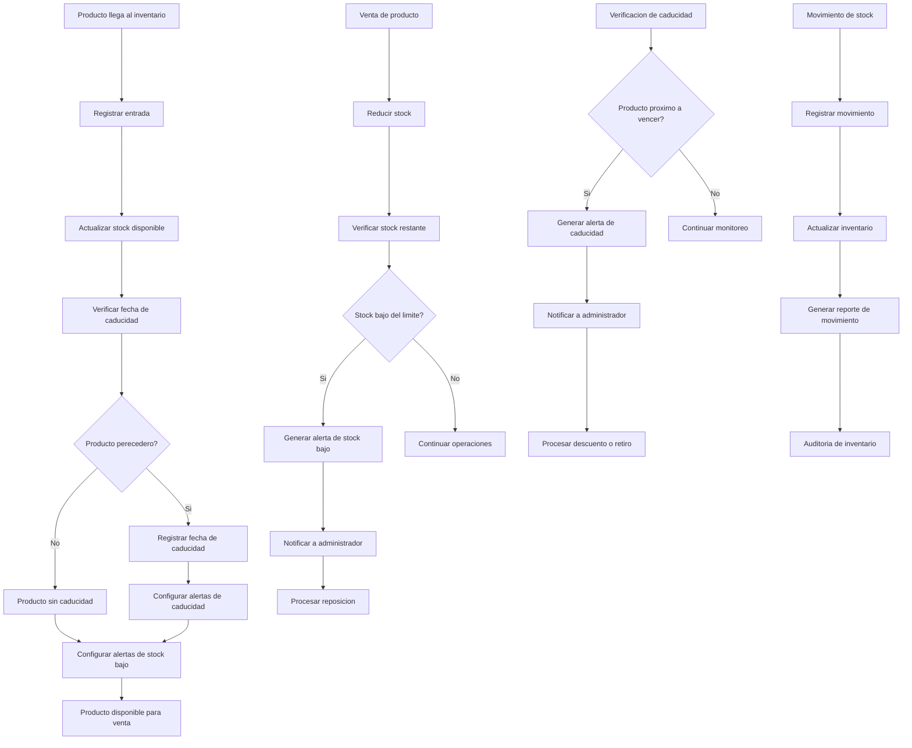

# Inventario & Stock - Documentacion Completa

**URL:** https://www.notion.so/29906f76bed481ddb9f1c39f4be9d89b
**Extraído el:** 2025-10-29T20:48:18.977Z

---

# Inventario & Stock - Documentacion Completa

Esta pagina sirve como documentacion completa del modulo de gestion de inventario del software fitness. Este modulo es esencial tanto para entrenadores como para gimnasios:

- Control de stock en tiempo real
- Gestion de caducidades de productos
- Alertas de stock bajo automaticas
- Gestion completa de inventario
- Seguimiento de movimientos de stock
Este modulo es fundamental para mantener un control preciso del inventario y evitar perdidas por productos vencidos o stock insuficiente.

## Diagramas de Flujo de Inventario

Los diagramas de flujo muestran el proceso completo de gestion de inventario y stock:

## Matrices de Stock

Tipos de productos y sus caracteristicas de stock:

- Suplementos: Stock alto, caducidad 2-3 años, alertas a 6 meses
- Ropa Deportiva: Stock medio, sin caducidad, alertas por temporada
- Accesorios: Stock bajo, sin caducidad, alertas por demanda
- Bebidas: Stock medio, caducidad 1-2 años, alertas a 3 meses
- Equipamiento: Stock bajo, sin caducidad, alertas por desgaste
- Merchandising: Stock variable, sin caducidad, alertas por eventos
## Componentes React

Documentacion de componentes React para el modulo de inventario y stock:

### InventarioManager

Componente principal que gestiona todo el sistema de inventario. Incluye dashboard con metricas principales, alertas y acceso rapido a todas las funcionalidades.

### ControlStock

Componente para el control de stock en tiempo real. Permite verificar niveles actuales, ajustar cantidades y configurar limites de stock bajo.

### AlertasCaducidad

Componente para gestionar alertas de caducidad. Muestra productos proximos a vencer, permite configurar alertas y gestionar acciones correctivas.

### MovimientosStock

Componente para registrar y seguir movimientos de stock. Incluye entradas, salidas, ajustes y transferencias entre ubicaciones.

### ReportesInventario

Componente para generar reportes completos de inventario. Incluye reportes de stock, movimientos, caducidades y analisis de rendimiento.

## Configuraciones de Alertas

Configuraciones especificas para el sistema de alertas:

- Alertas de Stock Bajo: Configurar limites por producto y categoria
- Alertas de Caducidad: 30, 60, 90 dias antes del vencimiento
- Notificaciones Multi-canal: Email, SMS, notificaciones push
- Alertas de Movimientos: Notificar entradas y salidas importantes
- Alertas de Auditoria: Notificar discrepancias en inventario
## APIs Requeridas

Documentacion de las APIs necesarias para el modulo de inventario y stock:

- GET /api/ventas/inventario - Obtener estado completo del inventario
- POST /api/ventas/stock - Actualizar niveles de stock
- GET /api/ventas/caducidades - Obtener productos proximos a vencer
- POST /api/ventas/movimientos - Registrar movimientos de stock
- GET /api/ventas/alertas - Obtener alertas activas del sistema
## Estructura de Carpetas MERN

Estructura de carpetas para el stack MERN:

- ventas/inventario/page.tsx - Pagina principal del inventario
- ventas/inventario/api/ - API routes para inventario
- ventas/inventario/components/ - Componentes React del inventario
- ventas/inventario/hooks/ - Custom hooks para gestion de estado
- ventas/inventario/utils/ - Utilidades y helpers
- ventas/inventario/services/ - Servicios de integracion
## Documentacion de Procesos

Procesos principales del modulo de inventario y stock:

### Proceso de Entrada de Stock

- Recibir productos del proveedor
- Verificar cantidad y calidad
- Registrar fecha de caducidad
- Actualizar stock disponible
- Configurar alertas de caducidad
### Proceso de Control de Stock

- Monitorear niveles de stock diariamente
- Verificar productos proximos a agotarse
- Generar alertas de stock bajo
- Procesar reposicion de productos
### Proceso de Gestion de Caducidades

- Revisar productos proximos a vencer
- Generar alertas de caducidad
- Aplicar descuentos por proximidad a vencimiento
- Retirar productos vencidos del inventario
### Proceso de Auditoria de Inventario

- Realizar conteo fisico del inventario
- Comparar con registros del sistema
- Identificar discrepancias
- Ajustar inventario segun conteo fisico
- Generar reporte de auditoria
## Consideraciones Tecnicas

Aspectos tecnicos importantes para la implementacion:

- Sincronizacion en tiempo real con sistemas de ventas
- Sistema de alertas automaticas y programables
- Backup automatico de datos de inventario
- Integracion con codigos de barras y escaners
- Sistema de auditoria completo y trazabilidad
## Mejores Practicas

Recomendaciones para el desarrollo:

- Usar TypeScript para tipado fuerte
- Implementar validaciones de stock en tiempo real
- Usar React Query para gestion de estado de servidor
- Implementar manejo de errores robusto
- Crear tests unitarios y de integracion
## Resumen

Esta documentacion proporciona una guia completa para implementar el modulo de Inventario & Stock del software fitness. Este modulo es esencial tanto para entrenadores como para gimnasios, proporcionando un control preciso del inventario y evitando perdidas por productos vencidos o stock insuficiente. Incluye gestion completa de stock, caducidades, alertas automaticas y seguimiento de movimientos.

URL de la pagina: https://www.notion.so/Inventario-Stock-29906f76bed481ddb9f1c39f4be9d89b

