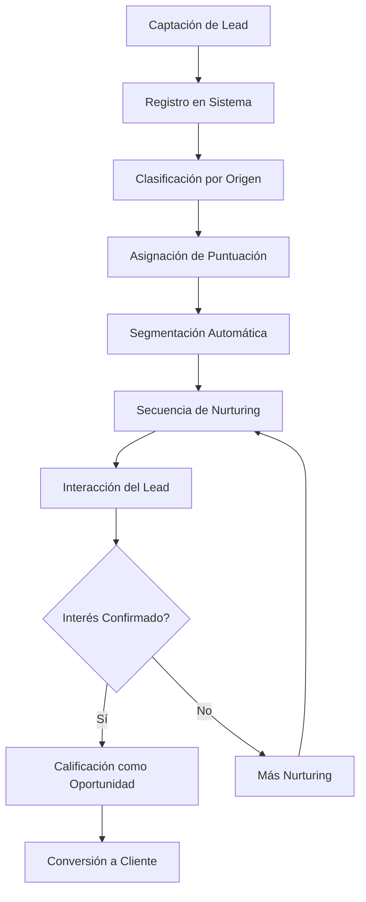
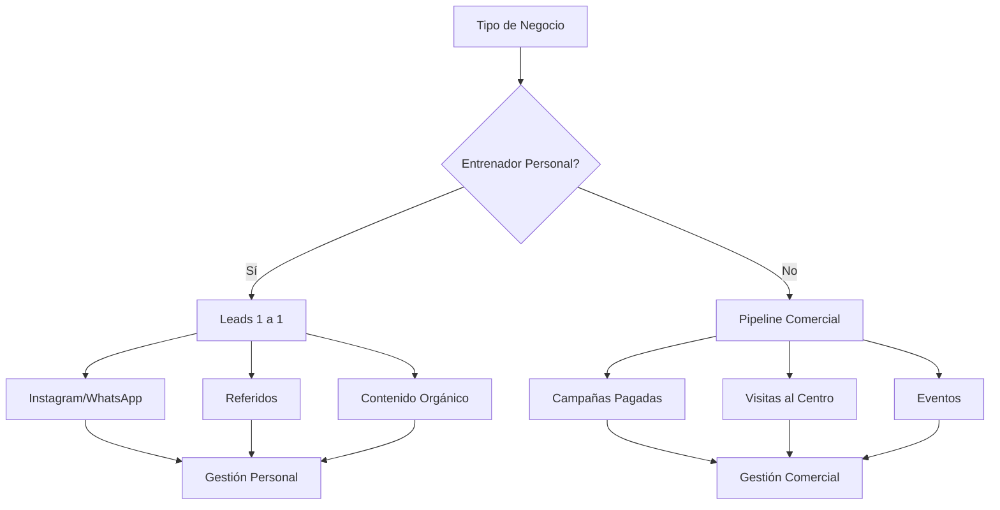

# Objetivo

**URL:** https://www.notion.so/29706f76bed481e78c65cda0ba64047d
**Extraído el:** 2025-10-29T20:48:29.028Z

---

> 🎯 **Sistema de gestión de leads y pipeline comercial personalizado por tipo de negocio**

# Objetivo

Proporcionar un sistema completo de gestión de leads que se adapte automáticamente al tipo de negocio (entrenador personal vs gimnasio). Para entrenadores personales, el foco está en leads 1 a 1 a través de redes sociales, mientras que para gimnasios se centra en pipeline comercial clásico con campañas de captación y visitas al centro.

# Diagramas de Flujo

## Flujo de Gestión de Leads



## Flujo por Tipo de Negocio



# Matrices de Recursos

## Funcionalidades Principales

- Gestión de Leads: Captura, seguimiento y conversión de leads potenciales
- Pipeline Visual: Vista Kanban del proceso de ventas
- Segmentación Inteligente: Clasificación automática por origen y comportamiento
- Scoring de Leads: Puntuación automática basada en interacciones
- Secuencias de Nurturing: Automatización de seguimiento por email/WhatsApp
- Analytics de Conversión: Métricas de efectividad por canal y campaña
## Integraciones

- Redes Sociales: Instagram, Facebook, TikTok para captación orgánica
- WhatsApp Business: Comunicación directa con leads
- Email Marketing: Mailchimp, ConvertKit, ActiveCampaign
- Google Ads: Integración con campañas pagadas
- Landing Pages: Captura de leads desde páginas de aterrizaje
- CRM Externo: Salesforce, HubSpot, Pipedrive
# User Stories

## Para Entrenadores Personales 🧍

- Como entrenador personal, quiero capturar leads interesados en entrenar conmigo a través de Instagram
- Como entrenador personal, necesito gestionar conversaciones 1 a 1 con leads por WhatsApp
- Como entrenador personal, debo poder hacer seguimiento personalizado a cada lead
- Como entrenador personal, quiero automatizar el primer contacto con nuevos leads
- Como entrenador personal, necesito recordatorios para dar seguimiento a leads calientes
- Como entrenador personal, debo poder ver el historial completo de interacciones con cada lead
## Para Gimnasios/Centros 🏢

- Como gimnasio, quiero gestionar un pipeline comercial clásico con múltiples leads
- Como centro, necesito capturar leads a través de campañas de marketing pagado
- Como gimnasio, debo poder gestionar visitas al centro y tours guiados
- Como centro, quiero segmentar leads por origen y nivel de interés
- Como gimnasio, necesito automatizar secuencias de nurturing masivas
- Como centro, debo poder asignar leads a diferentes vendedores del equipo
# Componentes React

- LeadsManager: Gestor principal de leads y pipeline
- PipelineKanban: Vista Kanban del proceso de ventas
- LeadCapture: Formularios de captura de leads
- ScoringEngine: Motor de puntuación de leads
- NurturingSequences: Gestor de secuencias de nurturing
- LeadAnalytics: Analytics y métricas de conversión
- LeadAssignment: Asignación de leads a vendedores
- LeadHistory: Historial completo de interacciones
# APIs Requeridas

```bash
GET /api/leads
POST /api/leads
PUT /api/leads/:id
DELETE /api/leads/:id
GET /api/leads/pipeline
POST /api/leads/score
GET /api/leads/analytics
POST /api/leads/assign
GET /api/leads/history/:id
POST /api/leads/nurture
```

# Estructura MERN

```bash
crm/leads/
├─ page.tsx
├─ api/
│  ├─ leads.ts
│  ├─ pipeline.ts
│  ├─ scoring.ts
│  └─ analytics.ts
└─ components/
   ├─ LeadsManager.tsx
   ├─ PipelineKanban.tsx
   ├─ LeadCapture.tsx
   ├─ ScoringEngine.tsx
   ├─ NurturingSequences.tsx
   ├─ LeadAnalytics.tsx
   ├─ LeadAssignment.tsx
   └─ LeadHistory.tsx
```

# Documentación de Procesos

1. Lead se captura a través de diferentes canales (redes sociales, landing pages, referidos)
1. Sistema registra automáticamente la información del lead y su origen
1. Se aplica scoring automático basado en comportamiento e interacciones
1. Lead se asigna al pipeline correspondiente según su puntuación
1. Se inicia secuencia de nurturing automática según el tipo de negocio
1. Usuario recibe notificaciones sobre leads calientes y acciones requeridas
1. Se realiza seguimiento personalizado hasta la conversión o pérdida del lead
# Nota Final

> 💡 **El sistema de leads se adapta completamente al tipo de negocio: entrenadores personales manejan leads 1 a 1 a través de redes sociales con enfoque personal, mientras que gimnasios gestionan pipeline comercial clásico con campañas masivas y procesos estructurados. La personalización del flujo es clave para maximizar las conversiones según el contexto del negocio.**

