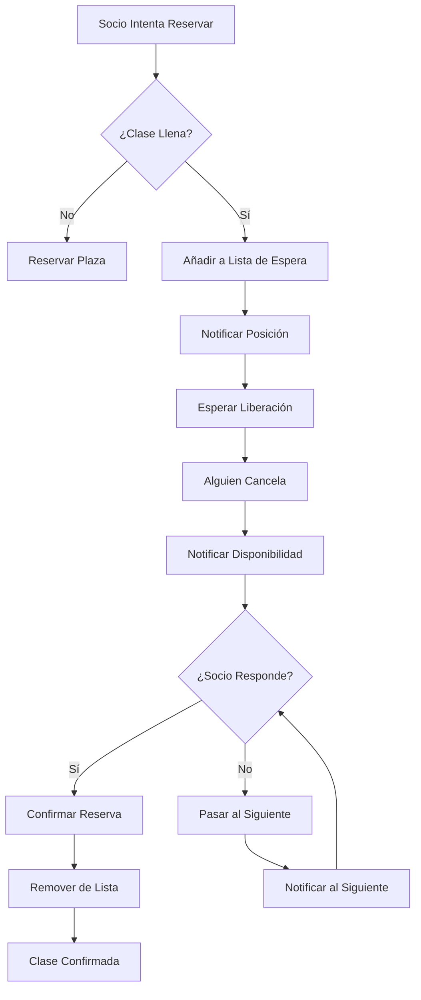
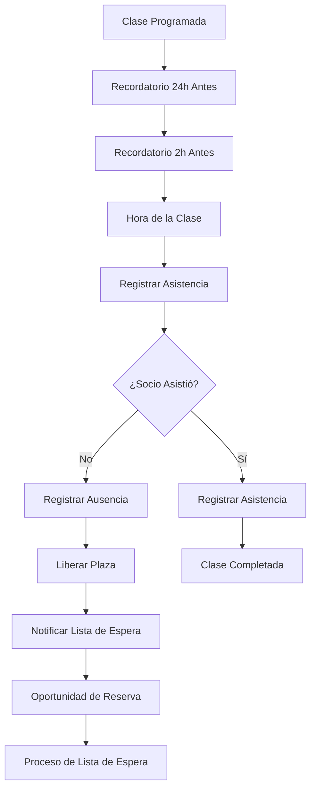

# Objetivo

**URL:** https://www.notion.so/29706f76bed4813fbf93f75261329bd8
**Extraído el:** 2025-10-29T20:48:46.918Z

---

> ⏳ **Sistema de gestión de lista de espera y ausencias para clases grupales con aforo limitado**

# Objetivo

Proporcionar un sistema completo de gestión de lista de espera y ausencias para clases grupales con aforo limitado. Funcionalidades: lista de espera para clases grupales con aforo limitado, gestión de ausencias, notificaciones automáticas, liberación de plazas. Específico para gimnasios/centros que tienen clases grupales con aforo limitado. Un entrenador 1 a 1 no tiene lista de espera para la 'clase de las 18:00 con 15 plazas'. Este módulo optimiza la ocupación y gestiona eficientemente las cancelaciones.

# Diagramas de Flujo

## Flujo de Lista de Espera



## Flujo de Gestión de Ausencias



# Matrices de Recursos

## Funcionalidades Principales

- Lista de Espera: Sistema automático cuando las clases se llenan
- Gestión de Ausencias: Control de asistencia y no-show
- Notificaciones Automáticas: Alertas cuando se liberan plazas
- Liberación de Plazas: Proceso automático cuando alguien cancela
- Control de Aforo: Gestión de capacidad máxima de clases
- Prioridades**: Sistema de prioridades en lista de espera
- Tiempo de Respuesta: Ventana de tiempo para confirmar reserva
- Analytics de Ocupación: Métricas de uso y optimización
## Integraciones

- Sistema de Reservas: Integración con reservas online
- Sistema de Clases: Gestión de clases grupales
- Sistema de Socios: Gestión de socios y membresías
- Sistema de Comunicaciones: Notificaciones y alertas
- Sistema de Pagos: Gestión de penalizaciones por no-show
- Sistema de Analytics: Métricas de ocupación y ausencias
# User Stories

## Para Gimnasios/Centros 🏢

- Como gimnasio, quiero que cuando una clase se llene, los socios puedan añadirse automáticamente a una lista de espera
- Como centro, necesito que el sistema notifique automáticamente a los socios en lista de espera cuando se libere una plaza
- Como gimnasio, debo poder gestionar las ausencias y no-show para liberar plazas y optimizar la ocupación
- Como centro, quiero que el sistema tenga un tiempo de respuesta para que los socios confirmen su reserva
- Como gimnasio, necesito analizar las ausencias para identificar patrones y optimizar las clases
- Como centro, debo poder configurar penalizaciones por no-show para reducir las ausencias
## Para Entrenadores Personales 🧍

- Como entrenador personal, NO necesito lista de espera porque trabajo con sesiones 1 a 1 individuales
- Como entrenador personal, mi enfoque está en la gestión individual de citas, no en clases grupales
- Como entrenador personal, no tengo 'clases de las 18:00 con 15 plazas' que requieran lista de espera
# Componentes React

- ListaEspera: Componente principal para gestión de lista de espera
- GestorAusencias: Sistema de control de asistencia y ausencias
- NotificacionesAutomaticas: Sistema de alertas y notificaciones
- LiberacionPlazas: Proceso automático de liberación de plazas
- ControlAforo: Gestión de capacidad máxima de clases
- PrioridadesLista: Sistema de prioridades en lista de espera
- TiempoRespuesta: Configuración de ventanas de tiempo
- AnalyticsAusencias: Métricas de ausencias y ocupación
# APIs Requeridas

```bash
GET /api/agenda/lista-espera
POST /api/agenda/lista-espera
PUT /api/agenda/lista-espera/:id
DELETE /api/agenda/lista-espera/:id
GET /api/agenda/ausencias
POST /api/agenda/notificar
GET /api/agenda/liberar-plaza
POST /api/agenda/confirmar-reserva
GET /api/agenda/analytics-ausencias
```

# Estructura MERN

```bash
agenda/lista-espera/
├─ page.tsx
├─ api/
│  ├─ lista-espera.ts
│  ├─ ausencias.ts
│  └─ notificaciones.ts
└─ components/
   ├─ ListaEspera.tsx
   ├─ GestorAusencias.tsx
   ├─ NotificacionesAutomaticas.tsx
   ├─ LiberacionPlazas.tsx
   ├─ ControlAforo.tsx
   ├─ PrioridadesLista.tsx
   ├─ TiempoRespuesta.tsx
   └─ AnalyticsAusencias.tsx
```

# Documentación de Procesos

1. Un socio intenta reservar una clase que ya está llena
1. El sistema añade automáticamente al socio a la lista de espera
1. Se notifica al socio su posición en la lista de espera
1. Cuando alguien cancela o no asiste, se libera una plaza
1. El sistema notifica automáticamente al primer socio en lista de espera
1. El socio tiene un tiempo limitado para confirmar su reserva
1. Si confirma, se confirma la reserva y se remueve de la lista
1. Si no responde, se pasa al siguiente socio en la lista
1. El sistema registra todas las ausencias para análisis
1. Se generan analytics de ocupación y ausencias para optimización
# Nota Final

> 💡 **La Lista de Espera & Ausencias es un módulo específico para gimnasios y centros con clases grupales que tienen aforo limitado. Los entrenadores personales no necesitan este módulo porque trabajan con sesiones 1 a 1 individuales. El sistema debe optimizar la ocupación de las clases y gestionar eficientemente las cancelaciones y ausencias para maximizar el uso de las instalaciones y la satisfacción de los socios.**

