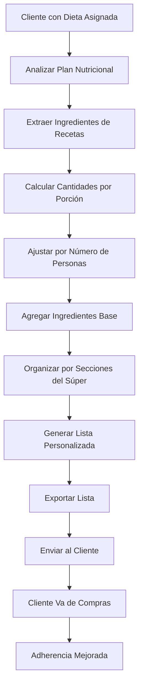
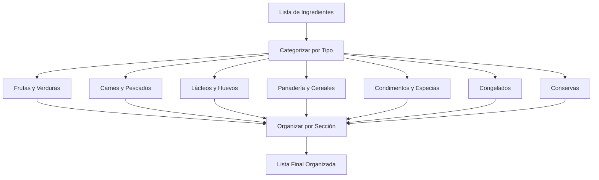

# Objetivo

**URL:** https://www.notion.so/29706f76bed481faa834c220d425f500
**Extraído el:** 2025-10-29T20:48:41.776Z

---

> 🛒 **Generador de listas de compra personalizadas cliente a cliente con valor percibido máximo**

# Objetivo

Proporcionar un sistema completo de generación de listas de compra personalizadas que permita crear listas específicas para cada cliente basadas en su dieta asignada. Funcionalidades: generar lista de compra del súper personalizada cliente a cliente, ingredientes por dieta, cantidades calculadas, organización por secciones del supermercado. Brutal para entrenadores personales (valor percibido máximo). El gimnasio estándar no genera la compra del súper personalizada cliente a cliente, porque eso no escala. Este módulo optimiza la experiencia de compra y facilita la adherencia nutricional.

# Diagramas de Flujo

## Flujo de Generación de Lista de Compra



## Flujo de Organización por Secciones



# Matrices de Recursos

## Funcionalidades Principales

- Lista Personalizada: Generación automática basada en dieta del cliente
- Ingredientes por Dieta: Extracción automática de recetas asignadas
- Cantidades Calculadas: Cálculo preciso por porción y número de personas
- Organización por Secciones: Agrupación por áreas del supermercado
- Exportación Múltiple: PDF, email, app móvil, impresión
- Ingredientes Base: Añadir productos básicos de despensa
- Optimización de Compras: Agrupación por supermercado preferido
- Recordatorios Automáticos**: Notificaciones de compra semanal
## Integraciones

- Sistema de Dietas: Extracción de ingredientes de planes asignados
- Recetario: Ingredientes de recetas seleccionadas
- Base de Datos de Alimentos: Información nutricional y precios
- Sistema de Clientes: Personalización por cliente específico
- Sistema de Comunicaciones: Envío automático de listas
- Sistema de Analytics: Métricas de uso y efectividad
# User Stories

## Para Entrenadores Personales 🧍

- Como entrenador personal, quiero generar listas de compra personalizadas para cada cliente basadas en su dieta específica para maximizar su adherencia
- Como entrenador personal, necesito que las cantidades se calculen automáticamente según el número de personas en el hogar del cliente
- Como entrenador personal, debo poder organizar la lista por secciones del supermercado para que mi cliente compre de forma eficiente
- Como entrenador personal, quiero enviar la lista directamente al cliente por email o app para que la tenga siempre disponible
- Como entrenador personal, necesito añadir ingredientes base de despensa que el cliente debe tener siempre en casa
- Como entrenador personal, debo poder personalizar la lista según las preferencias y restricciones alimentarias de cada cliente
## Para Gimnasios Estándar 🏢

- Como gimnasio estándar, NO genero listas de compra personalizadas cliente a cliente porque eso no escala operativamente
- Como gimnasio regular, mi enfoque está en servicios grupales y métricas de ocupación, no en personalización individual
- Como centro estándar, no tengo la infraestructura para generar listas personalizadas para cientos de socios
- Como gimnasio regular, ofrezco planes nutricionales generales pero no seguimiento individual de compras
## Para Gimnasios Boutique Premium 🏢

- Como gimnasio boutique, quiero ofrecer listas de compra personalizadas como servicio premium para clientes VIP
- Como centro premium, necesito diferenciar entre servicios básicos y premium basándome en el nivel de personalización
- Como gimnasio boutique, debo poder cobrar extra por el servicio de listas personalizadas como upsell
# Componentes React

- ListaCompra: Componente principal para gestión de listas de compra
- GeneradorLista: Herramienta para crear listas personalizadas
- OrganizadorSecciones: Agrupación por secciones del supermercado
- CalculadoraCantidades: Cálculo automático de cantidades
- ExportLista: Exportación en múltiples formatos
- PersonalizadorLista: Ajustes según preferencias del cliente
- OptimizadorCompras: Agrupación por supermercado preferido
- RecordatoriosLista: Sistema de notificaciones automáticas
# APIs Requeridas

```bash
GET /api/nutricion/lista-compra
POST /api/nutricion/lista-compra
GET /api/nutricion/ingredientes
POST /api/nutricion/calcular-cantidades
GET /api/nutricion/exportar-lista
POST /api/nutricion/lista-compra/personalizar
GET /api/nutricion/lista-compra/historial
POST /api/nutricion/lista-compra/recordatorio
```

# Estructura MERN

```bash
nutricion/lista-compra/
├─ page.tsx
├─ api/
│  ├─ lista-compra.ts
│  ├─ ingredientes.ts
│  └─ exportar.ts
└─ components/
   ├─ ListaCompra.tsx
   ├─ GeneradorLista.tsx
   ├─ OrganizadorSecciones.tsx
   ├─ CalculadoraCantidades.tsx
   ├─ ExportLista.tsx
   ├─ PersonalizadorLista.tsx
   ├─ OptimizadorCompras.tsx
   └─ RecordatoriosLista.tsx
```

# Documentación de Procesos

1. El entrenador accede al módulo de Lista de Compra para un cliente específico
1. El sistema analiza la dieta asignada al cliente y extrae todos los ingredientes
1. Se calculan las cantidades necesarias basándose en el número de porciones y personas
1. Se añaden ingredientes base de despensa que el cliente debe tener siempre
1. La lista se organiza por secciones del supermercado para compra eficiente
1. Se personaliza según las preferencias y restricciones del cliente
1. La lista se exporta en el formato preferido (PDF, email, app móvil)
1. Se envía automáticamente al cliente con recordatorios programados
1. El cliente utiliza la lista para hacer sus compras de forma organizada
1. La adherencia nutricional mejora significativamente con la facilidad de compra
# Nota Final

> 💡 **La Lista de la Compra / Supermercado es una funcionalidad de valor percibido máximo para entrenadores personales, ya que elimina una de las principales barreras para la adherencia nutricional: la dificultad de saber qué comprar. Sin embargo, su implementación a gran escala en gimnasios estándar es inviable debido a limitaciones operativas. Solo gimnasios boutique con servicios premium pueden justificar este nivel de personalización. El sistema debe ser intuitivo para generar listas automáticamente y fácil de usar para los clientes durante sus compras.**

