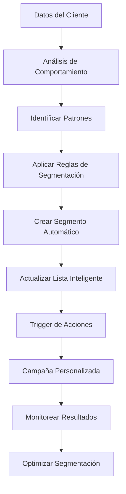
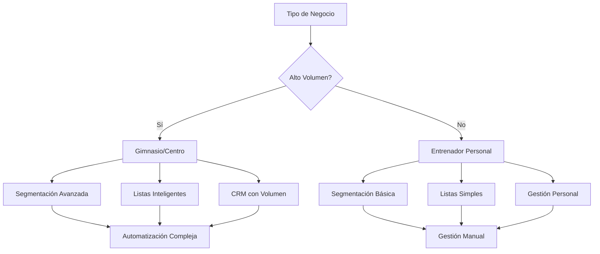

# Objetivo

**URL:** https://www.notion.so/29706f76bed481e88bdbcf073eaef60b
**Extraído el:** 2025-10-29T20:48:32.611Z

---

> 🎯 **Sistema avanzado de segmentación automática y listas inteligentes especializado para gimnasios con alto volumen de clientes**

# Objetivo

Proporcionar un sistema avanzado de segmentación automática y listas inteligentes que se adapte al volumen de clientes. Este módulo está especialmente diseñado para gimnasios y centros con alto volumen que necesitan segmentación avanzada (ej: 'mujeres 30-45 con bono a punto de caducar'). Un entrenador personal suele trabajar con menos gente y no necesita segmentación avanzada, pero los gimnasios requieren herramientas sofisticadas de CRM con volumen para optimizar campañas y comunicación.

# Diagramas de Flujo

## Flujo de Segmentación Inteligente



## Flujo por Tipo de Negocio



# Matrices de Recursos

## Funcionalidades Principales

- Segmentación Automática: Clasificación inteligente basada en comportamiento y perfil
- Listas Inteligentes: Segmentos dinámicos que se actualizan automáticamente
- Reglas de Segmentación: Criterios complejos y combinaciones avanzadas
- Segmentos Guardados: Listas reutilizables para campañas recurrentes
- Análisis Predictivo: Identificación de patrones y tendencias
- Automatización de Acciones: Triggers automáticos basados en segmentos
## Integraciones

- Sistema de CRM: Base de datos completa de clientes y leads
- Sistema de Comportamiento: Tracking de interacciones y actividades
- Sistema de Transacciones: Historial de compras y pagos
- Sistema de Entrenamientos: Adherencia y progreso
- Sistema de Comunicaciones: Historial de interacciones
- Analytics Externos: Integración con herramientas de BI
# User Stories

## Para Gimnasios/Centros 🏢

- Como gimnasio, quiero crear segmentos como 'mujeres 30-45 con bono a punto de caducar' para campañas específicas
- Como centro, necesito segmentar por comportamiento de uso para optimizar horarios de clases
- Como gimnasio, debo poder crear listas inteligentes que se actualicen automáticamente
- Como centro, quiero segmentar por nivel de gasto para ofertas personalizadas
- Como gimnasio, necesito identificar patrones de abandono para acciones de retención
- Como centro, debo poder comparar efectividad de campañas por segmento
## Para Entrenadores Personales 🧍

- Como entrenador personal, quiero listas simples de clientes por objetivo (pérdida de peso, ganancia de masa)
- Como entrenador personal, necesito segmentar clientes por nivel de adherencia
- Como entrenador personal, debo poder crear listas básicas para seguimiento personalizado
- Como entrenador personal, quiero identificar clientes en riesgo de abandono
# Componentes React

- SegmentationEngine: Motor principal de segmentación inteligente
- SmartListsManager: Gestor de listas inteligentes dinámicas
- SegmentBuilder: Constructor visual de reglas de segmentación
- BehaviorAnalyzer: Analizador de comportamiento y patrones
- PredictiveSegmentation: Segmentación predictiva basada en ML
- SegmentAnalytics: Analytics de efectividad por segmento
- AutomationRules: Reglas de automatización por segmento
- SegmentComparison: Comparación de rendimiento entre segmentos
# APIs Requeridas

```bash
GET /api/segments
POST /api/segments
PUT /api/segments/:id
DELETE /api/segments/:id
GET /api/segments/smart-lists
POST /api/segments/analyze
GET /api/segments/behavior
POST /api/segments/predict
GET /api/segments/analytics
POST /api/segments/automation
```

# Estructura MERN

```bash
crm/segmentation/
├─ page.tsx
├─ api/
│  ├─ segments.ts
│  ├─ smart-lists.ts
│  ├─ behavior.ts
│  └─ analytics.ts
└─ components/
   ├─ SegmentationEngine.tsx
   ├─ SmartListsManager.tsx
   ├─ SegmentBuilder.tsx
   ├─ BehaviorAnalyzer.tsx
   ├─ PredictiveSegmentation.tsx
   ├─ SegmentAnalytics.tsx
   ├─ AutomationRules.tsx
   └─ SegmentComparison.tsx
```

# Documentación de Procesos

1. Sistema recopila datos de comportamiento, transacciones y interacciones
1. Se analizan patrones y se identifican criterios de segmentación
1. Se crean reglas de segmentación basadas en criterios complejos
1. Se generan listas inteligentes que se actualizan automáticamente
1. Se activan automatizaciones específicas para cada segmento
1. Se monitorean resultados y se optimizan criterios de segmentación
1. Se generan reportes de efectividad por segmento para análisis
# Nota Final

> 💡 **El sistema de listas inteligentes y segmentos guardados está especialmente diseñado para gimnasios y centros con alto volumen de clientes que necesitan segmentación avanzada y CRM sofisticado. Los entrenadores personales pueden usar funcionalidades básicas para listas simples, pero el módulo completo es ideal para centros que requieren análisis predictivo, automatización compleja y segmentación por múltiples criterios para optimizar campañas y comunicación masiva.**

