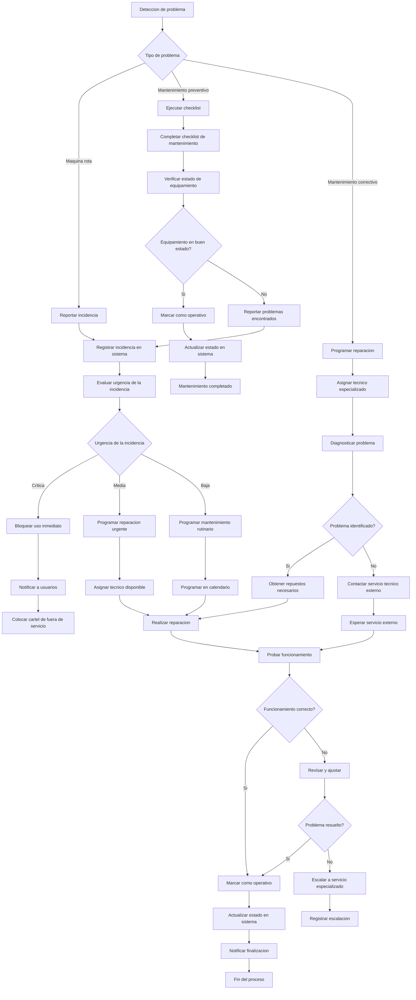

# Mantenimiento & Incidencias - Documentacion Completa

**URL:** https://www.notion.so/29906f76bed481228c28d31aaa720f72
**Extraído el:** 2025-10-29T20:48:26.191Z

---

# Mantenimiento & Incidencias - Documentacion Completa

Esta pagina sirve como documentacion completa del modulo de gestion de mantenimiento e incidencias del software fitness. Este modulo esta exclusivamente dirigido a gimnasios y centros fitness con infraestructura fisica:

## Funcionalidades Principales

- Gestion de maquinas rotas y equipamiento defectuoso
- Checklist de mantenimiento preventivo y correctivo
- Gestion completa de incidencias y reportes
- Seguimiento de reparaciones y mantenimientos
Nota: Este modulo es especifico para centros fisicos con infraestructura de maquinas y equipamiento. Un entrenador personal no gestiona mantenimiento de maquinas complejas.

## Diagramas de Flujo de Mantenimiento

Los diagramas de flujo muestran el proceso completo de gestion de mantenimiento e incidencias:

## Matrices de Incidencias

Tipos de incidencias y su clasificacion:

- Incidencias Criticas: Maquinas completamente rotas, problemas de seguridad
- Incidencias Medias: Funcionamiento parcial, ruidos anormales
- Incidencias Bajas: Mantenimiento preventivo, ajustes menores
- Incidencias de Seguridad: Problemas electricos, estructuras danadas
- Incidencias de Limpieza: Equipamiento sucio, areas sin limpiar
- Incidencias de Suministros: Falta de material, repuestos agotados
- Incidencias de Climatizacion: Problemas de aire acondicionado, calefaccion
## Componentes React

Documentacion de componentes React para el modulo de mantenimiento e incidencias:

### MantenimientoManager

Componente principal para gestionar todo el sistema de mantenimiento. Coordina incidencias, checklist, reparaciones y alertas. Proporciona dashboard centralizado con estado de todo el equipamiento.

### GestorIncidencias

Componente para gestionar incidencias reportadas. Permite crear, editar, asignar prioridades y hacer seguimiento del estado de cada incidencia hasta su resolucion.

### ChecklistMantenimiento

Componente para gestionar checklist de mantenimiento preventivo y correctivo. Incluye listas de verificacion personalizables por tipo de equipamiento y frecuencia de mantenimiento.

### SeguimientoReparaciones

Componente para hacer seguimiento de reparaciones en curso. Permite asignar tecnicos, programar citas, gestionar repuestos y actualizar el progreso de cada reparacion.

### AlertasMantenimiento

Componente para gestionar alertas y notificaciones de mantenimiento. Genera alertas por vencimiento de mantenimiento, incidencias criticas y recordatorios de tareas pendientes.

## Configuraciones de Checklists

Configuraciones especificas para los checklist de mantenimiento:

- Checklist Diario: Limpieza, verificacion basica de funcionamiento
- Checklist Semanal: Mantenimiento preventivo, lubricacion
- Checklist Mensual: Revision completa, calibracion
- Checklist Trimestral: Mantenimiento profundo, cambio de piezas
- Checklist Anual: Revision completa, certificaciones
- Checklist por Tipo: Especifico para cada tipo de maquina
## APIs Requeridas

Documentacion de las APIs necesarias para el modulo de mantenimiento e incidencias:

- GET /api/operaciones/mantenimiento - Obtener estado del mantenimiento
- POST /api/operaciones/mantenimiento - Crear nueva tarea de mantenimiento
- GET /api/operaciones/incidencias - Obtener lista de incidencias
- POST /api/operaciones/incidencias - Reportar nueva incidencia
- GET /api/operaciones/checklists - Obtener checklist de mantenimiento
## Estructura de Carpetas MERN

Estructura de carpetas para el stack MERN:

- operaciones/mantenimiento/page.tsx - Pagina principal de mantenimiento
- operaciones/mantenimiento/api/ - API routes para mantenimiento
- operaciones/mantenimiento/components/ - Componentes React de mantenimiento
- operaciones/mantenimiento/hooks/ - Custom hooks para gestion de estado
- operaciones/mantenimiento/utils/ - Utilidades y helpers
- operaciones/mantenimiento/services/ - Servicios de integracion
- operaciones/mantenimiento/types/ - Tipos TypeScript
- operaciones/mantenimiento/checklists/ - Componentes de checklist
## Documentacion de Procesos

Procesos principales del modulo de mantenimiento e incidencias:

### Proceso de Reporte de Incidencias

- Deteccion de problema o maquina rota
- Registro de incidencia en el sistema
- Clasificacion por urgencia y tipo
- Asignacion de tecnico responsable
- Notificacion a personal y usuarios
### Proceso de Mantenimiento Preventivo

- Programacion de mantenimiento segun calendario
- Ejecucion de checklist de mantenimiento
- Verificacion de estado de equipamiento
- Registro de actividades realizadas
- Actualizacion de estado en sistema
### Proceso de Reparacion

- Diagnostico del problema identificado
- Obtencion de repuestos necesarios
- Ejecucion de reparacion por tecnico
- Prueba de funcionamiento post-reparacion
- Registro de reparacion completada
### Proceso de Gestion de Alertas

- Monitoreo de vencimientos de mantenimiento
- Generacion de alertas automaticas
- Notificacion a personal responsable
- Seguimiento de alertas pendientes
- Escalacion de alertas no atendidas
## Consideraciones Tecnicas

Aspectos tecnicos importantes para la implementacion:

- Integracion con sistemas de inventario de repuestos
- Sistema de notificaciones en tiempo real
- Gestion de calendarios de mantenimiento automaticos
- Sistema de escalacion de incidencias criticas
- Integracion con proveedores de servicios externos
- Sistema de reportes y analiticas de mantenimiento
## Mejores Practicas

Recomendaciones para el desarrollo:

- Usar TypeScript para tipado fuerte
- Implementar validaciones de incidencias robustas
- Usar React Query para gestion de estado de servidor
- Implementar manejo de errores robusto
- Crear tests unitarios y de integracion
- Implementar sistema de auditoria completo
## Resumen

Esta documentacion proporciona una guia completa para implementar el modulo de Mantenimiento & Incidencias del software fitness. Este modulo esta exclusivamente dirigido a gimnasios y centros fitness con infraestructura fisica, proporcionando gestion completa de maquinas rotas, checklist de mantenimiento, gestion de incidencias y seguimiento de reparaciones. Un entrenador personal no gestiona mantenimiento de maquinas complejas. Incluye sistema de alertas automaticas, gestion de calendarios de mantenimiento y integracion con proveedores de servicios externos.

URL de la pagina: https://www.notion.so/Mantenimiento-Incidencias-29906f76bed481228c28d31aaa720f72

