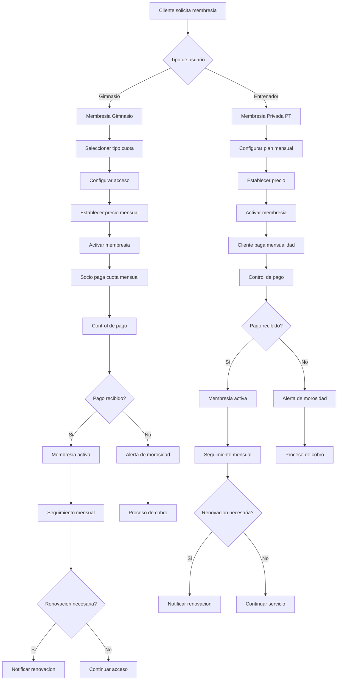

# Membresías Activas - Documentación Completa

**URL:** https://www.notion.so/29906f76bed4815680cce299127a2c7f
**Extraído el:** 2025-10-29T20:48:10.853Z

---

# Membresías Activas - Documentación Completa

Esta página sirve como documentación completa del módulo de gestión de membresías activas del software fitness. El módulo se adapta según el tipo de usuario:

- Para entrenadores: quién me está pagando la mensualidad privada
- Para gimnasios: todos los socios activos, su estado de pago
## Diagramas de Flujo de Membresias

Los diagramas de flujo muestran el proceso completo de gestion de membresias activas:



## Matrices de Socios

Tabla de estados de membresias para diferentes tipos de usuarios:

- Membresia Activa: Pago al dia, acceso completo
- Membresia Pendiente: Pago en proceso, acceso limitado
- Membresia Vencida: Pago atrasado, sin acceso
- Membresia Suspendida: Temporalmente inactiva
- Membresia Cancelada: Terminada permanentemente
## Componentes React

Documentacion de componentes React para el modulo de membresias activas:

### MembresiasActivas

```typescript
interface MembresiasActivasProps {
  userType: 'entrenador' | 'gimnasio';
  membresias: Membresia[];
  onUpdateMembresia: (id: string, data: UpdateMembresiaRequest) => void;
  onCancelMembresia: (id: string) => void;
  onRenewMembresia: (id: string) => void;
}

const MembresiasActivas: React.FC<MembresiasActivasProps> = ({
  userType,
  membresias,
  onUpdateMembresia,
  onCancelMembresia,
  onRenewMembresia
}) => {
  const [filter, setFilter] = useState<'todas' | 'activas' | 'vencidas' | 'suspendidas'>('todas');
  
  const filteredMembresias = useMemo(() => {
    return membresias.filter(membresia => {
      if (filter === 'todas') return true;
      return membresia.estado === filter;
    });
  }, [membresias, filter]);
  
  return (
    <div className='membresias-activas'>
      <div className='header'>
        <h2>Membresias Activas</h2>
        <FilterSelector 
          value={filter}
          onChange={setFilter}
          options={[
            { value: 'todas', label: 'Todas' },
            { value: 'activas', label: 'Activas' },
            { value: 'vencidas', label: 'Vencidas' },
            { value: 'suspendidas', label: 'Suspendidas' }
          ]}
        />
      </div>
      
      <MembresiasList
        membresias={filteredMembresias}
        userType={userType}
        onUpdate={onUpdateMembresia}
        onCancel={onCancelMembresia}
        onRenew={onRenewMembresia}
      />
    </div>
  );
};
```

### SociosActivos

```typescript
interface SociosActivosProps {
  socios: Socio[];
  onViewSocio: (socioId: string) => void;
  onUpdateSocio: (socioId: string, data: UpdateSocioRequest) => void;
  onSuspendSocio: (socioId: string, motivo: string) => void;
}

const SociosActivos: React.FC<SociosActivosProps> = ({
  socios,
  onViewSocio,
  onUpdateSocio,
  onSuspendSocio
}) => {
  const [searchTerm, setSearchTerm] = useState('');
  
  const filteredSocios = useMemo(() => {
    return socios.filter(socio => 
      socio.nombre.toLowerCase().includes(searchTerm.toLowerCase()) ||
      socio.email.toLowerCase().includes(searchTerm.toLowerCase())
    );
  }, [socios, searchTerm]);
  
  return (
    <div className='socios-activos'>
      <div className='header'>
        <h2>Socios Activos</h2>
        <SearchInput
          value={searchTerm}
          onChange={setSearchTerm}
          placeholder='Buscar socio...'
        />
      </div>
      
      <div className='socios-grid'>
        {filteredSocios.map(socio => (
          <SocioCard
            key={socio.id}
            socio={socio}
            onView={() => onViewSocio(socio.id)}
            onUpdate={(data) => onUpdateSocio(socio.id, data)}
            onSuspend={(motivo) => onSuspendSocio(socio.id, motivo)}
          />
        ))}
      </div>
    </div>
  );
};
```

### EstadoPago

```typescript
interface EstadoPagoProps {
  membresiaId: string;
  estado: EstadoPago;
  ultimoPago?: Pago;
  proximoVencimiento?: Date;
  onProcessPayment: (membresiaId: string) => void;
  onSendReminder: (membresiaId: string) => void;
}

const EstadoPago: React.FC<EstadoPagoProps> = ({
  membresiaId,
  estado,
  ultimoPago,
  proximoVencimiento,
  onProcessPayment,
  onSendReminder
}) => {
  const getEstadoColor = (estado: EstadoPago) => {
    switch (estado) {
      case 'pagado': return 'green';
      case 'pendiente': return 'yellow';
      case 'vencido': return 'red';
      case 'suspendido': return 'gray';
      default: return 'gray';
    }
  };
  
  const getEstadoLabel = (estado: EstadoPago) => {
    switch (estado) {
      case 'pagado': return 'Al dia';
      case 'pendiente': return 'Pendiente';
      case 'vencido': return 'Vencido';
      case 'suspendido': return 'Suspendido';
      default: return 'Desconocido';
    }
  };
  
  return (
    <div className='estado-pago'>
      <div className='estado-indicator'>
        <StatusBadge 
          color={getEstadoColor(estado)}
          label={getEstadoLabel(estado)}
        />
      </div>
      
      {ultimoPago && (
        <div className='ultimo-pago'>
          <span>Ultimo pago: {formatDate(ultimoPago.fecha)}</span>
          <span>Monto: {ultimoPago.monto}�,�</span>
        </div>
      )}
      
      {proximoVencimiento && (
        <div className='proximo-vencimiento'>
          <span>Proximo vencimiento: {formatDate(proximoVencimiento)}</span>
        </div>
      )}
      
      <div className='actions'>
        {estado === 'vencido' && (
          <button onClick={() => onProcessPayment(membresiaId)}>
            Procesar Pago
          </button>
        )}
        {estado === 'pendiente' && (
          <button onClick={() => onSendReminder(membresiaId)}>
            Enviar Recordatorio
          </button>
        )}
      </div>
    </div>
  );
};
```

### SeguimientoMensualidades

Componente para el seguimiento de pagos mensuales de membresias. Incluye estadisticas de pagos, formulario para agregar nuevos pagos y lista de pagos historicos.

### AlertasVencimiento

Componente para gestionar alertas de vencimiento de membresias. Permite filtrar alertas por prioridad, marcar como leidas y procesar acciones.

## Configuraciones de Estados

Configuraciones especificas para cada estado de membresia:

- Estado Activo: Acceso completo, servicios disponibles
- Estado Pendiente: Acceso limitado, notificaciones activas
- Estado Vencido: Sin acceso, proceso de cobro iniciado
- Estado Suspendido: Acceso temporalmente bloqueado
- Estado Cancelado: Membresia terminada permanentemente
## APIs Requeridas

Documentacion de las APIs necesarias para el modulo de membresias activas:

- GET /api/membresias/activas - Obtener todas las membresias activas
- GET /api/membresias/socios - Obtener lista de socios activos
- GET /api/membresias/estado-pago - Obtener estado de pagos de membresias
- POST /api/membresias/seguimiento - Crear seguimiento de membresia
- GET /api/membresias/alertas - Obtener alertas de vencimiento
## Estructura de Carpetas MERN

Estructura de carpetas para el stack MERN:

- membresias/activas/page.tsx - Pagina principal de membresias activas
- membresias/activas/api/ - API routes para membresias activas
- membresias/activas/components/ - Componentes React del modulo
- membresias/activas/hooks/ - Custom hooks para gestion de estado
- membresias/activas/utils/ - Utilidades y helpers
## Documentacion de Procesos

Procesos principales de la seccion de membresias activas:

### Proceso de Activacion de Membresia

- Cliente selecciona tipo de membresia
- Procesar pago inicial
- Activar acceso a servicios
- Enviar confirmacion y detalles
### Proceso de Seguimiento Mensual

- Generar recordatorio de pago
- Procesar pago mensual
- Actualizar estado de membresia
- Registrar historial de pagos
### Proceso de Gestion de Alertas

- Detectar membresias proximas a vencer
- Generar alertas automaticas
- Enviar notificaciones a clientes
- Procesar acciones de alertas
### Proceso de Suspension/Cancelacion

- Detectar morosidad prolongada
- Suspender acceso a servicios
- Notificar al cliente sobre suspension
- Procesar cancelacion si es necesario
## Consideraciones Tecnicas

Aspectos tecnicos importantes para la implementacion:

- Validacion automatica de estados de pago
- Sistema de notificaciones en tiempo real
- Integracion con pasarelas de pago
- Auditoria completa de cambios de estado
- Backup y recuperacion de datos de membresias
## Mejores Practicas

Recomendaciones para el desarrollo:

- Usar TypeScript para tipado fuerte de estados
- Implementar validaciones tanto en frontend como backend
- Usar React Query para gestion de estado de servidor
- Implementar manejo de errores robusto
- Crear tests unitarios y de integracion
## Resumen

Esta documentacion proporciona una guia completa para implementar el modulo de Membresias Activas del software fitness. El modulo se adapta segun el tipo de usuario (entrenador vs gimnasio) y proporciona todas las funcionalidades necesarias para la gestion eficiente de membresias activas, seguimiento de pagos y alertas de vencimiento.

URL de la pagina: https://www.notion.so/Membres-as-Activas-29906f76bed4815680cce299127a2c7f

