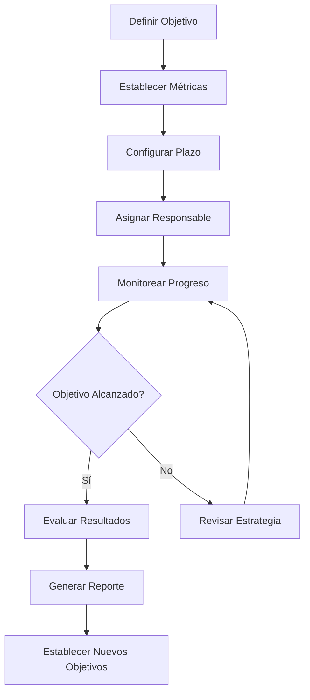
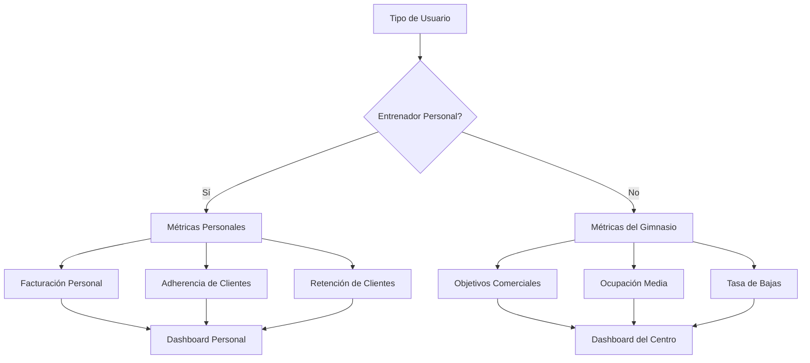

# Objetivo

**URL:** https://www.notion.so/29706f76bed481c29070f137e434b8de
**Extraído el:** 2025-10-29T20:48:28.362Z

---

> 🎯 **Sistema de gestión de objetivos y seguimiento de rendimiento personalizado por rol**

# Objetivo

Proporcionar un sistema completo de gestión de objetivos y seguimiento de rendimiento que se adapte automáticamente al tipo de usuario (entrenador personal vs gimnasio). El sistema debe permitir establecer, monitorear y evaluar objetivos específicos, proporcionando métricas relevantes y dashboards personalizados para optimizar el rendimiento del negocio.

# Diagramas de Flujo

## Flujo de Gestión de Objetivos



## Flujo de Métricas por Rol



# Matrices de Recursos

## Funcionalidades Principales

- Gestión de Objetivos: Creación, seguimiento y evaluación de objetivos SMART
- Dashboard de Rendimiento: Visualización de métricas clave en tiempo real
- Métricas Personalizadas: KPIs adaptados al tipo de usuario y objetivos
- Seguimiento de Progreso: Monitoreo continuo del avance hacia objetivos
- Reportes Automáticos: Generación de informes de rendimiento periódicos
- Alertas de Rendimiento: Notificaciones cuando se desvían de los objetivos
## Integraciones

- Sistema de Facturación: Métricas de ingresos y facturación
- Sistema de CRM: Métricas de clientes y leads
- Sistema de Entrenamientos: Métricas de adherencia y progreso
- Sistema de Nutrición: Métricas de cumplimiento dietético
- Sistema de Operaciones: Métricas de ocupación y eficiencia
- Sistema de Marketing: Métricas de adquisición y retención
# User Stories

## Para Entrenadores Personales 🧍

- Como entrenador personal, quiero establecer objetivos de facturación mensual para planificar mis ingresos
- Como entrenador personal, necesito monitorear la adherencia de mis clientes para evaluar mi efectividad
- Como entrenador personal, debo poder ver el progreso hacia mis objetivos en tiempo real
- Como entrenador personal, quiero recibir alertas cuando me desvío de mis objetivos para tomar acción
- Como entrenador personal, necesito reportes mensuales de mi rendimiento para evaluar mi crecimiento
- Como entrenador personal, debo poder comparar mi rendimiento actual con períodos anteriores
## Para Gimnasios/Centros 🏢

- Como gimnasio, quiero establecer objetivos comerciales globales para el centro
- Como centro, necesito monitorear la ocupación media para optimizar el uso de instalaciones
- Como gimnasio, debo poder controlar la tasa de bajas para mejorar la retención
- Como centro, quiero establecer objetivos por departamento (ventas, operaciones, marketing)
- Como gimnasio, necesito dashboards ejecutivos para tomar decisiones estratégicas
- Como centro, debo poder comparar el rendimiento entre diferentes períodos y sedes
# Componentes React

- ObjectivesManager: Gestor principal de objetivos y metas
- PerformanceDashboard: Dashboard de rendimiento en tiempo real
- MetricsChart: Gráficos de métricas y KPIs
- GoalTracker: Seguimiento de progreso hacia objetivos
- ReportsGenerator: Generador de reportes automáticos
- AlertsManager: Gestor de alertas de rendimiento
- ComparisonTool: Herramienta de comparación de períodos
- KPIConfigurator: Configurador de métricas personalizadas
# APIs Requeridas

```bash
GET /api/objectives
POST /api/objectives
PUT /api/objectives/:id
DELETE /api/objectives/:id
GET /api/performance/metrics
GET /api/performance/dashboard
GET /api/performance/reports
POST /api/performance/compare
GET /api/kpis
POST /api/kpis
PUT /api/kpis/:id
GET /api/objectives/progress
```

# Estructura MERN

```bash
dashboard/objetivos-rendimiento/
├─ page.tsx
├─ api/
│  ├─ objectives.ts
│  ├─ performance.ts
│  ├─ metrics.ts
│  └─ reports.ts
└─ components/
   ├─ ObjectivesManager.tsx
   ├─ PerformanceDashboard.tsx
   ├─ MetricsChart.tsx
   ├─ GoalTracker.tsx
   ├─ ReportsGenerator.tsx
   ├─ AlertsManager.tsx
   ├─ ComparisonTool.tsx
   └─ KPIConfigurator.tsx
```

# Documentación de Procesos

1. Usuario define objetivos específicos y medibles según su rol
1. Sistema configura métricas y KPIs relevantes para cada objetivo
1. Se establecen plazos y responsables para cada objetivo
1. Sistema monitorea continuamente el progreso hacia los objetivos
1. Se generan alertas cuando se detectan desviaciones significativas
1. Usuario recibe reportes periódicos del rendimiento
1. Al final del período, se evalúan los resultados y se establecen nuevos objetivos
# Nota Final

> 💡 **El sistema de objetivos y rendimiento es clave para el crecimiento del negocio. Se adapta automáticamente según el tipo de usuario: entrenadores personales se enfocan en facturación personal y adherencia de clientes, mientras que gimnasios se centran en objetivos comerciales globales, ocupación y retención. La personalización de métricas es fundamental para que cada usuario vea información relevante para su contexto.**

