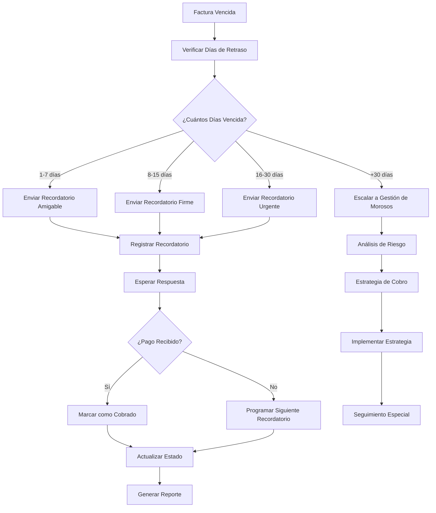
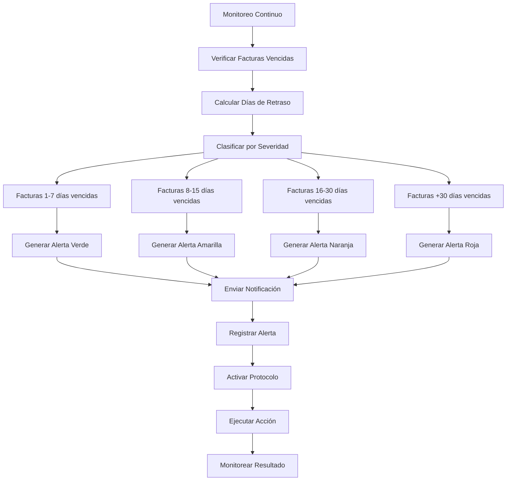

# Objetivo

**URL:** https://www.notion.so/29806f76bed4810e85eed02217cad55a
**Extraído el:** 2025-10-29T20:48:52.689Z

---

> ⚠️ **Sistema de gestión de morosidad y pagos pendientes para entrenadores y gimnasios**

# Objetivo

Proporcionar un sistema completo de gestión de morosidad y pagos pendientes para entrenadores y gimnasios. Funcionalidades: 'Quién me debe dinero ahora mismo?', seguimiento de pagos vencidos, alertas de morosidad, gestión de recordatorios. Le duele igual al entrenador y al gym. Este módulo optimiza la recuperación de cobros y minimiza las pérdidas por morosidad.

# Diagramas de Flujo

## Flujo de Gestión de Morosidad



## Flujo de Alertas de Morosidad



# Matrices de Pagos Vencidos

## Funcionalidades Principales

- Lista de Morosidad: 'Quién me debe dinero ahora mismo?'
- Seguimiento de Pagos Vencidos: Control detallado de facturas atrasadas
- Alertas de Morosidad: Sistema de notificaciones automáticas
- Gestión de Recordatorios: Sistema escalonado de cobros
- Clasificación de Riesgo: Evaluación de probabilidad de cobro
- Estrategias de Cobro: Protocolos diferenciados por situación
- Reportes de Morosidad: Análisis de situación financiera
- Integración Legal: Gestión de casos extremos
## Niveles de Morosidad

- Verde (1-7 días): Retraso leve, recordatorio amigable
- Amarillo (8-15 días): Retraso moderado, recordatorio firme
- Naranja (16-30 días): Retraso alto, recordatorio urgente
- Rojo (+30 días): Morosidad crítica, gestión especial
- Negro (+60 días): Morosidad extrema, gestión legal
# User Stories

## Para Entrenadores Personales 🧍

- Como entrenador personal, quiero saber 'quién me debe dinero ahora mismo' para gestionar mis cobros
- Como entrenador, necesito recibir alertas cuando un cliente no paga a tiempo
- Como entrenador, debo poder enviar recordatorios automáticos a clientes morosos
- Como entrenador, quiero ver el historial de pagos de cada cliente
- Como entrenador, necesito clasificar a mis clientes por riesgo de morosidad
- Como entrenador, debo poder generar reportes de morosidad para mi contabilidad
## Para Gimnasios/Centros 🏢

- Como gimnasio, quiero ver todos los pagos pendientes del centro en una sola vista
- Como centro, necesito automatizar el envío de recordatorios a socios morosos
- Como gimnasio, debo poder escalar la gestión de morosos según la gravedad
- Como centro, quiero analizar patrones de morosidad para prevenir futuros problemas
- Como gimnasio, necesito integrar la gestión de morosidad con mi sistema de membresías
- Como centro, debo poder generar reportes ejecutivos de morosidad para la dirección
## Para Gestión de Morosos 👨‍💼

- Como gestor de morosos, quiero ver todos los casos activos ordenados por prioridad
- Como gestor, necesito herramientas para contactar a los deudores
- Como gestor, debo poder registrar todas las acciones de cobro realizadas
- Como gestor, quiero poder escalar casos a gestión legal cuando sea necesario
- Como gestor, necesito métricas de efectividad de las estrategias de cobro
- Como gestor, debo poder generar reportes de gestión para la dirección
# Componentes React

- MorosidadList: Lista principal de pagos pendientes y morosos
- AlertasVencidos: Sistema de alertas por nivel de morosidad
- GestorRecordatorios: Sistema de gestión de recordatorios automáticos
- SeguimientoPagos: Control detallado del seguimiento de cobros
- ReportesMorosidad: Análisis y reportes de situación de morosidad
- ClasificadorRiesgo: Sistema de clasificación de riesgo de morosidad
- EstrategiasCobro: Protocolos diferenciados de gestión de cobros
- DashboardMorosidad: Vista general de la situación de morosidad
# APIs Requeridas

```bash
GET /api/finanzas/morosidad
GET /api/finanzas/pagos-vencidos
POST /api/finanzas/recordatorios
GET /api/finanzas/alertas
POST /api/finanzas/seguimiento
GET /api/finanzas/riesgo
POST /api/finanzas/estrategias
GET /api/finanzas/reportes-morosidad
```

# Estructura MERN

```bash
finanzas/morosidad/
├─ page.tsx
├─ api/
│  ├─ morosidad.ts
│  ├─ recordatorios.ts
│  └─ seguimiento.ts
└─ components/
   ├─ MorosidadList.tsx
   ├─ AlertasVencidos.tsx
   ├─ GestorRecordatorios.tsx
   ├─ SeguimientoPagos.tsx
   ├─ ReportesMorosidad.tsx
   ├─ ClasificadorRiesgo.tsx
   ├─ EstrategiasCobro.tsx
   └─ DashboardMorosidad.tsx
```

# Documentación de Procesos

1. Se identifican todas las facturas vencidas y se calculan los días de retraso
1. Se clasifican las facturas por nivel de morosidad (verde, amarillo, naranja, rojo)
1. Se generan alertas automáticas según el nivel de morosidad
1. Se envían recordatorios escalonados según la gravedad del retraso
1. Se registran todas las acciones de cobro realizadas
1. Se evalúa el riesgo de cada cliente y se ajustan las estrategias
1. Se implementan protocolos diferenciados según el tipo de morosidad
1. Se monitorean los resultados de las acciones de cobro
1. Se generan reportes de morosidad para análisis y toma de decisiones
1. Se archivan los casos resueltos y se mantiene el historial para futuras referencias
# Nota Final

> 💡 **La gestión de Pagos Pendientes / Morosidad es crítica para la salud financiera de cualquier negocio. 'Le duele igual al entrenador y al gym' porque ambos dependen del flujo de caja para operar. El sistema debe ser proactivo, automatizado y escalable, permitiendo identificar rápidamente quién debe dinero, clasificar el riesgo de morosidad y ejecutar estrategias de cobro diferenciadas según la gravedad de cada caso.**

