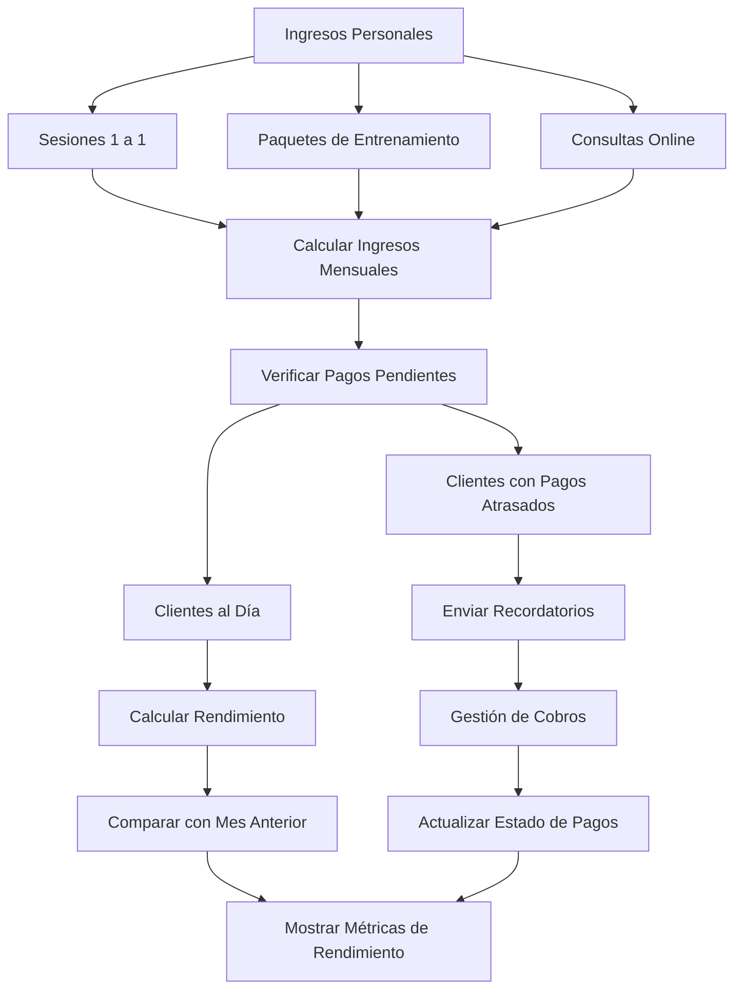
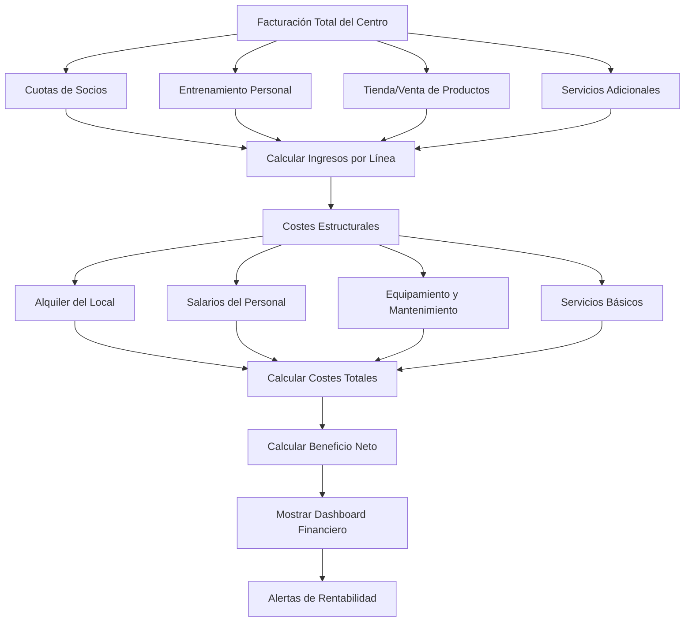

# Objetivo

**URL:** https://www.notion.so/29806f76bed48197a484fe88b02adb39
**Extraído el:** 2025-10-29T20:48:49.865Z

---

> 💰 **Sistema de overview financiero para entrenadores y gimnasios con métricas diferenciadas**

# Objetivo

Proporcionar un sistema completo de overview financiero para entrenadores y gimnasios. Para entrenadores: ingresos personales, quién no ha pagado, rendimiento mes actual. Para gimnasios: facturación total del centro, reparto por líneas (cuotas, PT, tienda), costes estructurales. Este módulo ofrece una visión clara y en tiempo real de la salud financiera del negocio.

# Diagramas de Flujo

## Flujo de Overview Financiero para Entrenadores



## Flujo de Overview Financiero para Gimnasios



# Matrices de Ingresos/Gastos

## Funcionalidades Principales

- Panel Financiero: Vista general de la situación financiera
- Métricas de Ingresos: Análisis detallado de fuentes de ingresos
- Gastos Estructurales: Control de costes fijos y variables
- Rendimiento Mensual: Comparación y evolución de resultados
- Alertas de Pagos: Notificaciones de cobros pendientes
- Análisis de Rentabilidad: Métricas de eficiencia financiera
- Proyecciones Financieras: Estimaciones futuras
- Reportes Personalizados: Análisis específicos por usuario
## Métricas por Tipo de Usuario

- Entrenadores: Ingresos personales, clientes pendientes, rendimiento individual
- Gimnasios: Facturación total, reparto por líneas, costes estructurales
- Ambos: Comparación mensual, tendencias, alertas financieras
# User Stories

## Para Entrenadores Personales 🧍

- Como entrenador personal, quiero ver mis ingresos del mes para controlar mi economía
- Como entrenador, necesito saber quién no ha pagado para gestionar mis cobros
- Como entrenador, debo poder comparar mi rendimiento mensual con meses anteriores
- Como entrenador, quiero recibir alertas cuando un cliente no paga
- Como entrenador, necesito ver qué servicios generan más ingresos
- Como entrenador, debo poder proyectar mis ingresos futuros
## Para Gimnasios/Centros 🏢

- Como gimnasio, quiero ver la facturación total del centro para evaluar el negocio
- Como centro, necesito ver el reparto por líneas (cuotas, PT, tienda) para optimizar
- Como gimnasio, debo controlar los costes estructurales para mantener rentabilidad
- Como centro, quiero analizar qué servicios son más rentables
- Como gimnasio, necesito recibir alertas cuando la rentabilidad baja
- Como centro, debo poder hacer proyecciones financieras a largo plazo
# Componentes React

- PanelFinanciero: Componente principal del overview financiero
- MetricasIngresos: Análisis detallado de fuentes de ingresos
- GastosEstructurales: Control y análisis de costes
- RendimientoMensual: Comparación y evolución de resultados
- AlertasPagos: Sistema de notificaciones de cobros pendientes
- AnalisisRentabilidad: Métricas de eficiencia financiera
- ProyeccionesFinancieras: Estimaciones y previsiones
- ReportesPersonalizados: Análisis específicos por usuario
# APIs Requeridas

```bash
GET /api/finanzas/overview
GET /api/finanzas/ingresos
GET /api/finanzas/gastos
GET /api/finanzas/rendimiento
GET /api/finanzas/alertas
GET /api/finanzas/rentabilidad
GET /api/finanzas/proyecciones
POST /api/finanzas/reportes
```

# Estructura MERN

```bash
finanzas/overview/
├─ page.tsx
├─ api/
│  ├─ overview.ts
│  ├─ ingresos.ts
│  └─ gastos.ts
└─ components/
   ├─ PanelFinanciero.tsx
   ├─ MetricasIngresos.tsx
   ├─ GastosEstructurales.tsx
   ├─ RendimientoMensual.tsx
   ├─ AlertasPagos.tsx
   ├─ AnalisisRentabilidad.tsx
   ├─ ProyeccionesFinancieras.tsx
   └─ ReportesPersonalizados.tsx
```

# Documentación de Procesos

1. Se recopilan todos los datos financieros del período actual
1. Se calculan los ingresos totales por fuente (entrenamientos, cuotas, ventas)
1. Se identifican los gastos estructurales y variables
1. Se calcula el beneficio neto y la rentabilidad
1. Se comparan los resultados con períodos anteriores
1. Se identifican pagos pendientes y se generan alertas
1. Se analizan las tendencias y se detectan patrones
1. Se generan proyecciones basadas en datos históricos
1. Se crean reportes personalizados según el tipo de usuario
1. Se presentan las métricas en un dashboard visual e intuitivo
# Nota Final

> 💡 **El Panel Financiero / Overview es fundamental para la toma de decisiones empresariales. Para entrenadores personales, se enfoca en ingresos individuales y gestión de cobros. Para gimnasios, se centra en la facturación total y el análisis de rentabilidad por líneas de negocio. El sistema debe proporcionar una visión clara, en tiempo real y fácil de entender de la salud financiera del negocio, permitiendo identificar oportunidades de mejora y tomar decisiones informadas.**

