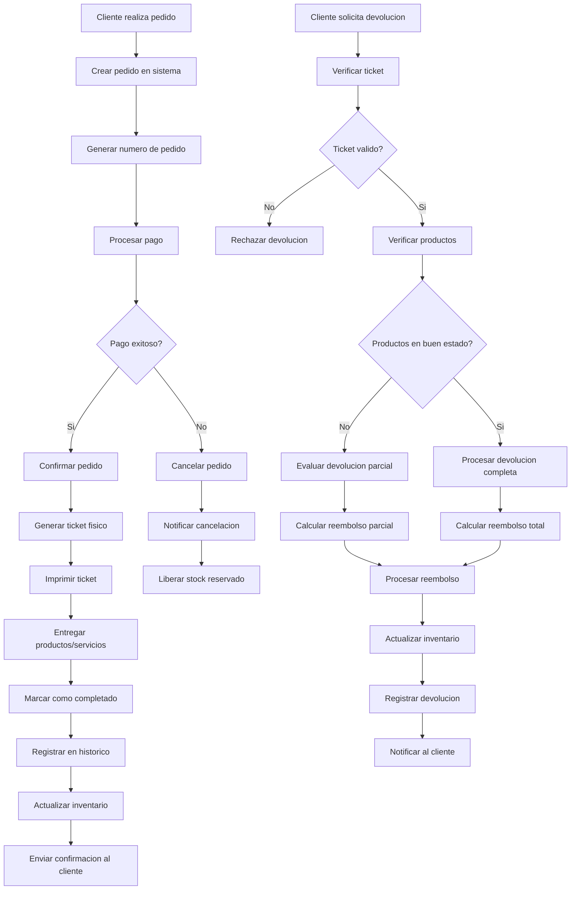

# Pedidos & Tickets - Documentacion Completa

**URL:** https://www.notion.so/29906f76bed48137840cd357f61cd929
**Extraído el:** 2025-10-29T20:48:16.189Z

---

# Pedidos & Tickets - Documentacion Completa

Esta pagina sirve como documentacion completa del modulo de gestion de pedidos y tickets del software fitness. Este modulo es util tanto para entrenadores como para gimnasios:

- Historico de tickets fisicos para auditoria
- Gestion de devoluciones y reembolsos
- Gestion completa de pedidos
- Seguimiento detallado de ventas
Este modulo es especialmente importante para mantener un registro completo de todas las transacciones y facilitar la gestion de devoluciones.

## Diagramas de Flujo de Pedidos

Los diagramas de flujo muestran el proceso completo de gestion de pedidos y tickets:

## Matrices de Tickets

Tipos de tickets y su informacion:

- Tickets de Venta: Productos, servicios, membresias
- Tickets de Devolucion: Reembolsos, cambios de productos
- Tickets de Cancelacion: Pedidos cancelados, reembolsos
- Tickets de Arqueo: Cierre de caja, conciliacion
- Tickets de Inventario: Movimientos de stock, ajustes
## Componentes React

Documentacion de componentes React para el modulo de pedidos y tickets:

### PedidosManager

Componente principal que gestiona todos los pedidos del sistema. Incluye creacion, modificacion, cancelacion y seguimiento de pedidos.

### TicketsHistorial

Componente para visualizar el historico completo de tickets. Permite buscar, filtrar y exportar tickets por fecha, tipo y estado.

### GestorDevoluciones

Componente para gestionar devoluciones y reembolsos. Incluye validacion de tickets, evaluacion de productos y procesamiento de reembolsos.

### SeguimientoVentas

Componente para realizar seguimiento detallado de ventas. Proporciona metricas, graficos y analisis de rendimiento de ventas.

### ReportesPedidos

Componente para generar reportes completos de pedidos. Incluye reportes de ventas, devoluciones, productos mas vendidos y analisis de tendencias.

## Configuraciones de Devoluciones

Configuraciones especificas para el sistema de devoluciones:

- Politica de devoluciones: 30 dias para productos, 7 dias para servicios
- Condiciones de devolucion: Productos en buen estado, ticket original
- Metodos de reembolso: Efectivo, tarjeta original, credito en cuenta
- Restricciones: Productos personalizados, servicios consumidos
- Proceso de autorizacion: Supervisor para montos altos
## APIs Requeridas

Documentacion de las APIs necesarias para el modulo de pedidos y tickets:

- GET /api/ventas/pedidos - Obtener lista de pedidos
- GET /api/ventas/tickets - Obtener historico de tickets
- POST /api/ventas/devoluciones - Procesar devolucion
- GET /api/ventas/seguimiento - Obtener seguimiento de ventas
- GET /api/ventas/reportes - Generar reportes de ventas
## Estructura de Carpetas MERN

Estructura de carpetas para el stack MERN:

- ventas/pedidos/page.tsx - Pagina principal de pedidos
- ventas/pedidos/api/ - API routes para pedidos
- ventas/pedidos/components/ - Componentes React de pedidos
- ventas/pedidos/hooks/ - Custom hooks para gestion de estado
- ventas/pedidos/utils/ - Utilidades y helpers
- ventas/pedidos/services/ - Servicios de integracion
## Documentacion de Procesos

Procesos principales del modulo de pedidos y tickets:

### Proceso de Creacion de Pedidos

- Cliente selecciona productos/servicios
- Validar disponibilidad de stock
- Calcular totales y descuentos
- Procesar pago del cliente
- Generar numero de pedido unico
- Crear ticket fisico
### Proceso de Gestion de Tickets

- Imprimir ticket en terminal
- Registrar ticket en base de datos
- Entregar ticket al cliente
- Archivar ticket para auditoria
### Proceso de Devoluciones

- Cliente presenta ticket original
- Verificar validez del ticket
- Evaluar estado de productos
- Calcular monto de reembolso
- Procesar reembolso
- Actualizar inventario
- Registrar devolucion en sistema
## Consideraciones Tecnicas

Aspectos tecnicos importantes para la implementacion:

- Sistema de numeracion unica para tickets
- Integracion con sistemas de impresion
- Backup automatico de transacciones
- Sistema de auditoria completo
- Sincronizacion en tiempo real con inventario
## Mejores Practicas

Recomendaciones para el desarrollo:

- Usar TypeScript para tipado fuerte
- Implementar validaciones de stock en tiempo real
- Usar React Query para gestion de estado de servidor
- Implementar manejo de errores robusto
- Crear tests unitarios y de integracion
## Resumen

Esta documentacion proporciona una guia completa para implementar el modulo de Pedidos & Tickets del software fitness. Este modulo es util tanto para entrenadores como para gimnasios, proporcionando un sistema completo de gestion de pedidos, tickets fisicos y devoluciones. Es especialmente importante para mantener un registro completo de todas las transacciones y facilitar la gestion de devoluciones.

URL de la pagina: https://www.notion.so/Pedidos-Tickets-29906f76bed48137840cd357f61cd929

