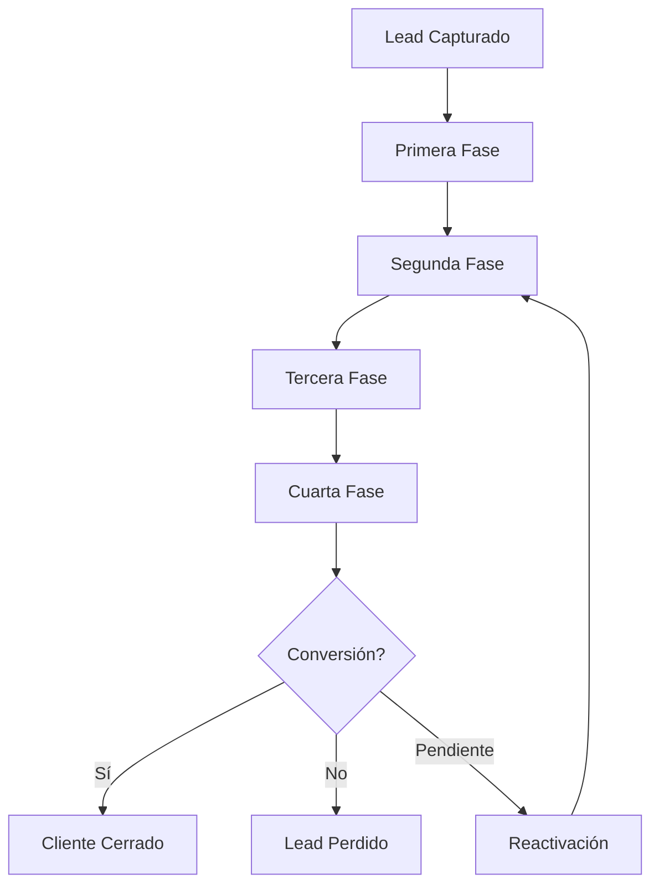
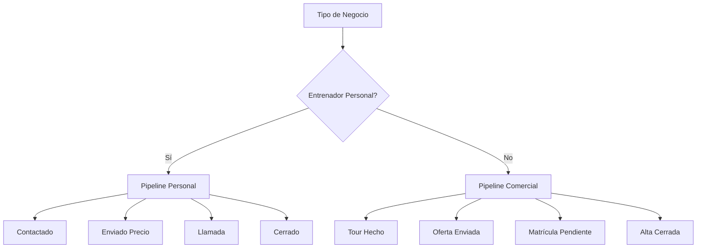

# Objetivo

**URL:** https://www.notion.so/29706f76bed4812c996edeb280efa6b6
**Extraído el:** 2025-10-29T20:48:29.735Z

---

> 📋 **Sistema visual de gestión de pipeline de ventas con fases personalizadas por tipo de negocio**

# Objetivo

Proporcionar un sistema visual de gestión del pipeline de ventas que se adapte automáticamente al tipo de negocio. Para entrenadores personales, el pipeline incluye fases como 'contactado → enviado precio → llamada → cerrado', mientras que para gimnasios se centra en 'tour hecho → oferta enviada → matrícula pendiente → alta cerrada'. El sistema debe permitir seguimiento visual del progreso de cada lead a través del proceso de ventas.

# Diagramas de Flujo

## Flujo del Pipeline de Venta



## Fases por Tipo de Negocio



# Matrices de Recursos

## Funcionalidades Principales

- Vista Kanban: Gestión visual del pipeline con columnas por fase
- Fases Personalizables: Configuración de etapas según tipo de negocio
- Drag & Drop: Movimiento intuitivo de leads entre fases
- Filtros Avanzados: Búsqueda y filtrado por múltiples criterios
- Métricas en Tiempo Real: Conversión, velocidad y efectividad por fase
- Automatización: Transiciones automáticas basadas en acciones
## Integraciones

- Sistema de Leads: Sincronización automática con base de leads
- CRM Externo: Integración con Salesforce, HubSpot, Pipedrive
- Email Marketing: Automatización de secuencias por fase
- WhatsApp Business: Notificaciones automáticas de cambios de fase
- Calendario: Integración con citas y seguimientos
- Analytics: Exportación de datos para análisis avanzado
# User Stories

## Para Entrenadores Personales 🧍

- Como entrenador personal, quiero ver mis leads organizados por fases: contactado, enviado precio, llamada, cerrado
- Como entrenador personal, necesito poder mover leads entre fases arrastrando y soltando
- Como entrenador personal, debo poder ver qué leads necesitan seguimiento en cada fase
- Como entrenador personal, quiero recibir alertas cuando un lead lleva mucho tiempo en una fase
- Como entrenador personal, necesito ver mis métricas de conversión por fase
- Como entrenador personal, debo poder personalizar las fases según mi proceso de ventas
## Para Gimnasios/Centros 🏢

- Como gimnasio, quiero gestionar mi pipeline comercial con fases: tour hecho, oferta enviada, matrícula pendiente, alta cerrada
- Como centro, necesito poder asignar leads a diferentes vendedores del equipo
- Como gimnasio, debo poder ver el rendimiento de cada vendedor por fase
- Como centro, quiero automatizar transiciones entre fases basadas en acciones
- Como gimnasio, necesito reportes de conversión por fase y vendedor
- Como centro, debo poder configurar diferentes pipelines para diferentes servicios
# Componentes React

- PipelineKanban: Componente principal del pipeline visual
- PhaseColumn: Columna individual de cada fase del pipeline
- LeadCard: Tarjeta individual de cada lead en el pipeline
- PipelineFilters: Filtros y búsqueda del pipeline
- PipelineMetrics: Métricas y analytics del pipeline
- PhaseConfigurator: Configurador de fases personalizadas
- PipelineAutomation: Automatización de transiciones
- PipelineReports: Generador de reportes del pipeline
# APIs Requeridas

```bash
GET /api/pipeline
POST /api/pipeline
PUT /api/pipeline/:id
DELETE /api/pipeline/:id
GET /api/pipeline/phases
POST /api/pipeline/phases
PUT /api/pipeline/phases/:id
GET /api/pipeline/metrics
POST /api/pipeline/move
GET /api/pipeline/reports
```

# Estructura MERN

```bash
crm/pipeline/
├─ page.tsx
├─ api/
│  ├─ pipeline.ts
│  ├─ phases.ts
│  ├─ metrics.ts
│  └─ reports.ts
└─ components/
   ├─ PipelineKanban.tsx
   ├─ PhaseColumn.tsx
   ├─ LeadCard.tsx
   ├─ PipelineFilters.tsx
   ├─ PipelineMetrics.tsx
   ├─ PhaseConfigurator.tsx
   ├─ PipelineAutomation.tsx
   └─ PipelineReports.tsx
```

# Documentación de Procesos

1. Lead ingresa al pipeline en la primera fase según su origen y tipo
1. Sistema asigna automáticamente el lead a la fase correspondiente
1. Usuario puede mover leads entre fases mediante drag & drop
1. Sistema registra automáticamente cambios de fase y timestamps
1. Se activan automatizaciones según la fase (emails, recordatorios, tareas)
1. Sistema calcula métricas en tiempo real (conversión, velocidad, efectividad)
1. Al final del proceso, lead se convierte en cliente o se marca como perdido
# Nota Final

> 💡 **El pipeline de ventas es fundamental para la gestión comercial. Se adapta completamente al tipo de negocio: entrenadores personales manejan fases simples y directas (contactado → precio → llamada → cerrado), mientras que gimnasios gestionan procesos más complejos (tour → oferta → matrícula → alta). La personalización de fases es clave para reflejar el proceso real de ventas de cada negocio.**

