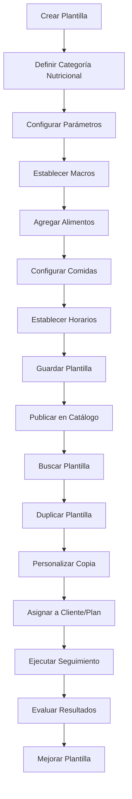
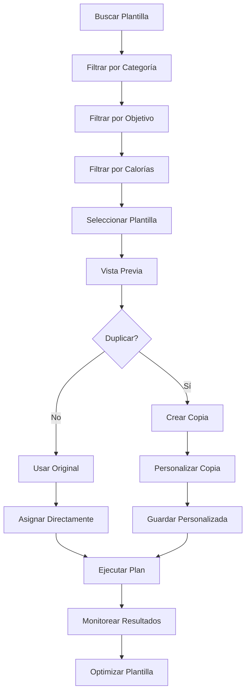

# Objetivo

**URL:** https://www.notion.so/29706f76bed481099520c7dc65a9f9d4
**Extraído el:** 2025-10-29T20:48:39.291Z

---

> 📋 **Sistema de plantillas nutricionales reutilizables para estandarizar y escalar planes de alimentación**

# Objetivo

Proporcionar un sistema completo de plantillas nutricionales reutilizables que permita crear, gestionar y reutilizar planes de alimentación estandarizados. Funcionalidades: plantillas 'vegetariana 1800 kcal', 'déficit suave 2-3kg/mes', catálogo reutilizable de planes nutricionales. Útil tanto para entrenadores como para gimnasios con servicio de nutrición interno. El sistema debe permitir categorización, búsqueda, duplicación y reutilización eficiente de plantillas nutricionales exitosas.

# Diagramas de Flujo

## Flujo de Gestión de Plantillas Nutricionales



## Flujo de Reutilización de Plantillas



# Matrices de Recursos

## Funcionalidades Principales

- Catálogo de Plantillas: Biblioteca completa de planes nutricionales
- Creador de Plantillas: Herramienta para crear nuevas plantillas
- Categorización Nutricional: Organización por tipo de dieta
- Duplicador de Planes: Sistema de copia y personalización
- Búsqueda Avanzada: Filtros por categoría, calorías, objetivos
- Gestión de Versiones: Control de versiones y actualizaciones
- Analytics de Uso: Métricas de efectividad de plantillas
- Optimización Continua: Mejoras basadas en resultados
## Integraciones

- Editor de Dieta: Creación de plantillas desde el editor
- Base de Datos de Alimentos: Alimentos disponibles para plantillas
- Sistema de Dietas: Asignación de plantillas a dietas
- Sistema de Progreso: Evaluación de efectividad de plantillas
- Sistema de Comunicaciones: Compartir plantillas entre usuarios
- Sistema de Analytics: Métricas de uso y efectividad
# User Stories

## Para Entrenadores Personales 🧍

- Como entrenador personal, quiero crear plantillas de dietas exitosas para reutilizar
- Como entrenador personal, necesito duplicar plantillas y personalizarlas para cada cliente
- Como entrenador personal, debo poder categorizar plantillas por tipo de dieta
- Como entrenador personal, quiero buscar plantillas por objetivos específicos
- Como entrenador personal, necesito escalar mi servicio con plantillas estandarizadas
- Como entrenador personal, debo poder compartir plantillas con otros entrenadores
## Para Gimnasios/Centros 🏢

- Como gimnasio, quiero estandarizar planes nutricionales para servicio interno
- Como centro, necesito crear plantillas para diferentes tipos de servicio nutricional
- Como gimnasio, debo poder duplicar plantillas exitosas para nuevos socios
- Como centro, quiero categorizar plantillas por nivel de servicio
- Como gimnasio, necesito gestionar versiones de plantillas para actualizaciones
- Como centro, debo poder analizar la efectividad de las plantillas
# Componentes React

- PlantillasDieta: Lista principal de plantillas nutricionales
- CreadorPlantilla: Herramienta para crear nuevas plantillas
- CategorizadorNutricion: Organizador por categorías nutricionales
- DuplicadorPlan: Sistema de duplicación y personalización
- BuscadorPlantillas: Motor de búsqueda avanzada
- VisorPlantilla: Visor detallado de plantillas
- GestorVersiones: Control de versiones de plantillas
- AnalyticsPlantillas: Métricas de uso y efectividad
# APIs Requeridas

```bash
GET /api/nutricion/plantillas
POST /api/nutricion/plantillas
PUT /api/nutricion/plantillas/:id
DELETE /api/nutricion/plantillas/:id
POST /api/nutricion/plantillas/duplicar
GET /api/nutricion/plantillas/categorias
GET /api/nutricion/plantillas/buscar
POST /api/nutricion/plantillas/compartir
GET /api/nutricion/plantillas/analytics
```

# Estructura MERN

```bash
nutricion/plantillas/
├─ page.tsx
├─ api/
│  ├─ plantillas.ts
│  ├─ categorias.ts
│  └─ analytics.ts
└─ components/
   ├─ PlantillasDieta.tsx
   ├─ CreadorPlantilla.tsx
   ├─ CategorizadorNutricion.tsx
   ├─ DuplicadorPlan.tsx
   ├─ BuscadorPlantillas.tsx
   ├─ VisorPlantilla.tsx
   ├─ GestorVersiones.tsx
   └─ AnalyticsPlantillas.tsx
```

# Documentación de Procesos

1. Se crea una nueva plantilla desde el editor de dieta
1. Se define la categoría nutricional y parámetros de la plantilla
1. Se configuran los macros, alimentos y comidas
1. Se guarda la plantilla en el catálogo con metadatos
1. Se publica la plantilla para búsqueda y reutilización
1. Los usuarios buscan y filtran plantillas por categoría
1. Se duplica la plantilla y se personaliza según necesidades
1. Se asigna la plantilla a clientes o planes
1. Se ejecuta el plan y se evalúa la efectividad
1. Se optimiza la plantilla basada en resultados
# Nota Final

> 💡 **Las plantillas de dieta son un activo reutilizable fundamental que permite escalar el servicio nutricional tanto para entrenadores personales como para gimnasios con servicio de nutrición interno. El sistema de duplicación y personalización permite mantener la flexibilidad mientras se aprovecha la estandarización. La categorización nutricional y búsqueda avanzada facilitan la gestión de grandes catálogos de plantillas, mientras que el sistema de versiones y analytics permite la mejora continua basada en datos reales de uso y efectividad.**

