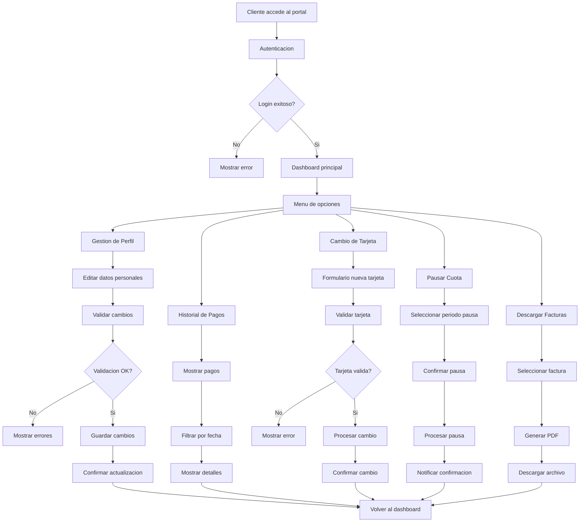

# Portal del Cliente / Autoservicio - Documentacion Completa

**URL:** https://www.notion.so/29906f76bed481ac9dacc30bc9ca2663
**Extraído el:** 2025-10-29T20:48:14.552Z

---

# Portal del Cliente / Autoservicio - Documentacion Completa

Esta pagina sirve como documentacion completa del modulo de portal de autoservicio del software fitness. Este modulo es util igual para entrenadores y gimnasios, solo cambia el branding pero las funcionalidades son las mismas:

- Cambio de tarjeta de pago
- Descarga de facturas
- Pausar cuota temporalmente
- Gestion de perfil personal
- Historial completo de pagos
## Diagramas de Flujo del Portal

Los diagramas de flujo muestran el proceso completo de autoservicio del cliente:

## Matrices de Autoservicio

Tabla de funcionalidades disponibles en el portal:

- Gestion de Perfil: Editar datos personales, cambiar contraseña, actualizar contacto
- Historial de Pagos: Ver todos los pagos, filtrar por fecha, descargar comprobantes
- Cambio de Tarjeta: Actualizar metodo de pago, validar nueva tarjeta
- Pausar Cuota: Suspender temporalmente el cobro, configurar fecha de reactivacion
- Descargar Facturas: Acceder a facturas historicas, generar PDFs
## Componentes React

Documentacion de componentes React para el modulo de portal de autoservicio:

### PortalCliente

Componente principal del portal que gestiona la navegacion y el dashboard del cliente. Incluye menu de navegacion, informacion del usuario y secciones principales.

### Autoservicio

Componente que gestiona los servicios de autoservicio disponibles para el cliente. Muestra una grilla de servicios activos y permite el acceso a cada uno.

### GestorPerfil

Componente para la gestion del perfil del cliente. Permite editar datos personales, cambiar contraseña y actualizar informacion de contacto.

### HistorialPagos

Componente que muestra el historial completo de pagos del cliente. Incluye filtros por fecha, detalles de cada pago y opciones de descarga.

### CambioTarjeta

Componente para cambiar el metodo de pago del cliente. Incluye formulario de nueva tarjeta, validacion y confirmacion del cambio.

## Configuraciones de Permisos

Configuraciones de permisos para el portal de autoservicio:

- Permisos de Lectura: Ver perfil, historial de pagos, facturas
- Permisos de Escritura: Editar perfil, cambiar tarjeta, pausar cuota
- Permisos de Descarga: Descargar facturas, comprobantes de pago
- Restricciones de Seguridad: Validacion de tarjetas, encriptacion de datos
- Auditoria: Registro de todas las acciones del cliente
## APIs Requeridas

Documentacion de las APIs necesarias para el modulo de portal de autoservicio:

- GET /api/portal/cliente - Obtener datos del cliente
- PUT /api/portal/perfil - Actualizar perfil del cliente
- GET /api/portal/facturas - Obtener facturas del cliente
- POST /api/portal/pausar-cuota - Pausar cuota temporalmente
- PUT /api/portal/tarjeta - Cambiar metodo de pago
## Estructura de Carpetas MERN

Estructura de carpetas para el stack MERN:

- portal/cliente/page.tsx - Pagina principal del portal
- portal/cliente/api/ - API routes para el portal
- portal/cliente/components/ - Componentes React del portal
- portal/cliente/hooks/ - Custom hooks para gestion de estado
- portal/cliente/utils/ - Utilidades y helpers
## Documentacion de Procesos

Procesos principales del portal de autoservicio:

### Proceso de Acceso al Portal

- Cliente accede con credenciales
- Validar autenticacion
- Cargar datos del cliente
- Mostrar dashboard principal
### Proceso de Gestion de Perfil

- Cliente selecciona editar perfil
- Validar cambios en datos personales
- Guardar cambios en base de datos
- Confirmar actualizacion exitosa
### Proceso de Cambio de Tarjeta

- Cliente selecciona cambiar tarjeta
- Ingresar datos de nueva tarjeta
- Validar tarjeta con procesador de pagos
- Actualizar metodo de pago
- Confirmar cambio exitoso
### Proceso de Pausar Cuota

- Cliente solicita pausar cuota
- Seleccionar periodo de pausa
- Validar solicitud de pausa
- Procesar pausa de cuota
- Notificar confirmacion de pausa
## Consideraciones Tecnicas

Aspectos tecnicos importantes para la implementacion:

- Autenticacion segura con tokens JWT
- Encriptacion de datos sensibles (tarjetas, datos personales)
- Integracion con procesadores de pago seguros
- Sistema de auditoria completo
- Backup y recuperacion de datos
## Mejores Practicas

Recomendaciones para el desarrollo:

- Usar TypeScript para tipado fuerte
- Implementar validaciones tanto en frontend como backend
- Usar React Query para gestion de estado de servidor
- Implementar manejo de errores robusto
- Crear tests unitarios y de integracion
## Resumen

Esta documentacion proporciona una guia completa para implementar el modulo de Portal del Cliente / Autoservicio del software fitness. Este modulo es util igual para entrenadores y gimnasios, solo cambia el branding pero las funcionalidades son las mismas. Proporciona todas las herramientas necesarias para que los clientes gestionen sus cuentas de forma autonoma.

URL de la pagina: https://www.notion.so/Portal-del-Cliente-Autoservicio-29906f76bed481ac9dacc30bc9ca2663

