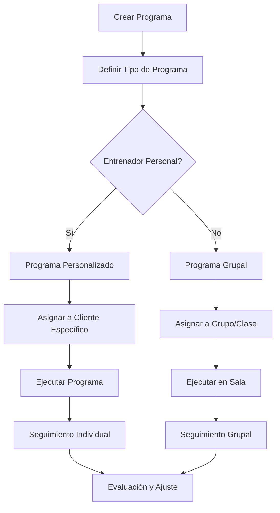
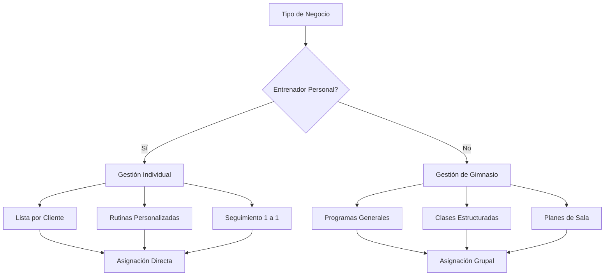

# Objetivo

**URL:** https://www.notion.so/29706f76bed48162a826fc7723f8a0bc
**Extraído el:** 2025-10-29T20:48:33.272Z

---

> 💪 **Sistema de gestión de programas de entrenamiento con listado de entrenos asignados, adaptado para entrenadores personales y gimnasios**

# Objetivo

Proporcionar un sistema completo de gestión de programas de entrenamiento con listado de entrenos asignados. Para entrenadores personales: lista por cliente personalizada (Rutina de fuerza para Carla, Rehab rodilla Miguel). Para gimnasios: programas generales, clases estructuradas del box, planes de sala accesibles a socios. El sistema debe permitir crear, asignar y gestionar programas de entrenamiento adaptados al tipo de negocio.

# Diagramas de Flujo

## Flujo de Programas de Entrenamiento



## Flujo por Tipo de Negocio



# Matrices de Recursos

## Funcionalidades Principales

- Listado de Programas: Gestión de todos los programas de entrenamiento
- Asignación Personalizada: Programas específicos para cada cliente
- Programas Grupales: Clases estructuradas para grupos
- Planes de Sala: Rutinas accesibles para socios
- Editor de Programas: Creación y modificación de rutinas
- Seguimiento de Progreso: Monitoreo de ejecución y resultados
## Integraciones

- Sistema de Clientes: Base de datos de clientes y socios
- Biblioteca de Ejercicios: Catálogo de ejercicios disponibles
- Sistema de Calendario: Programación de sesiones
- Sistema de Progreso: Seguimiento de resultados
- Sistema de Comunicaciones: Notificaciones y recordatorios
- Sistema de Reservas: Gestión de clases y sesiones
# User Stories

## Para Entrenadores Personales 🧍

- Como entrenador personal, quiero crear rutinas personalizadas para cada cliente
- Como entrenador personal, necesito asignar programas específicos como 'Rutina de fuerza para Carla'
- Como entrenador personal, debo poder crear programas de rehabilitación como 'Rehab rodilla Miguel'
- Como entrenador personal, quiero ver la lista de programas asignados por cliente
- Como entrenador personal, necesito modificar programas según el progreso del cliente
- Como entrenador personal, debo poder duplicar programas exitosos para otros clientes
## Para Gimnasios/Centros 🏢

- Como gimnasio, quiero crear programas generales para clases grupales
- Como centro, necesito estructurar clases del box con programas específicos
- Como gimnasio, debo poder crear planes de sala accesibles para socios
- Como centro, quiero asignar programas a grupos de socios
- Como gimnasio, necesito estandarizar programas para instructores
- Como centro, debo poder crear programas especializados por tipo de clase
# Componentes React

- ProgramasList: Lista principal de programas de entrenamiento
- AsignacionCliente: Asignación de programas a clientes específicos
- ProgramasGrupo: Gestión de programas grupales
- PlanSala: Planes de sala accesibles para socios
- EditorPrograma: Editor para crear y modificar programas
- SeguimientoPrograma: Seguimiento de ejecución y progreso
- DuplicadorPrograma: Duplicación de programas exitosos
- CategorizadorProgramas: Categorización por tipo de programa
# APIs Requeridas

```bash
GET /api/entrenamiento/programas
POST /api/entrenamiento/programas
PUT /api/entrenamiento/programas/:id
DELETE /api/entrenamiento/programas/:id
GET /api/entrenamiento/asignaciones
POST /api/entrenamiento/asignar
GET /api/entrenamiento/programas/cliente/:id
GET /api/entrenamiento/programas/grupo/:id
POST /api/entrenamiento/programas/duplicar
GET /api/entrenamiento/programas/categorias
```

# Estructura MERN

```bash
entrenamiento/programas/
├─ page.tsx
├─ api/
│  ├─ programas.ts
│  ├─ asignaciones.ts
│  └─ categorias.ts
└─ components/
   ├─ ProgramasList.tsx
   ├─ AsignacionCliente.tsx
   ├─ ProgramasGrupo.tsx
   ├─ PlanSala.tsx
   ├─ EditorPrograma.tsx
   ├─ SeguimientoPrograma.tsx
   ├─ DuplicadorPrograma.tsx
   └─ CategorizadorProgramas.tsx
```

# Documentación de Procesos

1. Se crea un nuevo programa de entrenamiento con objetivos específicos
1. Se define el tipo de programa (personalizado para entrenadores, grupal para gimnasios)
1. Se configuran los ejercicios, series, repeticiones y progresión
1. Se asigna el programa a cliente específico (entrenadores) o grupo/clase (gimnasios)
1. Se programa la ejecución en el calendario de sesiones
1. Se ejecuta el programa y se registra el progreso
1. Se evalúa el progreso y se ajusta el programa según sea necesario
# Nota Final

> 💡 **Los programas de entrenamiento son el corazón del sistema. Se adaptan completamente al tipo de negocio: entrenadores personales manejan programas individuales y personalizados, mientras que gimnasios gestionan programas grupales y planes de sala. La flexibilidad del sistema permite desde rutinas específicas de rehabilitación hasta clases estructuradas del box, manteniendo la misma base técnica pero con experiencias de usuario diferenciadas.**

