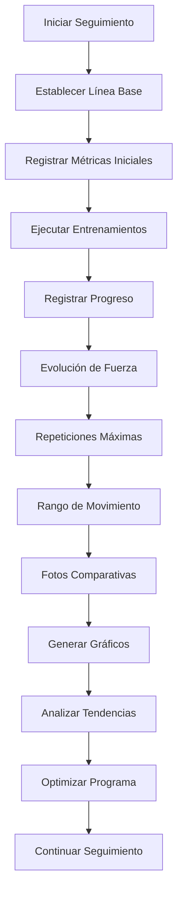
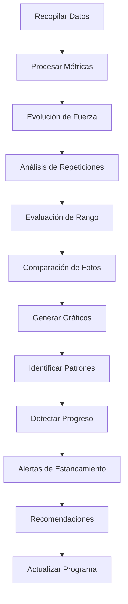

# Objetivo

**URL:** https://www.notion.so/29706f76bed48154bedfd698908220d1
**Extraído el:** 2025-10-29T20:48:36.955Z

---

> 📈 **Sistema completo de seguimiento de progreso con evolución de fuerza, métricas de rendimiento y análisis visual para entrenadores y gimnasios**

# Objetivo

Proporcionar un sistema completo de seguimiento de progreso y rendimiento para el software fitness. Funcionalidades: evolución de fuerza, repeticiones máximas, rango de movimiento, fotos comparativas, gráficos de progreso. Útil para entrenadores (todos sus clientes) y gimnasios (programas premium, entrenamiento personal interno). El sistema debe permitir seguimiento detallado, análisis visual, comparativas temporales y métricas de rendimiento.

# Diagramas de Flujo

## Flujo de Seguimiento de Progreso



## Flujo de Análisis de Métricas



# Matrices de Recursos

## Funcionalidades Principales

- Evolución de Fuerza: Seguimiento de ganancias de fuerza en el tiempo
- Repeticiones Máximas: Registro de RM por ejercicio
- Rango de Movimiento: Evaluación de flexibilidad y movilidad
- Fotos Comparativas: Análisis visual de cambios corporales
- Gráficos de Progreso: Visualización de tendencias y evolución
- Análisis de Tendencias: Identificación de patrones de progreso
- Alertas de Estancamiento: Notificaciones por falta de progreso
- Recomendaciones Automáticas: Sugerencias de optimización
## Integraciones

- Sistema de Programas: Progreso en programas asignados
- Sistema de Clientes: Seguimiento individual por cliente
- Sistema de Entrenamientos: Datos de sesiones ejecutadas
- Sistema de Check-ins: Relación entre sensaciones y progreso
- Sistema de Comunicaciones: Compartir progreso con clientes
- Sistema de Analytics: Métricas de efectividad de programas
# User Stories

## Para Entrenadores Personales 🧍

- Como entrenador personal, quiero ver la evolución de fuerza de todos mis clientes
- Como entrenador personal, necesito registrar repeticiones máximas para ajustar cargas
- Como entrenador personal, debo poder evaluar rango de movimiento para prevenir lesiones
- Como entrenador personal, quiero usar fotos comparativas para mostrar progreso visual
- Como entrenador personal, necesito gráficos de progreso para motivar a mis clientes
- Como entrenador personal, debo poder identificar estancamientos para ajustar programas
## Para Gimnasios/Centros 🏢

- Como gimnasio, quiero seguimiento de progreso para programas premium
- Como centro, necesito métricas de rendimiento para entrenamiento personal interno
- Como gimnasio, debo poder mostrar progreso a socios premium
- Como centro, quiero analizar efectividad de programas grupales
- Como gimnasio, necesito métricas para justificar precios premium
- Como centro, debo poder generar reportes de progreso para gestión
# Componentes React

- ProgresoCliente: Seguimiento principal de progreso por cliente
- GraficosEvolucion: Gráficos de evolución de métricas
- FotosComparativas: Sistema de fotos antes/después
- MetricasFuerza: Seguimiento específico de fuerza
- HistorialRendimiento: Historial completo de rendimiento
- AnalizadorTendencias: Análisis de patrones de progreso
- AlertasEstancamiento: Sistema de alertas por falta de progreso
- OptimizadorProgreso: Recomendaciones de mejora
# APIs Requeridas

```bash
GET /api/entrenamiento/progreso
POST /api/entrenamiento/progreso
GET /api/entrenamiento/metricas
POST /api/entrenamiento/fotos
GET /api/entrenamiento/graficos
GET /api/entrenamiento/progreso/cliente/:id
POST /api/entrenamiento/progreso/analisis
GET /api/entrenamiento/progreso/tendencias
```

# Estructura MERN

```bash
entrenamiento/progreso/
├─ page.tsx
├─ api/
│  ├─ progreso.ts
│  ├─ metricas.ts
│  └─ graficos.ts
└─ components/
   ├─ ProgresoCliente.tsx
   ├─ GraficosEvolucion.tsx
   ├─ FotosComparativas.tsx
   ├─ MetricasFuerza.tsx
   ├─ HistorialRendimiento.tsx
   ├─ AnalizadorTendencias.tsx
   ├─ AlertasEstancamiento.tsx
   └─ OptimizadorProgreso.tsx
```

# Documentación de Procesos

1. Se establece una línea base inicial con métricas de referencia
1. Se registran métricas iniciales: fuerza, repeticiones, rango de movimiento
1. Se toman fotos iniciales para comparación posterior
1. Se ejecutan entrenamientos y se registra progreso regularmente
1. Se actualizan métricas de fuerza y repeticiones máximas
1. Se evalúa rango de movimiento y flexibilidad
1. Se toman fotos comparativas en intervalos regulares
1. Se generan gráficos de progreso y evolución
1. Se analizan tendencias y patrones de progreso
1. Se identifican estancamientos y se generan alertas
1. Se optimizan programas basándose en datos de progreso
# Nota Final

> 💡 **El seguimiento de progreso y rendimiento es fundamental tanto para entrenadores personales como para gimnasios con programas premium. Para entrenadores, es esencial para todos sus clientes para demostrar valor y optimizar programas. Para gimnasios, es crucial para programas premium y entrenamiento personal interno para justificar precios y mostrar resultados. El sistema debe proporcionar análisis visual, métricas objetivas y tendencias que motiven a los usuarios y demuestren la efectividad de los programas.**

