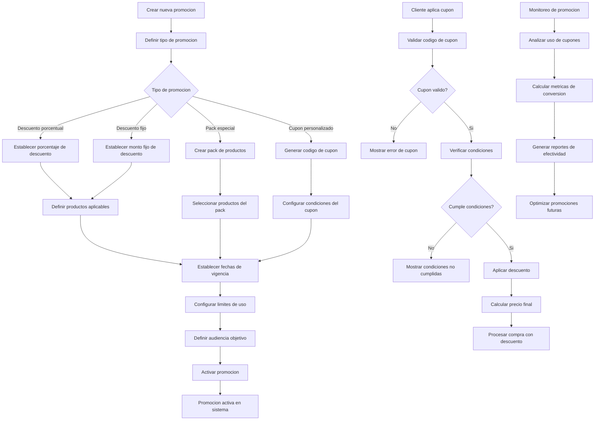

# Promociones & Cupones - Documentacion Completa

**URL:** https://www.notion.so/29906f76bed481eeb15bfb67e2aa0cd9
**Extraído el:** 2025-10-29T20:48:20.317Z

---

# Promociones & Cupones - Documentacion Completa

Esta pagina sirve como documentacion completa del modulo de gestion de promociones del software fitness. Este modulo esta principalmente dirigido a gimnasios y centros fitness:

- Marketing y promociones a escala
- Gestion completa de cupones
- Codigos promocionales personalizados
- Packs especiales para tienda fisica
Nota: Un entrenador puede hacer descuentos manuales, pero no suele necesitar un gestionador formal de cupones. Este modulo es principalmente para gimnasios con operaciones de marketing a escala.

## Diagramas de Flujo de Promociones

Los diagramas de flujo muestran el proceso completo de gestion de promociones y cupones:

## Matrices de Cupones

Tipos de cupones y promociones disponibles:

- Cupones de Descuento: Porcentaje o monto fijo
- Cupones de Envio Gratis: Para compras online
- Cupones de Producto Gratis: Al comprar otros productos
- Cupones de Membresia: Descuentos en planes
- Cupones de Primera Compra: Para nuevos clientes
- Cupones de Fidelidad: Para clientes recurrentes
## Componentes React

Documentacion de componentes React para el modulo de promociones y cupones:

### PromocionesManager

Componente principal que gestiona todas las promociones del sistema. Incluye dashboard con metricas de promociones activas, creacion de nuevas promociones y analisis de rendimiento.

### GestorCupones

Componente para la gestion completa de cupones. Permite crear, editar, activar/desactivar cupones y configurar todas sus condiciones de uso.

### CodigosPromocionales

Componente para generar y gestionar codigos promocionales personalizados. Incluye generacion automatica de codigos, validacion y seguimiento de uso.

### DescuentosProductos

Componente para aplicar descuentos especificos a productos o categorias. Permite configurar descuentos porcentuales o de monto fijo con condiciones personalizadas.

### PacksTienda

Componente para crear y gestionar packs especiales para tienda fisica. Permite combinar productos, establecer precios especiales y crear ofertas atractivas.

## Configuraciones de Descuentos

Configuraciones especificas para el sistema de descuentos:

- Descuentos Porcentuales: 5%, 10%, 15%, 20%, 25%, 30%
- Descuentos de Monto Fijo: 5�,�, 10�,�, 15�,�, 20�,�, 25�,�
- Descuentos por Compra Minima: Aplicar solo si supera X�,�
- Descuentos por Cantidad: Descuento al comprar X unidades
- Descuentos por Categoria: Aplicar solo a productos especificos
- Descuentos por Cliente: Para nuevos clientes o fidelidad
## APIs Requeridas

Documentacion de las APIs necesarias para el modulo de promociones y cupones:

- GET /api/ventas/promociones - Obtener promociones activas
- POST /api/ventas/cupones - Crear nuevo cupon
- GET /api/ventas/descuentos - Obtener descuentos disponibles
- POST /api/ventas/codigos - Generar codigos promocionales
- GET /api/ventas/packs - Obtener packs de tienda
## Estructura de Carpetas MERN

Estructura de carpetas para el stack MERN:

- ventas/promociones/page.tsx - Pagina principal de promociones
- ventas/promociones/api/ - API routes para promociones
- ventas/promociones/components/ - Componentes React de promociones
- ventas/promociones/hooks/ - Custom hooks para gestion de estado
- ventas/promociones/utils/ - Utilidades y helpers
- ventas/promociones/services/ - Servicios de integracion
## Documentacion de Procesos

Procesos principales del modulo de promociones y cupones:

### Proceso de Creacion de Promociones

- Definir objetivo de la promocion
- Seleccionar tipo de descuento
- Configurar productos aplicables
- Establecer fechas de vigencia
- Definir condiciones de uso
- Activar promocion en el sistema
### Proceso de Gestion de Cupones

- Generar codigo de cupon unico
- Configurar condiciones de aplicacion
- Establecer limites de uso
- Distribuir cupon a clientes objetivo
- Monitorear uso y efectividad
### Proceso de Aplicacion de Descuentos

- Cliente ingresa codigo de cupon
- Validar codigo y condiciones
- Calcular descuento aplicable
- Aplicar descuento al carrito
- Registrar uso del cupon
### Proceso de Creacion de Packs

- Seleccionar productos para el pack
- Definir precio especial del pack
- Configurar disponibilidad
- Crear material promocional
- Lanzar pack en tienda fisica
## Consideraciones Tecnicas

Aspectos tecnicos importantes para la implementacion:

- Validacion de cupones en tiempo real
- Sistema de codigos unicos y seguros
- Prevencion de fraude y uso multiple
- Integracion con sistemas de pago
- Analiticas de conversion y efectividad
## Mejores Practicas

Recomendaciones para el desarrollo:

- Usar TypeScript para tipado fuerte
- Implementar validaciones de cupones robustas
- Usar React Query para gestion de estado de servidor
- Implementar manejo de errores robusto
- Crear tests unitarios y de integracion
## Resumen

Esta documentacion proporciona una guia completa para implementar el modulo de Promociones & Cupones del software fitness. Este modulo esta principalmente dirigido a gimnasios y centros fitness que necesitan gestionar marketing y promociones a escala. Un entrenador puede hacer descuentos manuales, pero no suele necesitar un gestionador formal de cupones. El modulo incluye gestion completa de promociones, cupones, codigos promocionales y packs especiales para tienda fisica.

URL de la pagina: https://www.notion.so/Promociones-Cupones-29906f76bed481eeb15bfb67e2aa0cd9

