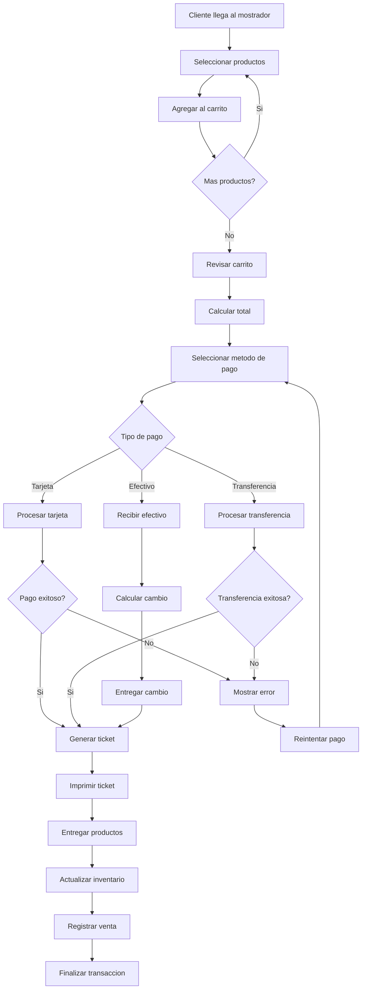

# Punto de Venta (POS) - Documentacion Completa

**URL:** https://www.notion.so/29906f76bed481338984dbb428936a71
**Extraído el:** 2025-10-29T20:48:15.327Z

---

# Punto de Venta (POS) - Documentacion Completa

Esta pagina sirve como documentacion completa del modulo de punto de venta del software fitness. Este modulo esta principalmente dirigido a gimnasios y centros fitness que necesitan gestionar ventas fisicas:

- TPV de mostrador para ventas en recepcion
- Venta de merch y suplementos dentro del gimnasio
- Caja registrada con tickets y arqueo
Nota: Un entrenador suelto rara vez necesita caja registrada, este modulo es principalmente para gimnasios y centros con tienda fisica.

## Diagramas de Flujo de POS

Los diagramas de flujo muestran el proceso completo de punto de venta:

## Matrices de Productos

Tabla de categorias de productos disponibles en el POS:

- Suplementos: Proteinas, creatina, vitaminas, pre-entrenos
- Merchandising: Camisetas, pantalones, gorras, botellas
- Accesorios: Guantes, cinturones, vendas, bandas elasticas
- Servicios: Membresias, clases especiales, entrenamientos
- Bebidas: Agua, isotonicas, batidos de proteina
## Componentes React

Documentacion de componentes React para el modulo de punto de venta:

### POSManager

Componente principal que gestiona todo el sistema de punto de venta. Incluye navegacion entre modulos, gestion de sesiones de caja y control de acceso.

### TPVMostrador

Interfaz principal del terminal de punto de venta. Permite seleccionar productos, gestionar carrito de compras y procesar pagos.

### VentaProductos

Componente para gestionar la venta de productos. Incluye busqueda de productos, seleccion de cantidades y calculo de totales.

### TicketsVenta

Componente para gestionar tickets de venta. Permite generar, imprimir y reimprimir tickets, asi como gestionar devoluciones.

### ArqueoCaja

Componente para realizar arqueos de caja. Permite contar efectivo, conciliar ventas y generar reportes de cierre de turno.

## Configuraciones de TPV

Configuraciones especificas para el terminal de punto de venta:

- Configuracion de impresora de tickets
- Configuracion de metodos de pago aceptados
- Configuracion de descuentos y promociones
- Configuracion de usuarios y permisos
- Configuracion de backup y sincronizacion
## APIs Requeridas

Documentacion de las APIs necesarias para el modulo de punto de venta:

- GET /api/ventas/pos - Obtener configuracion del POS
- POST /api/ventas/venta - Procesar nueva venta
- GET /api/ventas/productos - Obtener productos disponibles
- POST /api/ventas/ticket - Generar ticket de venta
- GET /api/ventas/arqueo - Obtener datos para arqueo de caja
## Estructura de Carpetas MERN

Estructura de carpetas para el stack MERN:

- ventas/pos/page.tsx - Pagina principal del POS
- ventas/pos/api/ - API routes para el POS
- ventas/pos/components/ - Componentes React del POS
- ventas/pos/hooks/ - Custom hooks para gestion de estado
- ventas/pos/utils/ - Utilidades y helpers
- ventas/pos/services/ - Servicios de integracion con TPV
## Documentacion de Procesos

Procesos principales del punto de venta:

### Proceso de Apertura de Caja

- Usuario inicia sesion en el POS
- Contar efectivo inicial
- Registrar apertura de caja
- Activar terminal para ventas
### Proceso de Venta

- Cliente selecciona productos
- Agregar productos al carrito
- Calcular total de la venta
- Procesar pago del cliente
- Generar y entregar ticket
- Actualizar inventario
### Proceso de Arqueo de Caja

- Contar efectivo en caja
- Conciliar ventas del dia
- Calcular diferencias
- Generar reporte de cierre
- Cerrar sesion de caja
## Consideraciones Tecnicas

Aspectos tecnicos importantes para la implementacion:

- Integracion con terminales de pago fisicos
- Sincronizacion en tiempo real con inventario
- Backup automatico de transacciones
- Sistema de impresion de tickets
- Manejo de conexion offline/online
## Mejores Practicas

Recomendaciones para el desarrollo:

- Usar TypeScript para tipado fuerte
- Implementar validaciones de stock en tiempo real
- Usar React Query para gestion de estado de servidor
- Implementar manejo de errores robusto
- Crear tests unitarios y de integracion
## Resumen

Esta documentacion proporciona una guia completa para implementar el modulo de Punto de Venta (POS) del software fitness. Este modulo esta principalmente dirigido a gimnasios y centros fitness que necesitan gestionar ventas fisicas de productos y servicios. Un entrenador suelto rara vez necesita caja registrada, pero los gimnasios con tienda fisica requieren un sistema completo de POS.

URL de la pagina: https://www.notion.so/Punto-de-Venta-POS-29906f76bed481338984dbb428936a71

