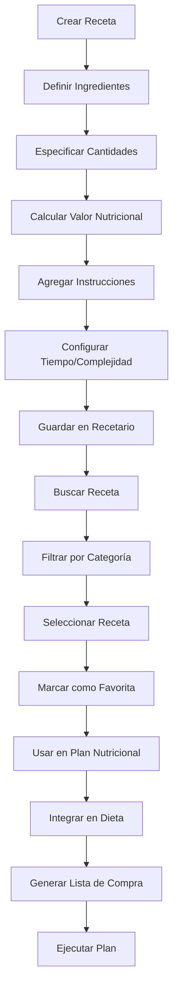
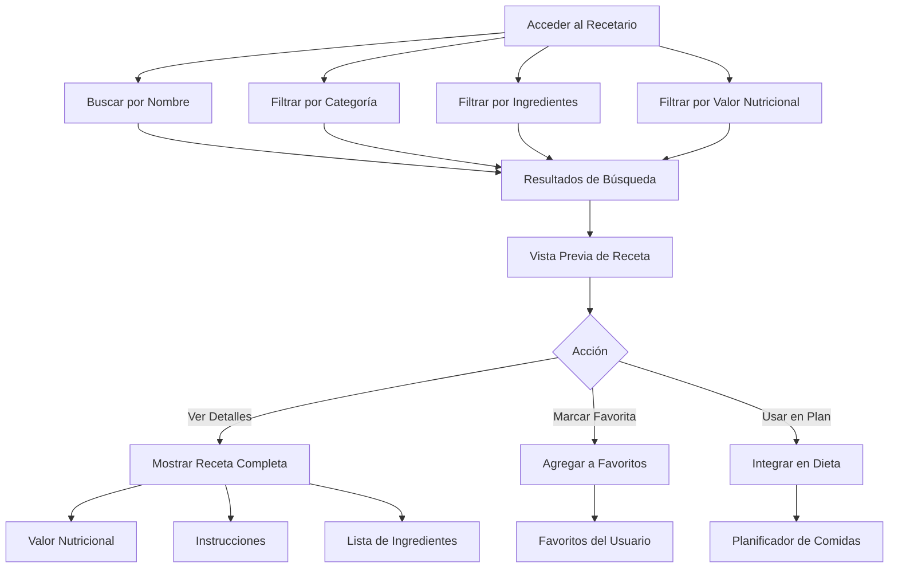

# Objetivo

**URL:** https://www.notion.so/29706f76bed4814180aaf54473ab8cb2
**Extraído el:** 2025-10-29T20:48:40.147Z

---

> 🍽️ **Catálogo reutilizable de recetas y comidas guardadas con valor nutricional completo**

# Objetivo

Proporcionar un sistema completo de recetario reutilizable que permita crear, gestionar y reutilizar recetas y comidas guardadas. Funcionalidades: catálogo de recetas guardadas, comidas favoritas, ingredientes y preparación, valor nutricional, búsqueda y filtrado. Igual de útil para entrenadores y gimnasios. Este módulo es un activo reutilizable fundamental para la planificación nutricional y la escalabilidad del servicio.

# Diagramas de Flujo

## Flujo de Gestión del Recetario



## Flujo de Búsqueda y Filtrado



# Matrices de Recursos

## Funcionalidades Principales

- Catálogo de Recetas: Biblioteca completa de recetas guardadas
- Comidas Favoritas: Sistema de favoritos personalizado
- Ingredientes y Preparación: Detalles completos de cada receta
- Valor Nutricional: Cálculo automático de macros y micronutrientes
- Búsqueda y Filtrado: Motor de búsqueda avanzada por múltiples criterios
- Categorización: Organización por tipo de comida, dieta, dificultad
- Integración con Planes: Uso directo en dietas y planes nutricionales
- Lista de Compra: Generación automática de ingredientes necesarios
## Integraciones

- Editor de Dieta: Uso de recetas en planes nutricionales
- Base de Datos de Alimentos: Ingredientes y valores nutricionales
- Sistema de Plantillas: Recetas en plantillas nutricionales
- Planificador de Comidas: Integración con horarios y menús
- Sistema de Favoritos: Gestión de recetas preferidas
- Generador de Listas: Lista de compra automática
# User Stories

## Para Entrenadores Personales 🧍

- Como entrenador personal, quiero tener un recetario con recetas saludables para recomendar a mis clientes
- Como entrenador personal, necesito buscar recetas por valor nutricional específico para cumplir con los macros de mis clientes
- Como entrenador personal, debo poder marcar recetas como favoritas para acceso rápido en mis planes nutricionales
- Como entrenador personal, quiero crear recetas personalizadas con ingredientes específicos para clientes con restricciones alimentarias
- Como entrenador personal, necesito que las recetas se integren automáticamente en los planes nutricionales de mis clientes
- Como entrenador personal, debo poder generar listas de compra automáticas basadas en las recetas seleccionadas
## Para Gimnasios/Centros 🏢

- Como gimnasio, quiero tener un recetario estandarizado para mi servicio de nutrición interno
- Como centro, necesito categorizar recetas por tipo de servicio (básico, premium, especializado)
- Como gimnasio, debo poder crear recetas específicas para diferentes programas (pérdida de peso, ganancia muscular, mantenimiento)
- Como gerente de gimnasio, quiero que mis nutricionistas puedan compartir recetas entre ellos para mantener consistencia
- Como centro, necesito que las recetas se integren en los planes nutricionales grupales que ofrezco
- Como gimnasio, debo poder generar listas de compra para los packs nutricionales que vendo como servicio extra
# Componentes React

- RecetarioList: Lista principal de recetas disponibles
- VisorReceta: Componente para mostrar detalles completos de una receta
- BuscadorRecetas: Motor de búsqueda y filtrado de recetas
- FavoritosComida: Gestión de recetas favoritas del usuario
- CalculadoraNutricional: Cálculo automático del valor nutricional
- CreadorReceta: Herramienta para crear nuevas recetas
- CategorizadorRecetas: Organizador por categorías de comida
- GeneradorListaCompra: Creación automática de listas de compra
# APIs Requeridas

```bash
GET /api/nutricion/recetas
POST /api/nutricion/recetas
PUT /api/nutricion/recetas/:id
DELETE /api/nutricion/recetas/:id
GET /api/nutricion/recetas/buscar
POST /api/nutricion/recetas/favoritos
GET /api/nutricion/recetas/favoritos
POST /api/nutricion/recetas/compartir
GET /api/nutricion/recetas/categorias
POST /api/nutricion/recetas/lista-compra
```

# Estructura MERN

```bash
nutricion/recetario/
├─ page.tsx
├─ api/
│  ├─ recetas.ts
│  ├─ favoritos.ts
│  └─ categorias.ts
└─ components/
   ├─ RecetarioList.tsx
   ├─ VisorReceta.tsx
   ├─ BuscadorRecetas.tsx
   ├─ FavoritosComida.tsx
   ├─ CalculadoraNutricional.tsx
   ├─ CreadorReceta.tsx
   ├─ CategorizadorRecetas.tsx
   └─ GeneradorListaCompra.tsx
```

# Documentación de Procesos

1. Se accede al módulo de Recetario desde el menú principal
1. Se puede crear una nueva receta o buscar en el catálogo existente
1. Para crear: se definen ingredientes, cantidades, instrucciones y categoría
1. El sistema calcula automáticamente el valor nutricional de la receta
1. Se guarda la receta en el catálogo con metadatos completos
1. Los usuarios pueden buscar y filtrar recetas por múltiples criterios
1. Se pueden marcar recetas como favoritas para acceso rápido
1. Las recetas se pueden integrar directamente en planes nutricionales
1. Se genera automáticamente una lista de compra basada en las recetas seleccionadas
1. El recetario es un activo reutilizable que optimiza la planificación nutricional
# Nota Final

> 💡 **El Recetario / Comidas Guardadas es un activo reutilizable fundamental que permite escalar el servicio nutricional tanto para entrenadores como para gimnasios. Su catálogo de recetas con valor nutricional completo, sistema de favoritos y búsqueda avanzada facilitan la planificación nutricional eficiente. La integración directa con planes nutricionales y la generación automática de listas de compra optimizan el flujo de trabajo. Este módulo es universalmente útil y se adapta tanto a la personalización extrema de entrenadores como a la estandarización de gimnasios.**

