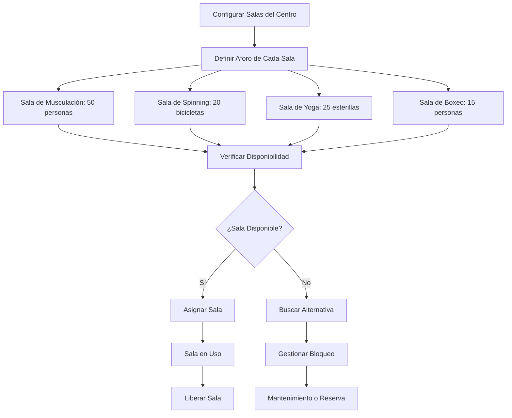
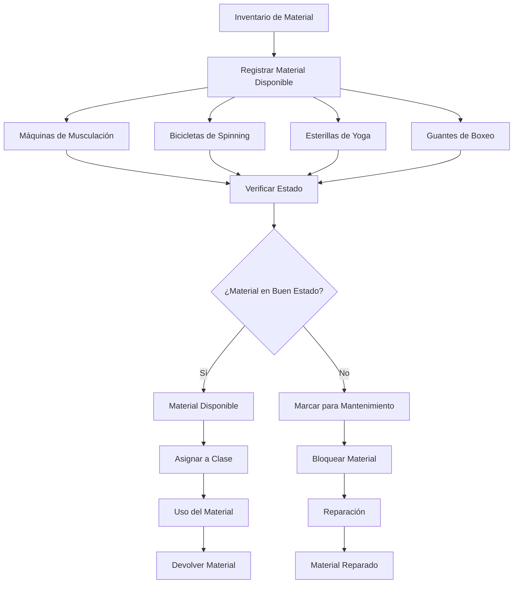

# Objetivo

**URL:** https://www.notion.so/29806f76bed48125a23be75ae25e15c1
**Extraído el:** 2025-10-29T20:48:48.375Z

---

> 🏢 **Sistema de gestión de recursos físicos, salas y material para gimnasios y centros**

# Objetivo

Proporcionar un sistema completo de gestión de recursos físicos para gimnasios y centros. Funcionalidades: gestión de salas, aforo, bloqueos por mantenimiento, control de material, disponibilidad de recursos. Específico para gimnasios/centros. No aplica a un entrenador que trabaja solo. Este módulo optimiza la utilización de espacios y recursos físicos del centro.

# Diagramas de Flujo

## Flujo de Gestión de Salas



## Flujo de Control de Material



# Matrices de Recursos

## Funcionalidades Principales

- Gestión de Salas: Control y administración de espacios del centro
- Control de Aforo: Límites de capacidad por sala y actividad
- Bloqueos por Mantenimiento: Gestión de mantenimiento y reparaciones
- Control de Material: Inventario y disponibilidad de equipamiento
- Disponibilidad de Recursos: Estado en tiempo real de salas y material
- Reservas de Espacios: Sistema de reserva de salas y recursos
- Mantenimiento Preventivo: Programación de mantenimientos
- Analytics de Uso: Métricas de utilización de recursos
## Tipos de Salas

- Sala de Musculación: Máquinas de peso libre y guiadas
- Sala de Cardio: Cintas, bicicletas, elípticas
- Sala de Spinning: Bicicletas estáticas grupales
- Sala de Yoga/Pilates: Espacio para clases de suelo
- Sala de Boxeo/Artes Marciales: Ring y tatami
- Sala de Crossfit: Espacio funcional con equipamiento específico
- Sala de Fisioterapia: Consultas y tratamientos
- Sala de Nutrición: Consultas nutricionales
# User Stories

## Para Gimnasios/Centros 🏢

- Como gerente de gimnasio, quiero gestionar las salas del centro para optimizar su uso
- Como centro, necesito controlar el aforo de cada sala para cumplir normativas
- Como gimnasio, debo poder bloquear salas por mantenimiento sin afectar las clases
- Como centro, quiero controlar el material disponible para cada actividad
- Como gimnasio, necesito saber qué recursos están disponibles en tiempo real
- Como centro, debo poder programar mantenimientos preventivos del equipamiento
- Como gimnasio, quiero analizar el uso de recursos para optimizar la distribución
## Para Instructores/Personal 👨‍💼

- Como instructor, quiero reservar salas para mis clases con antelación
- Como instructor, necesito saber qué material está disponible para mi clase
- Como personal, debo poder reportar problemas con el equipamiento
- Como instructor, quiero ver el estado de las salas antes de mi clase
- Como personal, necesito poder solicitar material adicional para mis clases
- Como instructor, debo poder ver el aforo máximo de mi sala asignada
# Componentes React

- GestorRecursos: Componente principal para gestión de recursos físicos
- SalasDisponibles: Sistema de visualización de salas disponibles
- ControlAforo: Gestión de límites de capacidad por sala
- BloqueosMantenimiento: Sistema de bloqueos por mantenimiento
- MaterialDisponible: Control de inventario y disponibilidad de material
- ReservasSalas: Sistema de reserva de espacios
- MantenimientoPreventivo: Programación de mantenimientos
- AnalyticsRecursos: Métricas de utilización de recursos
# APIs Requeridas

```bash
GET /api/operaciones/recursos
POST /api/operaciones/recursos
PUT /api/operaciones/recursos/:id
DELETE /api/operaciones/recursos/:id
GET /api/operaciones/salas
POST /api/operaciones/bloqueos
GET /api/operaciones/material
POST /api/operaciones/reservas
GET /api/operaciones/disponibilidad
POST /api/operaciones/mantenimiento
```

# Estructura MERN

```bash
operaciones/recursos/
├─ page.tsx
├─ api/
│  ├─ recursos.ts
│  ├─ salas.ts
│  └─ material.ts
└─ components/
   ├─ GestorRecursos.tsx
   ├─ SalasDisponibles.tsx
   ├─ ControlAforo.tsx
   ├─ BloqueosMantenimiento.tsx
   ├─ MaterialDisponible.tsx
   ├─ ReservasSalas.tsx
   ├─ MantenimientoPreventivo.tsx
   └─ AnalyticsRecursos.tsx
```

# Documentación de Procesos

1. Se configuran las salas del centro con sus características y aforo
1. Se registra el inventario de material y equipamiento disponible
1. Se establecen los horarios de disponibilidad de cada sala
1. Se programan los mantenimientos preventivos del equipamiento
1. Se gestionan las reservas de salas por parte de instructores
1. Se controla el aforo en tiempo real durante las actividades
1. Se gestionan los bloqueos por mantenimiento o reparaciones
1. Se registra el uso de material y su estado después de cada uso
1. Se generan reportes de utilización de recursos y salas
1. Se optimiza la distribución de recursos basándose en datos de uso
# Nota Final

> 💡 **El módulo de Recursos / Salas / Material es específico para gimnasios y centros que manejan múltiples espacios físicos y equipamiento. Los entrenadores personales que trabajan solos no necesitan este módulo porque no gestionan salas ni material compartido. El sistema debe optimizar la utilización de espacios, controlar el aforo según normativas, gestionar mantenimientos y asegurar que los recursos estén disponibles cuando se necesiten.**

