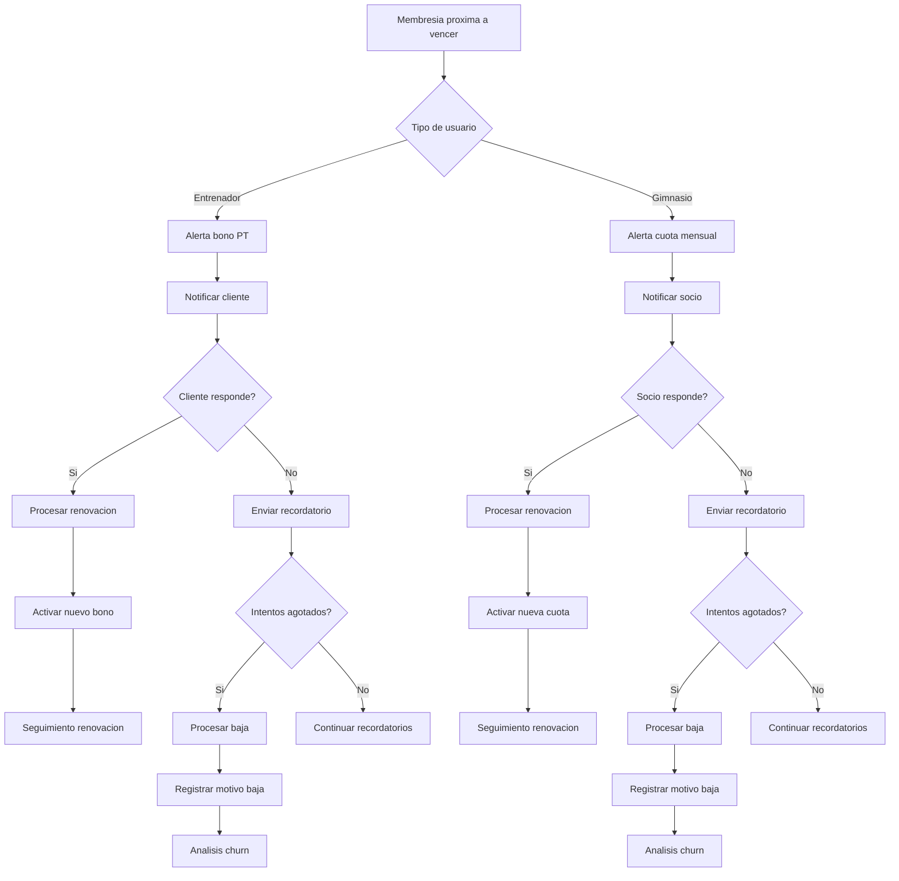

# Renovaciones & Bajas - Documentacion Completa

**URL:** https://www.notion.so/29906f76bed48126adb6c1658dfae21e
**Extraído el:** 2025-10-29T20:48:13.773Z

---

# Renovaciones & Bajas - Documentacion Completa

Esta pagina sirve como documentacion completa del modulo de gestion de renovaciones y bajas del software fitness. El modulo se adapta segun el tipo de usuario:

- Para entrenadores: avisos de 'tu bono de 4 sesiones se acaba esta semana'
- Para gimnasios: bajas de socios, motivo baja (importantisimo para churn)
## Diagramas de Flujo de Renovaciones

Los diagramas de flujo muestran el proceso completo de gestion de renovaciones y bajas:



## Matrices de Bajas

Tabla de motivos de baja mas comunes:

- Motivos Economicos: Precio elevado, problemas financieros
- Motivos Personales: Falta de tiempo, cambio de objetivos
- Motivos de Servicio: Insatisfaccion, falta de resultados
- Motivos de Ubicacion: Mudanza, cambio de trabajo
- Motivos de Salud: Lesiones, problemas medicos
## Componentes React

Documentacion de componentes React para el modulo de renovaciones y bajas:

### RenovacionesManager

```typescript
interface RenovacionesManagerProps {
  userType: 'entrenador' | 'gimnasio';
  renovaciones: Renovacion[];
  onProcessRenovacion: (id: string, data: ProcessRenovacionRequest) => void;
  onCancelRenovacion: (id: string) => void;
  onSendReminder: (id: string) => void;
}

const RenovacionesManager: React.FC<RenovacionesManagerProps> = ({
  userType,
  renovaciones,
  onProcessRenovacion,
  onCancelRenovacion,
  onSendReminder
}) => {
  const [filter, setFilter] = useState<'todas' | 'pendientes' | 'procesadas' | 'canceladas'>('todas');
  
  const filteredRenovaciones = useMemo(() => {
    return renovaciones.filter(renovacion => {
      if (filter === 'todas') return true;
      return renovacion.estado === filter;
    });
  }, [renovaciones, filter]);
  
  return (
    <div className='renovaciones-manager'>
      <div className='header'>
        <h2>Gestion de Renovaciones</h2>
        <FilterSelector
          value={filter}
          onChange={setFilter}
          options={[
            { value: 'todas', label: 'Todas' },
            { value: 'pendientes', label: 'Pendientes' },
            { value: 'procesadas', label: 'Procesadas' },
            { value: 'canceladas', label: 'Canceladas' }
          ]}
        />
      </div>
      
      <RenovacionesList
        renovaciones={filteredRenovaciones}
        userType={userType}
        onProcess={onProcessRenovacion}
        onCancel={onCancelRenovacion}
        onSendReminder={onSendReminder}
      />
    </div>
  );
};
```

### GestorBajas

```typescript
interface GestorBajasProps {
  bajas: Baja[];
  onProcessBaja: (id: string, motivo: string) => void;
  onCancelBaja: (id: string) => void;
  onExportBajas: () => void;
}

const GestorBajas: React.FC<GestorBajasProps> = ({
  bajas,
  onProcessBaja,
  onCancelBaja,
  onExportBajas
}) => {
  const [searchTerm, setSearchTerm] = useState('');
  
  const filteredBajas = useMemo(() => {
    return bajas.filter(baja => 
      baja.cliente.nombre.toLowerCase().includes(searchTerm.toLowerCase()) ||
      baja.motivo.toLowerCase().includes(searchTerm.toLowerCase())
    );
  }, [bajas, searchTerm]);
  
  return (
    <div className='gestor-bajas'>
      <div className='header'>
        <h2>Gestion de Bajas</h2>
        <div className='actions'>
          <SearchInput
            value={searchTerm}
            onChange={setSearchTerm}
            placeholder='Buscar baja...'
          />
          <button onClick={onExportBajas}>
            Exportar Bajas
          </button>
        </div>
      </div>
      
      <BajasList
        bajas={filteredBajas}
        onProcess={onProcessBaja}
        onCancel={onCancelBaja}
      />
    </div>
  );
};
```

### MotivosBaja

```typescript
interface MotivosBajaProps {
  motivos: MotivoBaja[];
  onAddMotivo: (motivo: CreateMotivoBajaRequest) => void;
  onUpdateMotivo: (id: string, motivo: UpdateMotivoBajaRequest) => void;
  onDeleteMotivo: (id: string) => void;
}

const MotivosBaja: React.FC<MotivosBajaProps> = ({
  motivos,
  onAddMotivo,
  onUpdateMotivo,
  onDeleteMotivo
}) => {
  const [showAddForm, setShowAddForm] = useState(false);
  
  const motivosPorCategoria = useMemo(() => {
    return motivos.reduce((acc, motivo) => {
      if (!acc[motivo.categoria]) {
        acc[motivo.categoria] = [];
      }
      acc[motivo.categoria].push(motivo);
      return acc;
    }, {} as Record<string, MotivoBaja[]>);
  }, [motivos]);
  
  return (
    <div className='motivos-baja'>
      <div className='header'>
        <h2>Motivos de Baja</h2>
        <button onClick={() => setShowAddForm(true)}>
          Agregar Motivo
        </button>
      </div>
      
      {showAddForm && (
        <MotivoForm
          onSubmit={onAddMotivo}
          onCancel={() => setShowAddForm(false)}
        />
      )}
      
      <div className='motivos-grid'>
        {Object.entries(motivosPorCategoria).map(([categoria, motivosCategoria]) => (
          <div key={categoria} className='categoria-section'>
            <h3>{categoria}</h3>
            {motivosCategoria.map(motivo => (
              <MotivoCard
                key={motivo.id}
                motivo={motivo}
                onUpdate={onUpdateMotivo}
                onDelete={onDeleteMotivo}
              />
            ))}
          </div>
        ))}
      </div>
    </div>
  );
};
```

### AlertasVencimiento

```typescript
interface AlertasVencimientoProps {
  alertas: AlertaVencimiento[];
  onMarkAsRead: (alertaId: string) => void;
  onProcessAlerta: (alertaId: string, accion: AccionAlerta) => void;
  onDismissAlerta: (alertaId: string) => void;
}

const AlertasVencimiento: React.FC<AlertasVencimientoProps> = ({
  alertas,
  onMarkAsRead,
  onProcessAlerta,
  onDismissAlerta
}) => {
  const [filter, setFilter] = useState<'todas' | 'no-leidas' | 'urgentes'>('todas');
  
  const filteredAlertas = useMemo(() => {
    return alertas.filter(alerta => {
      if (filter === 'todas') return true;
      if (filter === 'no-leidas') return !alerta.leida;
      if (filter === 'urgentes') return alerta.prioridad === 'alta';
      return true;
    });
  }, [alertas, filter]);
  
  const getPrioridadColor = (prioridad: PrioridadAlerta) => {
    switch (prioridad) {
      case 'alta': return 'red';
      case 'media': return 'yellow';
      case 'baja': return 'green';
      default: return 'gray';
    }
  };
  
  return (
    <div className='alertas-vencimiento'>
      <div className='header'>
        <h2>Alertas de Vencimiento</h2>
        <FilterSelector
          value={filter}
          onChange={setFilter}
          options={[
            { value: 'todas', label: 'Todas' },
            { value: 'no-leidas', label: 'No Leidas' },
            { value: 'urgentes', label: 'Urgentes' }
          ]}
        />
      </div>
      
      <div className='alertas-list'>
        {filteredAlertas.map(alerta => (
          <AlertaCard
            key={alerta.id}
            alerta={alerta}
            prioridadColor={getPrioridadColor(alerta.prioridad)}
            onMarkAsRead={() => onMarkAsRead(alerta.id)}
            onProcess={(accion) => onProcessAlerta(alerta.id, accion)}
            onDismiss={() => onDismissAlerta(alerta.id)}
          />
        ))}
      </div>
    </div>
  );
};
```

### AnalisisChurn

```typescript
interface AnalisisChurnProps {
  datosChurn: ChurnData[];
  periodo: 'mensual' | 'trimestral' | 'anual';
  onCambiarPeriodo: (periodo: string) => void;
  onExportReporte: () => void;
}

const AnalisisChurn: React.FC<AnalisisChurnProps> = ({
  datosChurn,
  periodo,
  onCambiarPeriodo,
  onExportReporte
}) => {
  const calcularMetricas = () => {
    const totalBajas = datosChurn.reduce((sum, data) => sum + data.bajas, 0);
    const totalSocios = datosChurn.reduce((sum, data) => sum + data.sociosIniciales, 0);
    const tasaChurn = totalSocios > 0 ? (totalBajas / totalSocios) * 100 : 0;
    
    const motivosMasComunes = datosChurn.reduce((acc, data) => {
      data.motivosBaja.forEach(motivo => {
        acc[motivo] = (acc[motivo] || 0) + 1;
      });
      return acc;
    }, {} as Record<string, number>);
    
    return {
      tasaChurn,
      totalBajas,
      totalSocios,
      motivosMasComunes
    };
  };
  
  const metricas = calcularMetricas();
  
  return (
    <div className='analisis-churn'>
      <div className='header'>
        <h2>Analisis de Churn</h2>
        <div className='controls'>
          <PeriodSelector
            value={periodo}
            onChange={onCambiarPeriodo}
            options={[
              { value: 'mensual', label: 'Mensual' },
              { value: 'trimestral', label: 'Trimestral' },
              { value: 'anual', label: 'Anual' }
            ]}
          />
          <button onClick={onExportReporte}>
            Exportar Reporte
          </button>
        </div>
      </div>
      
      <div className='metricas'>
        <MetricCard title='Tasa de Churn' value={${metricas.tasaChurn.toFixed(2)}%} />
        <MetricCard title='Total Bajas' value={metricas.totalBajas} />
        <MetricCard title='Total Socios' value={metricas.totalSocios} />
      </div>
      
      <ChurnChart datos={datosChurn} />
      <MotivosChart motivos={metricas.motivosMasComunes} />
    </div>
  );
};
```

## Configuraciones de Alertas

Configuraciones especificas para alertas de renovacion y vencimiento:

- Alertas Tempranas: 30 dias antes del vencimiento
- Alertas Urgentes: 7 dias antes del vencimiento
- Alertas Criticas: 1 dia antes del vencimiento
- Recordatorios Automaticos: Cada 3 dias hasta respuesta
- Notificaciones Multi-canal: Email, SMS, WhatsApp
## APIs Requeridas

Documentacion de las APIs necesarias para el modulo de renovaciones y bajas:

- GET /api/membresias/renovaciones - Obtener todas las renovaciones pendientes
- POST /api/membresias/renovaciones - Crear nueva renovacion
- GET /api/membresias/bajas - Obtener lista de bajas
- POST /api/membresias/bajas - Procesar nueva baja
- GET /api/membresias/churn - Obtener analisis de churn
## Estructura de Carpetas MERN

Estructura de carpetas para el stack MERN:

- membresias/renovaciones/page.tsx - Pagina principal de renovaciones
- membresias/renovaciones/api/ - API routes para renovaciones
- membresias/renovaciones/components/ - Componentes React del modulo
- membresias/renovaciones/hooks/ - Custom hooks para gestion de estado
- membresias/renovaciones/utils/ - Utilidades y helpers
## Documentacion de Procesos

Procesos principales de la seccion de renovaciones y bajas:

### Proceso de Renovacion

- Detectar membresia proxima a vencer
- Generar alerta de renovacion
- Enviar notificacion al cliente/socio
- Procesar respuesta de renovacion
- Activar nueva membresia si procede
### Proceso de Baja

- Detectar falta de respuesta a renovacion
- Iniciar proceso de baja automatica
- Registrar motivo de baja
- Suspender acceso a servicios
- Actualizar analisis de churn
### Proceso de Analisis de Churn

- Recopilar datos de bajas por periodo
- Calcular tasa de churn
- Analizar motivos mas comunes
- Generar reportes y graficos
- Identificar patrones y tendencias
## Consideraciones Tecnicas

Aspectos tecnicos importantes para la implementacion:

- Sistema de alertas automaticas en tiempo real
- Integracion con sistemas de notificacion (Email, SMS, WhatsApp)
- Almacenamiento seguro de motivos de baja
- Calculos automaticos de metricas de churn
- Auditoria completa de procesos de renovacion y baja
## Mejores Practicas

Recomendaciones para el desarrollo:

- Usar TypeScript para tipado fuerte de estados
- Implementar validaciones tanto en frontend como backend
- Usar React Query para gestion de estado de servidor
- Implementar manejo de errores robusto
- Crear tests unitarios y de integracion
## Resumen

Esta documentacion proporciona una guia completa para implementar el modulo de Renovaciones & Bajas del software fitness. El modulo se adapta segun el tipo de usuario (entrenador vs gimnasio) y proporciona todas las funcionalidades necesarias para la gestion eficiente de renovaciones, procesamiento de bajas y analisis de churn.

URL de la pagina: https://www.notion.so/Renovaciones-Bajas-29906f76bed48126adb6c1658dfae21e

