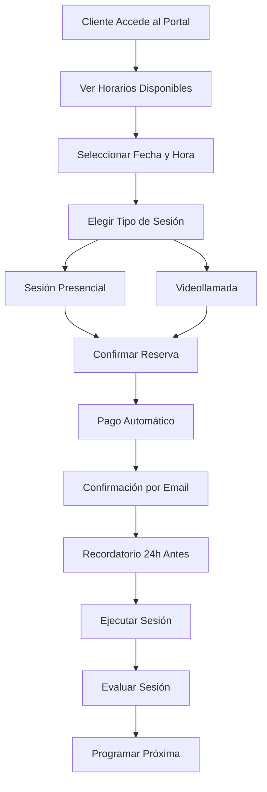
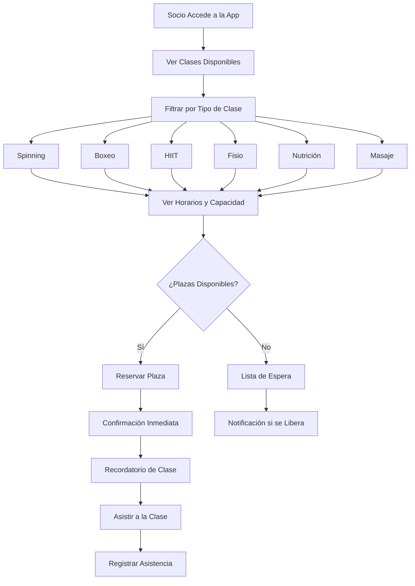

# Objetivo

**URL:** https://www.notion.so/29706f76bed481e0a9ffe677ac962688
**Extraído el:** 2025-10-29T20:48:45.868Z

---

> 📱 **Sistema de reservas online diferenciado: sesiones 1 a 1 para entrenadores, clases grupales para gimnasios**

# Objetivo

Proporcionar un sistema completo de reservas online que permita a clientes y socios reservar servicios de forma autónoma y eficiente. Para entrenadores: el cliente reserva sesión contigo directamente según tus huecos. Para gimnasios: el socio reserva plaza en clase de spinning, boxeo, HIIT, fisio, nutrición, masaje. El sistema debe optimizar la ocupación y facilitar la gestión de disponibilidad según el modelo de negocio.

# Diagramas de Flujo

## Flujo de Reservas para Entrenadores



## Flujo de Reservas para Gimnasios



# Matrices de Recursos

## Funcionalidades Principales

- Reservas Online: Sistema de reservas autónomo para clientes y socios
- Selector de Huecos: Visualización de horarios disponibles
- Confirmación de Reserva: Proceso de confirmación automático
- Historial de Reservas: Registro completo de reservas realizadas
- Gestión de Cancelaciones: Sistema de cancelaciones y reembolsos
- Lista de Espera: Sistema automático para clases llenas
- Recordatorios Automáticos**: Notificaciones de reservas
- Integración con Pagos: Cobro automático de reservas
## Integraciones

- Sistema de Agenda: Integración con calendario y disponibilidad
- Sistema de Clientes: Gestión de clientes y socios
- Sistema de Pagos: Cobro automático de servicios
- Sistema de Comunicaciones: Notificaciones y recordatorios
- Sistema de Clases: Gestión de clases y servicios
- Sistema de Analytics: Métricas de ocupación y reservas
# User Stories

## Para Entrenadores Personales 🧍

- Como entrenador personal, quiero que mis clientes puedan reservar sesiones directamente según mis horarios disponibles para optimizar mi agenda
- Como entrenador personal, necesito que el sistema permita reservar tanto sesiones presenciales como videollamadas según la preferencia del cliente
- Como entrenador personal, debo poder configurar diferentes tipos de sesión (evaluación, seguimiento, consulta) con precios diferentes
- Como entrenador personal, quiero que el sistema cobre automáticamente cada sesión reservada para garantizar mis ingresos
- Como entrenador personal, necesito recibir notificaciones cuando un cliente reserva una sesión para prepararme adecuadamente
- Como entrenador personal, debo poder gestionar cancelaciones y reembolsos de forma automática según mi política
## Para Gimnasios/Centros 🏢

- Como gimnasio, quiero que mis socios puedan reservar plazas en clases de spinning, boxeo, HIIT directamente desde la app móvil
- Como centro, necesito gestionar la capacidad de cada clase para evitar sobreocupación y mantener la calidad del servicio
- Como gimnasio, debo poder ofrecer servicios adicionales como fisioterapia, nutrición y masajes con reservas online
- Como centro, quiero que el sistema gestione automáticamente las listas de espera cuando las clases se llenan
- Como gimnasio, necesito analizar la ocupación de las clases para optimizar horarios y oferta
- Como centro, debo poder configurar políticas de cancelación y penalizaciones por no-show
# Componentes React

- ReservasOnline: Componente principal del sistema de reservas
- SelectorHuecos: Visualización de horarios disponibles para reservar
- ConfirmacionReserva: Proceso de confirmación de reservas
- HistorialReservas: Registro completo de reservas realizadas
- Cancelaciones: Gestión de cancelaciones y reembolsos
- ListaEspera: Sistema de lista de espera para clases llenas
- RecordatoriosReserva: Sistema de notificaciones automáticas
- AnalyticsReservas: Métricas de ocupación y reservas
# APIs Requeridas

```bash
GET /api/agenda/reservas
POST /api/agenda/reservas
PUT /api/agenda/reservas/:id
DELETE /api/agenda/reservas/:id
GET /api/agenda/disponibilidad
POST /api/agenda/confirmar
GET /api/agenda/clases
POST /api/agenda/lista-espera
GET /api/agenda/analytics
```

# Estructura MERN

```bash
agenda/reservas/
├─ page.tsx
├─ api/
│  ├─ reservas.ts
│  ├─ disponibilidad.ts
│  └─ confirmacion.ts
└─ components/
   ├─ ReservasOnline.tsx
   ├─ SelectorHuecos.tsx
   ├─ ConfirmacionReserva.tsx
   ├─ HistorialReservas.tsx
   ├─ Cancelaciones.tsx
   ├─ ListaEspera.tsx
   ├─ RecordatoriosReserva.tsx
   └─ AnalyticsReservas.tsx
```

# Documentación de Procesos

1. El cliente/socio accede al portal de reservas desde la app o web
1. Para entrenadores: ve horarios disponibles y selecciona fecha/hora
1. Para gimnasios: ve clases disponibles y selecciona tipo de clase
1. El sistema verifica disponibilidad y capacidad en tiempo real
1. Si hay disponibilidad, se procede con la reserva
1. Si no hay disponibilidad, se ofrece lista de espera o alternativas
1. Se confirma la reserva y se envía notificación automática
1. Se envía recordatorio 24h antes de la cita/clase
1. Se registra la asistencia y se actualiza el historial
1. El sistema genera analytics de ocupación para optimización
# Nota Final

> 💡 **Las Reservas Online son un módulo fundamental que debe adaptarse perfectamente al modelo de negocio. Para entrenadores, la gestión individual de sesiones 1 a 1 es clave. Para gimnasios, la gestión colectiva de clases y servicios es prioritaria. El sistema debe ser intuitivo para los usuarios finales y eficiente para la gestión operativa. La integración con pagos, comunicaciones y analytics es esencial para maximizar la ocupación y los ingresos.**

