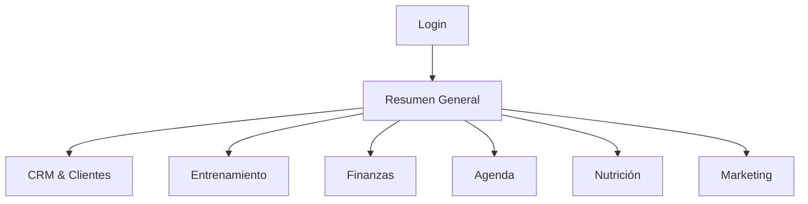
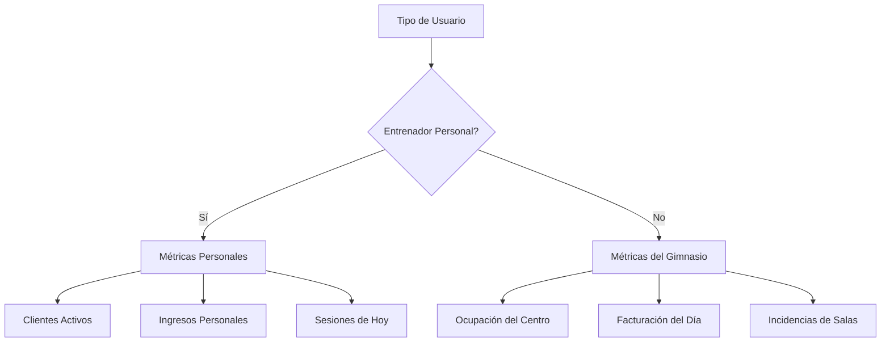

# Objetivo

**URL:** https://www.notion.so/29706f76bed481b0a549fb0546db85d3
**Extraído el:** 2025-10-29T20:48:26.878Z

---

> 📊 **Panel principal de control y métricas del sistema**

# Objetivo

Proporcionar una vista general del estado del negocio, métricas clave y acceso rápido a las funcionalidades más importantes para entrenadores personales y gimnasios. El resumen general se adapta automáticamente según el tipo de usuario, mostrando información relevante y personalizada para cada rol.

# Diagramas de Flujo

## Flujo de Navegación del Resumen General



## Flujo de Métricas por Rol



# Matrices de Recursos

## Funcionalidades Principales

- KPIs Personalizados: Métricas adaptadas al tipo de usuario
- Tareas del Día: Lista de actividades pendientes y prioritarias
- Alertas Inteligentes: Notificaciones relevantes por rol
- Acceso Rápido: Enlaces directos a módulos principales
- Gráficos de Rendimiento: Visualización de datos clave
- Resumen Financiero: Estado económico del negocio
## Integraciones

- Base de Datos de Clientes: Información actualizada de clientes/leads
- Sistema de Facturación: Estado de cobros y pagos
- Calendario de Citas: Próximas sesiones y eventos
- Sistema de Entrenamientos: Progreso y adherencia
- Sistema de Nutrición: Seguimiento dietético
- Marketing Automation: Campañas activas y resultados
# User Stories

## Para Entrenadores Personales 🧍

- Como entrenador personal, quiero ver mis clientes activos para gestionar mi agenda diaria
- Como entrenador personal, necesito ver mis ingresos del mes para controlar mi negocio personal
- Como entrenador personal, debo poder acceder rápidamente a mis próximas sesiones para prepararme
- Como entrenador personal, quiero ver las tareas pendientes para organizar mi día
- Como entrenador personal, necesito alertas sobre clientes que no han hecho check-in para dar seguimiento
- Como entrenador personal, debo poder ver el progreso de mis clientes para ajustar sus planes
## Para Gimnasios/Centros 🏢

- Como gimnasio, quiero ver la ocupación actual para gestionar recursos y aforo
- Como centro, necesito ver la facturación del día para controlar ingresos diarios
- Como gerente de gimnasio, debo poder ver las incidencias del centro para resolver problemas
- Como gimnasio, quiero ver los leads nuevos para gestionar el pipeline comercial
- Como centro, necesito alertas sobre equipos rotos para mantenimiento
- Como gimnasio, debo poder ver la ocupación de clases para optimizar horarios
# Componentes React

- DashboardOverview: Vista general de métricas principales
- QuickActions: Accesos rápidos a módulos del sistema
- AlertsPanel: Panel de alertas y notificaciones inteligentes
- MetricsChart: Gráficos de rendimiento y tendencias
- RecentActivity: Actividad reciente del sistema
- TasksWidget: Widget de tareas pendientes
- FinancialSummary: Resumen financiero personalizado
- ClientStatus: Estado de clientes/leads activos
# APIs Requeridas

```bash
GET /api/dashboard/metrics
GET /api/dashboard/alerts
GET /api/dashboard/quick-stats
GET /api/dashboard/tasks
GET /api/dashboard/financial-summary
GET /api/dashboard/client-status
POST /api/dashboard/refresh
PUT /api/dashboard/preferences
```

# Estructura MERN

```bash
dashboard/resumen-general/
├─ page.tsx
├─ api/
│  ├─ metrics.ts
│  ├─ alerts.ts
│  ├─ tasks.ts
│  ├─ financial.ts
│  └─ client-status.ts
└─ components/
   ├─ DashboardOverview.tsx
   ├─ QuickActions.tsx
   ├─ AlertsPanel.tsx
   ├─ MetricsChart.tsx
   ├─ RecentActivity.tsx
   ├─ TasksWidget.tsx
   ├─ FinancialSummary.tsx
   └─ ClientStatus.tsx
```

# Documentación de Procesos

1. Usuario accede al sistema y se autentica
1. Sistema identifica el tipo de usuario (entrenador vs gimnasio)
1. Se cargan métricas personalizadas según el rol del usuario
1. Se muestran alertas pendientes relevantes para el usuario
1. Se despliegan widgets de acceso rápido a módulos principales
1. Usuario puede navegar a módulos específicos desde el resumen
1. Dashboard se actualiza en tiempo real con información actualizada
# Nota Final

> 💡 **El resumen general es la página más importante del sistema ya que es el punto de entrada principal. Se adapta automáticamente según el tipo de usuario (entrenador personal vs gimnasio) mostrando métricas, alertas y funcionalidades relevantes para cada rol. Esta personalización es clave para la experiencia de usuario y la eficiencia operativa.**

