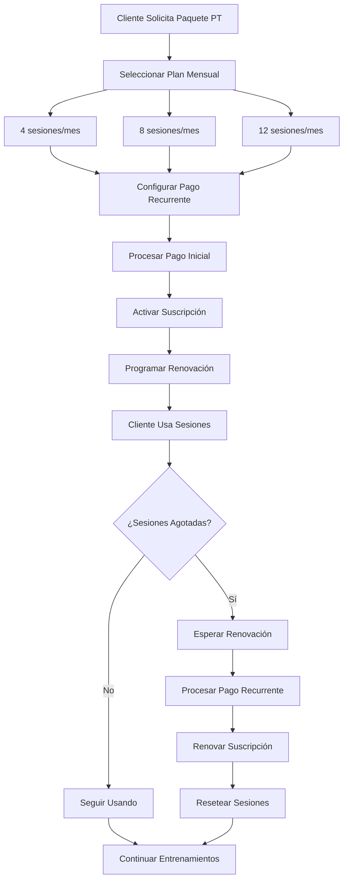
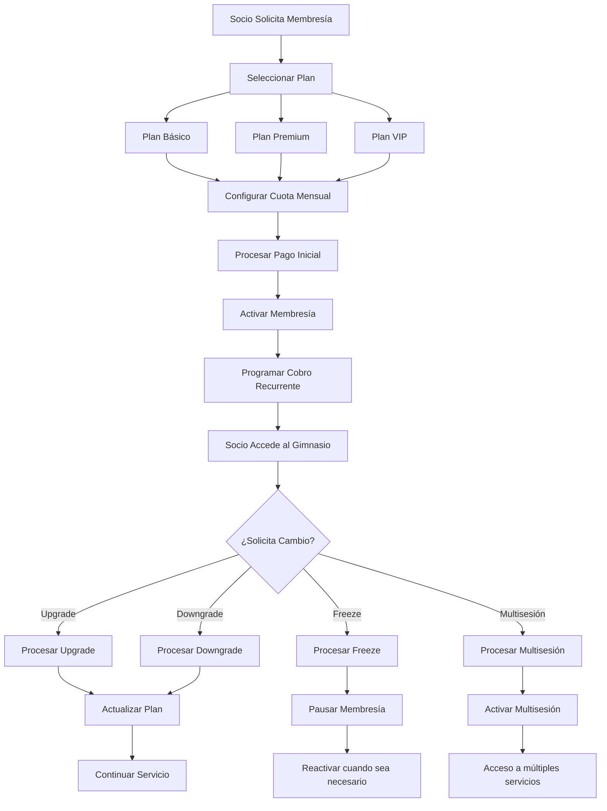

# Objetivo

**URL:** https://www.notion.so/29806f76bed481fdad6de995e81a7fa6
**Extraído el:** 2025-10-29T20:48:56.734Z

---

> 🔄 **Sistema de gestión de suscripciones y cuotas recurrentes con lógica diferenciada por tipo de usuario**

# Objetivo

Proporcionar un sistema completo de gestión de suscripciones y cuotas recurrentes para entrenadores y gimnasios. Para entrenadores: paquetes mensuales PT ('4 sesiones/mes'), pagos recurrentes 1 a 1. Para gimnasios: cuotas de socios, freeze, upgrade/downgrade de plan, multisesión. La página existe en ambos, pero la lógica es distinta. Este módulo automatiza la gestión de membresías y garantiza un flujo de ingresos recurrente predecible.

# Diagramas de Flujo

## Flujo de Suscripciones para Entrenadores



## Flujo de Suscripciones para Gimnasios



# Matrices de Cuotas

## Funcionalidades Principales

- Gestión de Suscripciones: Sistema completo de membresías y paquetes
- Cuotas Recurrentes: Automatización de pagos periódicos
- Upgrade/Downgrade: Cambios de plan flexibles
- Freeze de Suscripción: Pausa temporal de membresías
- Multisesión: Acceso a múltiples servicios
- Gestión de Renovaciones: Automatización de renovaciones
- Control de Acceso: Gestión de permisos por plan
- Analytics de Suscripciones: Métricas de retención y conversión
## Tipos de Suscripciones

- Suscripciones de Entrenamiento: Paquetes PT, sesiones individuales
- Membresías de Gimnasio: Acceso completo al centro
- Suscripciones de Servicios: Nutrición, fisioterapia, masajes
- Suscripciones de Contenido: Acceso a material digital
- Suscripciones de Eventos: Acceso a clases especiales
- Suscripciones Híbridas: Combinación de servicios
# User Stories

## Para Entrenadores Personales 🧍

- Como entrenador personal, quiero crear paquetes mensuales PT ('4 sesiones/mes') para fidelizar clientes
- Como entrenador, necesito automatizar los pagos recurrentes de mis clientes
- Como entrenador, debo poder gestionar las sesiones disponibles de cada cliente
- Como entrenador, quiero que mis clientes puedan renovar sus paquetes automáticamente
- Como entrenador, necesito poder pausar suscripciones cuando un cliente viaja
- Como entrenador, debo poder ofrecer upgrades de paquetes a mis clientes
## Para Gimnasios/Centros 🏢

- Como gimnasio, quiero gestionar las cuotas de todos mis socios de forma automatizada
- Como centro, necesito permitir que los socios congelen sus membresías temporalmente
- Como gimnasio, debo poder gestionar upgrades y downgrades de planes
- Como centro, quiero ofrecer multisesión para acceder a múltiples servicios
- Como gimnasio, necesito controlar el acceso según el tipo de membresía
- Como centro, debo poder analizar la retención y conversión de socios
## Para Socios/Clientes 👥

- Como socio, quiero poder cambiar mi plan de membresía cuando lo necesite
- Como cliente, necesito poder congelar mi suscripción temporalmente
- Como socio, quiero poder acceder a múltiples servicios con mi membresía
- Como cliente, debo poder ver el estado de mi suscripción en tiempo real
- Como socio, quiero recibir notificaciones antes de la renovación
- Como cliente, debo poder cancelar mi suscripción cuando lo necesite
# Componentes React

- SuscripcionesManager: Componente principal de gestión de suscripciones
- GestorCuotas: Sistema de gestión de cuotas recurrentes
- UpgradeDowngrade: Herramientas para cambios de plan
- FreezeSuscripcion: Sistema de pausa temporal de suscripciones
- Multisesion: Gestión de acceso a múltiples servicios
- ControlAcceso: Gestión de permisos por tipo de suscripción
- RenovacionesAutomaticas: Sistema de renovación automática
- AnalyticsSuscripciones: Métricas de retención y conversión
# APIs Requeridas

```bash
GET /api/membresias/suscripciones
POST /api/membresias/suscripciones
PUT /api/membresias/suscripciones/:id
DELETE /api/membresias/suscripciones/:id
POST /api/membresias/upgrade
POST /api/membresias/downgrade
POST /api/membresias/freeze
POST /api/membresias/multisesion
GET /api/membresias/renovaciones
```

# Estructura MERN

```bash
membresias/suscripciones/
├─ page.tsx
├─ api/
│  ├─ suscripciones.ts
│  ├─ cuotas.ts
│  └─ renovaciones.ts
└─ components/
   ├─ SuscripcionesManager.tsx
   ├─ GestorCuotas.tsx
   ├─ UpgradeDowngrade.tsx
   ├─ FreezeSuscripcion.tsx
   ├─ Multisesion.tsx
   ├─ ControlAcceso.tsx
   ├─ RenovacionesAutomaticas.tsx
   └─ AnalyticsSuscripciones.tsx
```

# Documentación de Procesos

1. Se configuran los planes de suscripción disponibles según el tipo de usuario
1. Se establecen las cuotas recurrentes y frecuencias de pago
1. Se procesa el pago inicial y se activa la suscripción
1. Se programa la renovación automática según la frecuencia establecida
1. Se gestionan los cambios de plan (upgrade/downgrade) cuando se soliciten
1. Se procesan las pausas temporales (freeze) de suscripciones
1. Se controla el acceso a servicios según el tipo de suscripción
1. Se procesan las renovaciones automáticas en las fechas programadas
1. Se generan reportes de retención y conversión de suscripciones
1. Se optimizan los planes basándose en datos de uso y satisfacción
# Nota Final

> 💡 **Las Suscripciones & Cuotas Recurrentes son fundamentales para generar ingresos predecibles y fidelizar clientes. Para entrenadores, se enfoca en paquetes PT y pagos recurrentes 1 a 1. Para gimnasios, se centra en cuotas de socios, freeze, upgrade/downgrade y multisesión. La página existe en ambos, pero la lógica es distinta. El sistema debe automatizar completamente la gestión de membresías, garantizando un flujo de ingresos recurrente y una experiencia de usuario fluida.**

