# Objetivo

**URL:** https://www.notion.so/29706f76bed4818ebd67c6831420915b
**Extraído el:** 2025-10-29T20:48:27.550Z

---

> 🔔 **Sistema inteligente de gestión de tareas y alertas personalizadas por rol**

# Objetivo

Proporcionar un sistema centralizado de gestión de tareas pendientes y alertas inteligentes que se adapten automáticamente al tipo de usuario (entrenador personal vs gimnasio). El sistema debe priorizar las tareas más importantes y enviar alertas relevantes para optimizar la productividad y el seguimiento del negocio.

# Diagramas de Flujo

## Flujo de Gestión de Tareas

```mermaid
graph TD
    A[Nueva Tarea/Alerta] --> B{Evaluar Prioridad}
    B --> C[Alta Prioridad]
    B --> D[Media Prioridad]
    B --> E[Baja Prioridad]
    C --> F[Notificación Inmediata]
    D --> G[Recordatorio Programado]
    E --> H[Cola de Tareas]
    F --> I[Acción del Usuario]
    G --> I
    H --> I
    I --> J{Tarea Completada?}
    J -->|Sí| K[Marcar como Completada]
    J -->|No| L[Reagendar/Reasignar]
```



## Flujo de Alertas por Rol


# Matrices de Recursos

## Funcionalidades Principales

- Gestión de Tareas: Creación, asignación y seguimiento de tareas pendientes
- Alertas Inteligentes: Notificaciones automáticas basadas en eventos del sistema
- Priorización Automática: Clasificación de tareas por importancia y urgencia
- Recordatorios Programados: Notificaciones en momentos óptimos
- Dashboard de Tareas: Vista consolidada de todas las tareas pendientes
- Historial de Alertas: Registro de todas las notificaciones enviadas
## Integraciones

- Sistema de CRM: Alertas sobre leads y clientes
- Sistema de Facturación: Alertas sobre pagos pendientes y vencidos
- Calendario de Citas: Recordatorios de sesiones y evaluaciones
- Sistema de Entrenamientos: Alertas sobre adherencia y progreso
- Sistema de Nutrición: Recordatorios de check-ins nutricionales
- Sistema de Operaciones: Alertas sobre mantenimiento e incidencias
# User Stories

## Para Entrenadores Personales 🧍

- Como entrenador personal, quiero recibir alertas cuando un cliente no ha subido check-in para dar seguimiento
- Como entrenador personal, necesito recordatorios para llamar a leads calientes y no perder oportunidades
- Como entrenador personal, debo poder ver mis tareas pendientes organizadas por prioridad para gestionar mi tiempo
- Como entrenador personal, quiero alertas sobre pagos pendientes para mantener mi flujo de caja
- Como entrenador personal, necesito recordatorios para preparar sesiones y evaluaciones
- Como entrenador personal, debo poder crear tareas personalizadas para organizar mi trabajo diario
## Para Gimnasios/Centros 🏢

- Como gimnasio, quiero alertas sobre facturas vencidas para gestionar la cobranza
- Como centro, necesito notificaciones sobre equipos rotos para programar mantenimiento
- Como gimnasio, debo recibir alertas cuando una clase supera el aforo para tomar medidas
- Como centro, quiero recordatorios sobre tareas operativas como apertura y cierre
- Como gimnasio, necesito alertas sobre leads nuevos para gestionar el pipeline comercial
- Como centro, debo poder asignar tareas a diferentes miembros del staff
# Componentes React

- TasksManager: Gestor principal de tareas y alertas
- AlertsPanel: Panel de alertas en tiempo real
- TaskCreator: Creador de tareas personalizadas
- PriorityQueue: Cola de tareas ordenada por prioridad
- NotificationCenter: Centro de notificaciones y recordatorios
- TaskHistory: Historial de tareas completadas
- AlertRules: Configurador de reglas de alertas
- TaskAssigner: Asignador de tareas a usuarios
# APIs Requeridas

```bash
GET /api/tasks
POST /api/tasks
PUT /api/tasks/:id
DELETE /api/tasks/:id
GET /api/alerts
POST /api/alerts
PUT /api/alerts/:id
GET /api/tasks/priority
GET /api/tasks/assigned
POST /api/tasks/complete
GET /api/alerts/history
```

# Estructura MERN

```bash
dashboard/tareas-alertas/
├─ page.tsx
├─ api/
│  ├─ tasks.ts
│  ├─ alerts.ts
│  ├─ notifications.ts
│  └─ priority.ts
└─ components/
   ├─ TasksManager.tsx
   ├─ AlertsPanel.tsx
   ├─ TaskCreator.tsx
   ├─ PriorityQueue.tsx
   ├─ NotificationCenter.tsx
   ├─ TaskHistory.tsx
   ├─ AlertRules.tsx
   └─ TaskAssigner.tsx
```

# Documentación de Procesos

1. Sistema detecta evento que requiere atención (pago vencido, cliente sin check-in, etc.)
1. Se evalúa la prioridad de la tarea/alerta según reglas predefinidas
1. Se crea la tarea o alerta en el sistema con la información relevante
1. Se envía notificación al usuario correspondiente según su rol
1. Usuario recibe la notificación y puede ver los detalles en el dashboard
1. Usuario toma acción sobre la tarea (completa, reagenda, reasigna)
1. Sistema actualiza el estado y registra la acción en el historial
# Nota Final

> 💡 **El sistema de tareas y alertas es fundamental para la eficiencia operativa. Se adapta automáticamente según el tipo de usuario, mostrando alertas relevantes para entrenadores personales (clientes, leads, pagos) vs gimnasios (facturas, equipos, aforo). La personalización de alertas es clave para no saturar al usuario con información irrelevante.**

