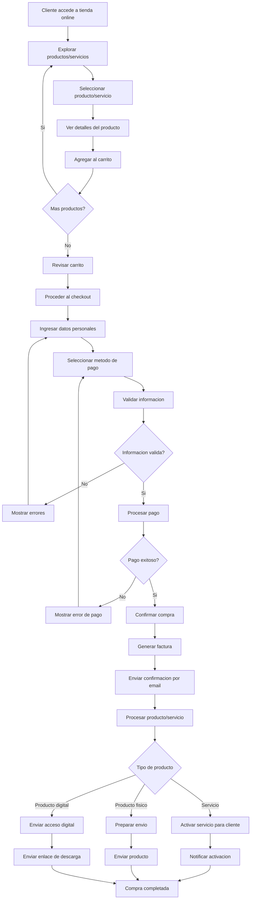

# Tienda Online / Checkout Online - Documentacion Completa

**URL:** https://www.notion.so/29906f76bed4814d8721c5ac2764bfc8
**Extraído el:** 2025-10-29T20:48:21.579Z

---

# Tienda Online / Checkout Online - Documentacion Completa

Esta pagina sirve como documentacion completa del modulo de tienda online del software fitness. Este modulo se adapta segun el tipo de usuario:

## Para Entrenadores

- Vender servicios de entrenamiento (plan mensual)
- Ofrecer asesoria nutricional personalizada
- Vender planes nutricionales personalizados
## Para Gimnasios

- Vender merchandising y productos del gimnasio
- Vender suplementos deportivos
- Ofrecer bonos regalo
- Vender pases de dia
## Diagramas de Flujo de Tienda Online

Los diagramas de flujo muestran el proceso completo de tienda online y checkout:

## Matrices de Productos Digitales

Tipos de productos digitales disponibles segun el tipo de usuario:

### Para Entrenadores

- Planes de Entrenamiento: Rutinas personalizadas, videos de ejercicios
- Asesoria Nutricional: Consultas virtuales, planes de alimentacion
- Planes Nutricionales: Recetas, calculadoras de macros, guias
- Sesiones Virtuales: Entrenamientos en vivo, seguimiento online
### Para Gimnasios

- Bonos Regalo: Membresias, clases especiales, servicios
- Pases de Dia: Acceso temporal al gimnasio
- Productos Fisicos: Merchandising, suplementos, equipamiento
- Servicios Digitales: Clases online, programas de entrenamiento
## Componentes React

Documentacion de componentes React para el modulo de tienda online:

### TiendaOnline

Componente principal de la tienda online. Muestra el catalogo de productos/servicios, incluye busqueda, filtros y navegacion por categorias. Se adapta segun el tipo de usuario (entrenador vs gimnasio).

### CheckoutManager

Componente para gestionar el proceso de checkout. Incluye formulario de datos personales, seleccion de metodo de pago, validaciones y confirmacion de compra.

### ProductosDigitales

Componente especializado para productos digitales. Maneja la entrega inmediata de servicios, acceso a contenido digital y activacion automatica de servicios.

### PagosOnline

Componente para procesar pagos online. Integra con pasarelas de pago, maneja diferentes metodos de pago y gestiona la seguridad de transacciones.

### GestorVentas

Componente para gestionar las ventas realizadas. Incluye historial de ventas, seguimiento de pedidos, gestion de reembolsos y analisis de rendimiento.

## Configuraciones de Checkout

Configuraciones especificas para el proceso de checkout:

- Metodos de Pago: Tarjeta de credito, PayPal, transferencia bancaria
- Validaciones: Email, telefono, direccion de facturacion
- Seguridad: SSL, encriptacion de datos, PCI compliance
- Confirmaciones: Email automatico, SMS opcional
- Entrega: Inmediata para digitales, programada para fisicos
## APIs Requeridas

Documentacion de las APIs necesarias para el modulo de tienda online:

- GET /api/tienda/productos - Obtener catalogo de productos/servicios
- POST /api/tienda/checkout - Procesar checkout y validar datos
- GET /api/tienda/pagos - Obtener metodos de pago disponibles
- POST /api/tienda/venta - Procesar venta y generar factura
- GET /api/tienda/ventas - Obtener historial de ventas
## Estructura de Carpetas MERN

Estructura de carpetas para el stack MERN:

- ventas/tienda-online/page.tsx - Pagina principal de tienda online
- ventas/tienda-online/api/ - API routes para tienda online
- ventas/tienda-online/components/ - Componentes React de tienda
- ventas/tienda-online/hooks/ - Custom hooks para gestion de estado
- ventas/tienda-online/utils/ - Utilidades y helpers
- ventas/tienda-online/services/ - Servicios de integracion
- ventas/tienda-online/types/ - Tipos TypeScript
## Documentacion de Procesos

Procesos principales del modulo de tienda online:

### Proceso de Compra Online

- Cliente navega por el catalogo de productos
- Selecciona productos/servicios deseados
- Agrega productos al carrito de compras
- Procede al checkout y completa datos
- Selecciona metodo de pago y procesa transaccion
- Recibe confirmacion y acceso al producto/servicio
### Proceso de Entrega de Servicios

- Identificar tipo de producto/servicio vendido
- Para servicios: activar inmediatamente en el sistema
- Para productos digitales: enviar enlace de acceso
- Para productos fisicos: preparar envio
- Enviar confirmacion por email y SMS
### Proceso de Gestion de Ventas

- Registrar venta en el sistema
- Generar factura electronica
- Actualizar inventario si aplica
- Registrar en historial de ventas
- Generar metricas y reportes
### Proceso de Soporte Post-Venta

- Seguimiento de satisfaccion del cliente
- Gestion de reembolsos y devoluciones
- Soporte tecnico para productos digitales
- Actualizaciones y mejoras de servicios
## Consideraciones Tecnicas

Aspectos tecnicos importantes para la implementacion:

- Integracion con pasarelas de pago seguras
- Sistema de carrito persistente y sincronizado
- Entrega inmediata de productos digitales
- Sistema de facturacion electronica
- Gestion de inventario en tiempo real
- Sistema de notificaciones automaticas
## Mejores Practicas

Recomendaciones para el desarrollo:

- Usar TypeScript para tipado fuerte
- Implementar validaciones robustas en frontend y backend
- Usar React Query para gestion de estado de servidor
- Implementar manejo de errores robusto
- Crear tests unitarios y de integracion
- Implementar analiticas de conversion
## Resumen

Esta documentacion proporciona una guia completa para implementar el modulo de Tienda Online / Checkout Online del software fitness. Este modulo se adapta segun el tipo de usuario: para entrenadores permite vender servicios (plan mensual, asesoria, plan nutricional personalizado), mientras que para gimnasios permite vender merch, suplementos, bonos regalo y pases de dia. Incluye gestion completa de tienda online, checkout seguro, entrega de productos digitales y fisicos, y sistema de ventas integrado.

URL de la pagina: https://www.notion.so/Tienda-Online-Checkout-Online-29906f76bed4814d8721c5ac2764bfc8

