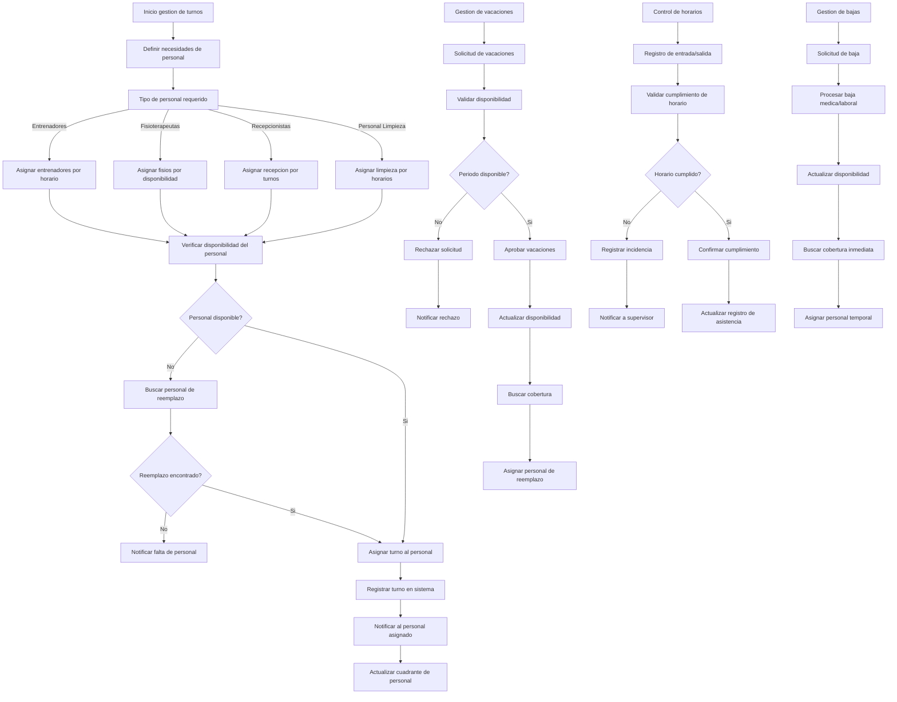

# Turnos & Horarios del Staff - Documentacion Completa

**URL:** https://www.notion.so/29906f76bed481bb9b80da0b5bb95dfc
**Extraído el:** 2025-10-29T20:48:23.971Z

---

# Turnos & Horarios del Staff - Documentacion Completa

Esta pagina sirve como documentacion completa del modulo de gestion de turnos del personal del software fitness. Este modulo esta exclusivamente dirigido a gimnasios y centros fitness con personal:

## Funcionalidades Principales

- Cuadrantes del personal y gestion de horarios
- Gestion de vacaciones y bajas del personal
- Asignacion de turnos y disponibilidad
- Control de horarios y recursos humanos fisicos
Nota: Este modulo es especifico para gimnasios/centros con personal. Permite gestionar 'que entrenador esta en el centro de 9 a 13', 'que fisio esta hoy', y otros aspectos de recursos humanos fisicos.

## Diagramas de Flujo de Turnos

Los diagramas de flujo muestran el proceso completo de gestion de turnos del personal:

## Matrices de Personal

Tipos de personal y sus turnos especificos:

- Entrenadores: Turnos de mañana, tarde y noche
- Fisioterapeutas: Horarios de consulta y tratamientos
- Recepcionistas: Turnos de apertura y cierre
- Personal de Limpieza: Horarios de mantenimiento
- Supervisores: Turnos de supervision y control
- Personal de Seguridad: Turnos de vigilancia
- Instructores de Clases: Horarios de clases grupales
## Componentes React

Documentacion de componentes React para el modulo de gestion de turnos del personal:

### TurnosStaff

Componente principal para gestionar los turnos del personal. Permite crear, editar y asignar turnos, verificar disponibilidad y gestionar cambios de ultima hora.

### CuadrantesPersonal

Componente para visualizar y gestionar los cuadrantes del personal. Muestra horarios semanales, mensuales y permite la asignacion visual de turnos por persona.

### GestorVacaciones

Componente para gestionar las vacaciones del personal. Permite solicitar, aprobar, rechazar vacaciones y buscar cobertura automatica durante los periodos de ausencia.

### AsignacionTurnos

Componente para asignar turnos especificos al personal. Incluye validacion de disponibilidad, conflictos de horario y notificaciones automaticas.

### ControlHorarios

Componente para controlar el cumplimiento de horarios. Registra entrada y salida, detecta incidencias y genera reportes de asistencia.

## Configuraciones de Horarios

Configuraciones especificas para la gestion de horarios:

- Turnos de Mañana: 6:00 - 14:00
- Turnos de Tarde: 14:00 - 22:00
- Turnos de Noche: 22:00 - 6:00
- Turnos de Fin de Semana: Horarios especiales
- Turnos de Festivos: Horarios reducidos
- Turnos de Emergencia: Disponibilidad 24/7
## APIs Requeridas

Documentacion de las APIs necesarias para el modulo de gestion de turnos del personal:

- GET /api/rrhh/turnos - Obtener turnos del personal
- POST /api/rrhh/turnos - Crear nuevo turno
- PUT /api/rrhh/turnos/:id - Actualizar turno existente
- GET /api/rrhh/personal - Obtener lista del personal
- POST /api/rrhh/vacaciones - Gestionar vacaciones
## Estructura de Carpetas MERN

Estructura de carpetas para el stack MERN:

- rrhh/turnos/page.tsx - Pagina principal de gestion de turnos
- rrhh/turnos/api/ - API routes para turnos
- rrhh/turnos/components/ - Componentes React de turnos
- rrhh/turnos/hooks/ - Custom hooks para gestion de estado
- rrhh/turnos/utils/ - Utilidades y helpers
- rrhh/turnos/services/ - Servicios de integracion
- rrhh/turnos/types/ - Tipos TypeScript
- rrhh/turnos/calendar/ - Componentes de calendario
## Documentacion de Procesos

Procesos principales del modulo de gestion de turnos del personal:

### Proceso de Asignacion de Turnos

- Definir necesidades de personal por horario
- Verificar disponibilidad del personal
- Asignar turnos segun competencias y experiencia
- Notificar al personal sobre sus turnos asignados
- Actualizar cuadrantes y calendarios
### Proceso de Gestion de Vacaciones

- Solicitud de vacaciones por parte del personal
- Validacion de disponibilidad y cobertura
- Aprobacion o rechazo de la solicitud
- Busqueda de personal de reemplazo
- Actualizacion de disponibilidad y turnos
### Proceso de Control de Horarios

- Registro de entrada y salida del personal
- Validacion del cumplimiento de horarios
- Deteccion de incidencias y retrasos
- Notificacion a supervisores sobre incidencias
- Generacion de reportes de asistencia
### Proceso de Gestion de Bajas

- Solicitud de baja medica o laboral
- Procesamiento y validacion de la baja
- Busqueda inmediata de cobertura
- Asignacion de personal temporal
- Actualizacion de disponibilidad y turnos
## Consideraciones Tecnicas

Aspectos tecnicos importantes para la implementacion:

- Sistema de notificaciones en tiempo real
- Integracion con sistemas de fichaje
- Gestion de conflictos de horarios automatica
- Sistema de respaldo y recuperacion de datos
- Calendario sincronizado con dispositivos moviles
- Sistema de alertas y recordatorios automaticos
## Mejores Practicas

Recomendaciones para el desarrollo:

- Usar TypeScript para tipado fuerte
- Implementar validaciones de horarios robustas
- Usar React Query para gestion de estado de servidor
- Implementar manejo de errores robusto
- Crear tests unitarios y de integracion
- Implementar sistema de permisos y roles
## Resumen

Esta documentacion proporciona una guia completa para implementar el modulo de Turnos & Horarios del Staff del software fitness. Este modulo esta exclusivamente dirigido a gimnasios y centros fitness con personal, proporcionando gestion completa de cuadrantes del personal, vacaciones, bajas, gestion de horarios y asignacion de turnos. Permite gestionar 'que entrenador esta en el centro de 9 a 13', 'que fisio esta hoy', y otros aspectos de recursos humanos fisicos. Incluye control de horarios, gestion de disponibilidad y sistema de notificaciones automaticas.

URL de la pagina: https://www.notion.so/Turnos-Horarios-del-Staff-29906f76bed481bb9b80da0b5bb95dfc

